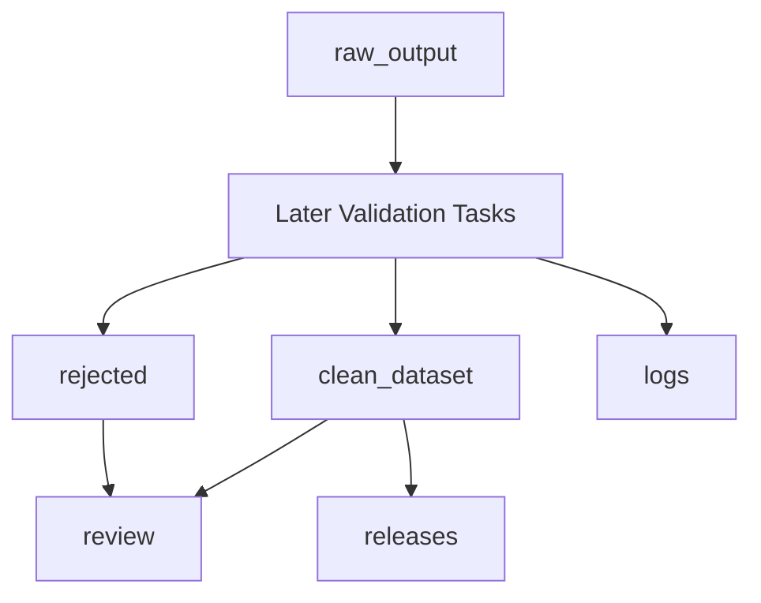

# Jac Context Bundle: jac-context-v1

## Core Warning

Jac is NOT Python. Generated code must be idiomatic Jac and must compile.

## Dataset Strategy

# Jac Coding Agent — Data Generation Strategy

Synthetic dataset construction for supervised finetuning and reinforcement learning.

---

## Overview

The dataset is entirely synthetic. There is no existing public corpus of Jac code large or diverse enough to use directly, so generation must be deliberate, validated, and heavily reviewed before scaling.

A key lesson from the MultiPL-T paper (Cassano et al. 2024, "Knowledge Transfer from High-Resource to Low-Resource Programming Languages for Code LLMs") is that directly generating code in a low-resource language produces poor results. The paper showed that 4 of 5 self-generated Racket functions had bugs. Jac is an even lower-resource language than Racket, so the pipeline should favor translating validated Python code over direct generation wherever possible. When direct Jac generation is unavoidable (e.g., walker/graph patterns with no Python equivalent), apply stricter validation gates.

Generation uses two distinct workflows depending on the task category:

- **Scripted OpenAI API pipeline**: for code generation, debugging, explanation, and conversion. A script calls OpenAI's API, validates output programmatically using the Jac compiler, and writes clean examples to disk only after the validation gates pass.
- **Vibe-coding agent + Jac MCP/tooling**: for agentic trajectories only. The session transcript of an agentic coding environment such as Cursor, Codex, or Claude Code solving a Jac task with Jac compiler/tooling access is the training example. This cannot be scripted because the trajectory itself is the artifact.

Manual human review covers a 5--10% sample of each category. The reviewer checks correctness, idiomatic Jac usage, and whether the generated example is useful for the target model behavior.

**Target release total: 10,000--15,000 clean examples across all categories.**

---

## Workflow 1: Scripted OpenAI API Pipeline

Used for: code generation, debugging, explanation, code conversion.

### Architecture

```
generation_script.py
  └── calls OpenAI's API
        with full Jac context in system prompt
        returns structured JSON batch
  └── calls Jac compiler on every code field
        pass  → write to clean_dataset/
        fail  → write to rejected/ (reuse as debugging pairs)
  └── logs metadata per example
  └── runs deduplication pass after each batch
```

The script runs in a cautious loop. Start with tiny pilot batches of 5--10 examples, inspect the outputs, revise prompts and schemas, then move to batches of 20--50 examples only after the category passes validation and manual review thresholds. Do not scale a category to thousands of examples until its small batches are consistently clean.

### System prompt for the OpenAI model

The system prompt is the most important factor in raw output quality. It directly determines your compile pass rate on the first pass. It must include:

- Full Jac syntax reference
- Complete contents of `skills.md`
- Multiple concrete examples of valid Jac code covering every major construct
- Explicit instruction: produce idiomatic Jac, not Python written in Jac syntax
- Explicit instruction: output will be validated by a compiler, it must pass
- Output format specification (see below)

Do not truncate Jac context casually to save tokens. Use an OpenAI model and context configuration large enough for the selected batch size, Jac reference material, and output schema. If the full context does not fit, reduce batch size before removing language guidance.

### Output format

Ask the OpenAI model to return a JSON array so the script can parse it without regex. One format per category:

**Code generation:**
```json
[
  {
    "prompt": "natural language task description",
    "code": "complete jac code",
    "complexity": "simple | medium | hard"
  }
]
```

**Debugging:**
```json
[
  {
    "broken_code": "jac code with injected error",
    "error_type": "syntax | type | walker | scope | import | semantic",
    "error_message": "compiler or runtime error",
    "fixed_code": "corrected jac code",
    "fix_explanation": "specific explanation of what was wrong and what changed"
  }
]
```

**Explanation:**
```json
[
  {
    "code": "valid jac code",
    "granularity": "line | block | module",
    "explanation": "natural language description"
  }
]
```

**Code conversion:**
```json
[
  {
    "python_code": "source python code",
    "jac_code": "converted idiomatic jac code",
    "conversion_notes": "what patterns changed and why"
  }
]
```

### Batching and diversity

Generate in batches of 20--50 per call only after pilot batches are stable. Within each batch, explicitly instruct the OpenAI model to vary:
- Complexity level
- Which Jac constructs are used (walkers, nodes, edges, abilities, type system)
- Problem domain (graph algorithms, data processing, web, utilities)

Without this instruction, batches cluster around similar examples and the dataset becomes homogeneous.

### Category quality rules

**Code generation** examples use the structure: natural language prompt -> correct, compilable Jac code. Prompts should be unambiguous, should have one reasonable implementation, and should vary from single-function tasks to small complete programs. Complexity should be roughly 40% simple, 40% medium, and 20% hard. For directly-generated (non-translated) code examples with testable behavior, have the model emit the Jac solution and its tests in one completion, then filter on execution — co-generating tests improves consistency (SelfCodeAlign, 2410.24198).

**Debugging** examples use the structure: broken Jac code + compiler error message -> fixed Jac code + explanation. Generate these from valid compiler-verified Jac code, inject one realistic error type, confirm the broken version fails as expected, and confirm the fixed version compiles.

**Explanation** examples use the structure: valid Jac code -> natural language explanation. Include line-level, block-level, and module-level explanations. These require manual accuracy review because the compiler cannot validate explanation quality.

**Code conversion** examples use the structure: Python code -> idiomatic Jac code that preserves behavior. Cover function-to-ability conversion, class-to-node conversion, graph pattern conversion, and algorithms rewritten around walkers and traversal. Generate 50--100 candidate Jac translations per Python source function at high temperature (0.8). Keep all translations that pass cross-compiled tests. This diversity-through-sampling approach produces more varied training data than generating a single translation per source.

Before translating, filter Python source functions aggressively: require docstrings, Pyright type-check passing, no TODO/incomplete markers, no benchmark contamination, and LLM-generated unit tests with at least 90% line coverage. This filtering follows the MultiPL-T methodology that reduced 22 million Python functions to 133,000 high-quality translation candidates. Two further criteria sharpen the candidate pool: keep only Python functions that return a value, so generated tests have meaningful assertions (SelfCodeAlign, 2410.24198); and drop functions with misleading docstrings using a binary docstring-quality LLM classifier (SelfCodeAlign).

### Type inference from test execution

For conversion examples targeting Jac (which has type annotations), infer Python argument and return types by executing the Python test suite and observing runtime values. Inject these inferred types into the Jac translation prompt so the LLM produces correctly typed Jac code. This avoids the LLM guessing types from identifier names alone, which is unreliable for low-resource target languages.

### Compiler validation (hard gate)

Every `code`, `fixed_code`, and `jac_code` field in every generated example is run through the Jac compiler programmatically. This is a hard gate.

- Compile pass: example goes to `clean_dataset/`
- Compile fail on a code generation example: goes to `rejected/`
- Compile fail on a `fixed_code` field in a debugging example: the whole debugging pair is discarded
- Compile fail on a `broken_code` field in a debugging example: this is expected and correct, keep it

Expected compile pass rate on raw output is 60--80%. This is an observed raw-output band, not the scale-up gate. A category should not scale until pilot batches reach the stricter validation targets documented in the task roadmap.

Rejected code generation examples are not wasted. A rejected example that fails to compile is a valid broken code input. Feed it back into the debugging category with the compiler error message attached.

Debugging examples are the exception to the general code-compiles rule: `broken_code` is expected to fail, and `fixed_code` is expected to compile.

### Cross-Compiled Test Validation (hard gate for deterministic categories)

For code generation and conversion examples with deterministic behavior, test validation is a hard gate, not a soft gate. Following the MultiPL-T approach, tests should be generated in Python (where LLMs are reliable), then compiled to Jac using a deterministic rule-based test compiler — not an LLM. This eliminates LLM hallucination from the test layer entirely.

The cross-compiled test gate works as follows:
- Generate unit tests in Python for the source function
- Verify tests pass against the Python source with at least 90% line coverage
- Compile Python assertions to Jac assertions using a deterministic compiler
- Run compiled tests against the Jac translation
- Pass: example enters the clean dataset
- Fail: example is rejected (not routed to manual review)

This gate applies to code generation and conversion categories. Explanation and trajectory categories remain under manual review because their correctness cannot be tested automatically.

### Test harness validation (soft gate)

For non-deterministic categories (explanation, trajectory) and examples without cross-compiled tests, the test harness remains a soft gate.

For code generation and conversion examples where testable behavior can be defined, run a small test against the compiled output. This checks that the code produces correct output on known inputs, not just that it compiles.

Soft gate: failing the test harness flags the example for manual review, it does not automatically discard it. Some test failures are due to the test being wrong rather than the code.

### Deduplication

After each batch, run a deduplication pass. Remove exact duplicates and near-duplicates where prompts differ only in variable names or trivial surface changes. Run a full deduplication pass again before finalizing the dataset.

---

## Seeding And Coverage Beyond The Grammar

Two coverage axes that complement direct generation:

- **Snippet-seeded generation (OSS-Instruct, Magicoder 2312.02120).** Feed the generator 1--15 random lines of real Python code and ask it to invent a self-contained, unrelated Jac problem inspired by the fragment. This injects real-world domain structure that grammar-driven or persona-driven prompts miss. Abstract the snippet to high-level concepts before generating so the model does not echo an out-of-distribution format (SelfCodeAlign found seed→concepts beats seed→instruction directly).
- **Semantic-domain coverage.** Track a domain axis (algorithmic, DB/SQL, web, security, systems, data-processing, graph, math, CLI, domain-specific) orthogonal to the Jac construct coverage. Cluster generated tasks by embedding and balance domains so the dataset does not over-index on whatever the generator finds easy.

---

## Workflow 2: Vibe-Coding Agent + Jac MCP/Tooling (Agentic Trajectories)

Used for: agentic trajectories only.

### Why this is different

A trajectory cannot be generated by a single API call. It is the result of an agent actually executing steps: calling tools, reading compiler output, recovering from errors, and iterating. The only way to produce a genuine trajectory is to run a real agentic session and record it.

Use a real vibe-coding agent session for this, such as Cursor, Codex, or Claude Code with the Jac MCP or equivalent Jac compiler/tooling attached. The Jac tooling gives the agent live compiler access, file tooling, and full Jac context inside the session. The session transcript of the agent solving a Jac task is the training example.

### How to generate trajectories

1. Open a vibe-coding agent session in Cursor, Codex, Claude Code, or another approved agentic coding environment with Jac MCP/tooling attached
2. Give the agent a Jac task at the target complexity level
3. Let it execute end to end: planning, MCP tool calls, compiler feedback, error recovery, final output
4. Record the full session transcript
5. Validate: the final output must compile via the MCP compiler
6. If the session ends successfully, the transcript is a training trajectory
7. If the session fails or the final code does not compile, discard it

Your involvement is starting the session and checking the final result. The rest runs autonomously.

### What makes a good trajectory

Keep trajectories where:
- The agent encounters a compiler error from the MCP, reasons about it, and recovers correctly
- The agent uses MCP tools in a logical sequence
- The final output compiles and is correct

Discard trajectories where:
- The agent gives up or cannot complete the task
- The final code does not compile
- More than 3 consecutive failed MCP compiler calls without recovery
- Total trajectory length exceeds the training context window (8,192 tokens for initial SFT runs)

Recovery trajectories, where the agent hits a compiler error and correctly fixes itself, are the most valuable examples for agentic behavior. Prioritize tasks that are likely to require at least one recovery step.

### Task range and distribution

Tasks should range from simple to complex: 30% simple / 50% medium / 20% complex.

- Simple: "write a Jac walker that sums node values"
- Medium: "build a Jac graph-based task queue with priority ordering"
- Complex: "build a Jac web API with routing, authentication, and error handling"

### Trajectory format

Each trajectory is stored as a list of turns. A turn is a dict with a role and content. Tool calls and tool results are separate turns. This format must exactly match the chat template used during SFT. If the format does not match, the model learns the wrong turn structure.

```json
[
  {"role": "user", "content": "task description"},
  {"role": "assistant", "content": "reasoning and plan"},
  {"role": "tool_call", "content": "jac_mcp.compile(...)"},
  {"role": "tool_result", "content": "compiler output"},
  {"role": "assistant", "content": "response to compiler output"},
  {"role": "assistant", "content": "final output"}
]
```

---

## Manual Review

After the scripted pipeline runs, manually review 5--10% of each single-turn category. Check:

- Code generation: does the code do what the prompt asks, in idiomatic Jac?
- Debugging: is the injected error realistic, is the fix correct, is the explanation accurate?
- Explanation: is the natural language description accurate at every level?
- Conversion: does the Jac output preserve the Python behavior?

If the manual review pass rate on a sample drops below 80%, revise the generation system prompt for that category and re-run small batches before continuing.

For trajectories, review the same 5--10% sample checking that agent reasoning is coherent, MCP tool calls are appropriate, and the final output is correct.

---

## Volume and Distribution

| Category | Workflow | Target Count | Proportion |
|---|---|---|---|
| Code generation | Scripted OpenAI API pipeline | 3,000--5,000 | 30--35% |
| Debugging | Scripted OpenAI API pipeline | 2,000--3,000 | 20--25% |
| Explanation | Scripted OpenAI API pipeline | 1,000--2,000 | 10--15% |
| Code conversion | Scripted OpenAI API pipeline | 1,000--2,000 | 10--15% |
| Agentic trajectories | Vibe-coding agent + Jac MCP/tooling | 2,000--3,000 | 20--25% |
| **Release total** | | **10,000--15,000** | **100%** |

The category ranges are planning bands. Their absolute lower bounds add up to 9,000, but a release should continue generation and balancing until it reaches at least 10,000 clean examples.

Hard examples (20% of each category) matter most for ceiling performance. Do not deprioritize them in favor of generating more easy examples quickly.

---

## Token Accounting

Track tokens at two levels. Per-example: record each example's token count (prompt plus completion) so context-window fit and token-efficiency can be measured and over-long examples filtered before training. Aggregate: log total tokens consumed per batch and per generation run, broken down by generator and recipe, for cost and budget tracking. Per-example counts live in example metadata; aggregate counts live in the generation logs.

---

## Dataset Versioning and Bookkeeping

Every example is stored with metadata regardless of which workflow produced it:

```json
{
  "id": "unique identifier",
  "batch_id": "generation batch identifier",
  "category": "code_gen | debug | explanation | conversion | trajectory",
  "complexity": "simple | medium | hard",
  "compiler_pass": true,
  "test_pass": true,
  "manually_reviewed": false,
  "generator": "openai-api | cursor-jac-mcp | codex-jac-mcp | claude-code-jac-mcp",
  "generation_date": "timestamp",
  "source_prompt_version": "prompt-category-vN",
  "context_bundle_version": "jac-context-vN",
  "validator_version": "validator-vN",
  "dataset_version": "jac-synth-vMAJOR.MINOR.PATCH"
}
```

Store raw output separately from the validated clean dataset. The raw output is useful for debugging generation quality and recovering recycled examples.

Version the clean dataset. Training runs reference a specific dataset version so results are reproducible. Increment the version whenever examples are added or removed.

## Dataset Foundation

# Dataset Foundation

This document is the Task 1 source of truth for the Jac synthetic dataset structure. It defines where artifacts live, which metadata every example carries, how records are named, and what Jac context must be available before prompt design, validation planning, generation, or release work begins.

The target release range is 10,000-15,000 clean examples across exactly these categories:

- `code_gen`
- `debug`
- `explanation`
- `conversion`
- `trajectory`

Task 1 does not define category prompt templates, category output schemas, compiler validation implementation, generation loops, deduplication logic, or release manifests. Those are handled by later tasks.

## Dataset Storage Policy

All dataset artifacts should live under a future `dataset/` root. Raw, clean, rejected, review, log, and release artifacts must remain separate by path so that unvalidated material cannot be confused with training-ready examples.



`dataset/raw_output/` stores unvalidated OpenAI API responses and raw trajectory transcripts. Files in this area may contain malformed JSON, compiler-failing Jac, incomplete trajectories, duplicated examples, or other raw material. Nothing in `raw_output/` is training-ready.

`dataset/clean_dataset/` stores examples that pass the required validation gates for their category. A clean example must include required metadata, a stable example ID, and a `context_bundle_version`. Later validation rules define the exact compiler and test gates, but no example with known failed required validation belongs here.

`dataset/rejected/` stores failed generations and discarded trajectories that may be inspected, audited, or recycled. Rejected artifacts must keep enough metadata to explain why they were rejected, including `rejection_reason` when available. Rejected code generation examples with clear compiler errors may later seed debugging examples, but malformed or missing-code records should not be recycled.

`dataset/review/` stores manual review samples, reviewer notes, adjudication records, and review status updates. Review files must reference the relevant example IDs and batch IDs rather than duplicating clean examples as independent source records.

`dataset/logs/` stores process logs for generation, parsing, compiler checks, tests, retries, and deduplication. Logs support reproducibility and failure analysis; they are not examples. `dataset/logs/generation/` also records aggregate token usage per batch and per run, broken down by generator and recipe, for cost and budget tracking.

`dataset/releases/` stores frozen dataset versions used by training runs. Release contents should be immutable after version freeze and should reference the exact dataset version consumed by training.

## Category Subdirectories

Each example-bearing storage area must have a subdirectory for every dataset category:

```text
dataset/
  raw_output/
    code_gen/
    debug/
    explanation/
    conversion/
    trajectory/
  clean_dataset/
    code_gen/
    debug/
    explanation/
    conversion/
    trajectory/
  rejected/
    code_gen/
    debug/
    explanation/
    conversion/
    trajectory/
  review/
    code_gen/
    debug/
    explanation/
    conversion/
    trajectory/
  context/
    python_source/
  logs/
    generation/
    parsing/
    compiler/
    test/
    retry/
    deduplication/
  releases/
```

Logs are grouped by process type instead of category by default. Later tasks may add category-specific log partitions if validation or generation tooling needs them.

## Naming Conventions

Category names must be one of `code_gen`, `debug`, `explanation`, `conversion`, or `trajectory`. Use these exact values in paths, IDs, metadata, logs, and review records.

Batch IDs use:

```text
YYYYMMDD-category-seq
```

Example:

```text
20260507-code_gen-001
```

The date is the UTC or agreed project date for the batch, `category` is one allowed category value, and `seq` is a zero-padded three-digit sequence for that category on that date.

Example IDs use:

```text
category-YYYYMMDD-batchSeq-exampleSeq
```

Example:

```text
code_gen-20260507-001-0007
```

The example ID embeds the category and batch sequence so IDs remain unique across categories and batches while still being scannable.

Dataset versions use:

```text
jac-synth-vMAJOR.MINOR.PATCH
```

Example:

```text
jac-synth-v0.1.0
```

Context bundle versions use:

```text
jac-context-vN
```

Example:

```text
jac-context-v1
```

Prompt versions and validator versions are referenced by metadata but designed in later tasks:

```text
prompt-category-vN
validator-vN
```

Examples:

```text
prompt-code_gen-v1
validator-v1
```

## Metadata Schema

Every example record, whether raw, clean, rejected, or under review, must carry the required metadata fields when the field value is known. Clean examples must have every required field populated.

### Required Fields

```json
{
  "id": "string",
  "batch_id": "string",
  "category": "code_gen | debug | explanation | conversion | trajectory",
  "complexity": "simple | medium | hard",
  "compiler_pass": true,
  "test_pass": true,
  "manually_reviewed": false,
  "generator": "openai-api | cursor-jac-mcp | codex-jac-mcp | claude-code-jac-mcp",
  "generation_date": "ISO-8601 timestamp or YYYY-MM-DD date",
  "source_prompt_version": "prompt-category-vN",
  "context_bundle_version": "jac-context-vN",
  "validator_version": "validator-vN",
  "dataset_version": "jac-synth-vMAJOR.MINOR.PATCH"
}
```

Allowed `category` values:

- `code_gen`
- `debug`
- `explanation`
- `conversion`
- `trajectory`

Allowed `complexity` values:

- `simple`
- `medium`
- `hard`

Allowed `generator` values:

- `openai-api`
- `cursor-jac-mcp`
- `codex-jac-mcp`
- `claude-code-jac-mcp`

### Optional Fields

```json
{
  "error_type": "syntax | type | walker | scope | import | semantic",
  "granularity": "line | block | module",
  "trajectory_length_tokens": 6144,
  "dedup_hash": "sha256-or-other-stable-hash",
  "reviewer": "reviewer identifier",
  "review_status": "pending | passed | failed | needs_adjudication",
  "rejection_reason": "short reason for rejection",
  "source_python_id": "python-func-00042",
  "source_test_count": 7,
  "test_coverage_percent": 95,
  "cross_compiled_tests_pass": true,
  "candidate_translation_count": 50,
  "type_inference_method": "runtime_observation",
  "token_count": 412,
  "prompt_token_count": 96,
  "completion_token_count": 316,
  "test_credibility_score": 0.91,
  "solution_credibility_score": 0.88,
  "runtime_ms": 14,
  "semantic_domain": "graph",
  "seed_source": "oss_instruct"
}
```

Optional fields are category-specific and must not become required for unrelated categories. For example, `error_type` is useful for debugging examples, `granularity` is useful for explanation examples, and `trajectory_length_tokens` is useful for trajectory examples. `source_python_id` links conversion and Python-sourced code_gen examples to their source Python function. `source_test_count`, `test_coverage_percent`, and `cross_compiled_tests_pass` record cross-compiled test validation results following the MultiPL-T methodology. `candidate_translation_count` records how many candidate translations were generated for the source function. `type_inference_method` records how Python types were inferred for Jac type annotations (`runtime_observation`, `pyright_static`, or `none`). `token_count` (and optional `prompt_token_count` / `completion_token_count`) record per-example token length for context-window fit and token-efficiency tracking. `test_credibility_score` and `solution_credibility_score` record CodeDPO-style mutual code↔test credibility (0–1). `runtime_ms` records execution time for runtime-efficiency preference pairs. `semantic_domain` records the embedding-clustered domain (algorithmic, db_sql, web, security, systems, data_processing, graph, math, cli, domain_specific). `seed_source` records how the example was seeded (`grammar_matrix`, `python_translation`, `oss_instruct`, `zero_seed`, `persona`, `doc`, `evol`).

### Clean Code Generation Metadata Example

```json
{
  "id": "code_gen-20260507-001-0007",
  "batch_id": "20260507-code_gen-001",
  "category": "code_gen",
  "complexity": "medium",
  "compiler_pass": true,
  "test_pass": true,
  "manually_reviewed": false,
  "generator": "openai-api",
  "generation_date": "2026-05-07",
  "source_prompt_version": "prompt-code_gen-v1",
  "context_bundle_version": "jac-context-v1",
  "validator_version": "validator-v1",
  "dataset_version": "jac-synth-v0.1.0",
  "dedup_hash": "sha256:example-placeholder"
}
```

### Rejected Trajectory Metadata Example

```json
{
  "id": "trajectory-20260507-001-0003",
  "batch_id": "20260507-trajectory-001",
  "category": "trajectory",
  "complexity": "hard",
  "compiler_pass": false,
  "test_pass": false,
  "manually_reviewed": true,
  "generator": "cursor-jac-mcp",
  "generation_date": "2026-05-07",
  "source_prompt_version": "prompt-trajectory-v1",
  "context_bundle_version": "jac-context-v1",
  "validator_version": "validator-v1",
  "dataset_version": "jac-synth-v0.1.0",
  "trajectory_length_tokens": 9340,
  "reviewer": "manual-reviewer",
  "review_status": "failed",
  "rejection_reason": "final Jac output did not compile"
}
```

## Jac Context Bundle Requirements

A Jac context bundle is a versioned set of references, guidance, and curated examples used by OpenAI prompts and vibe-coding agent sessions with Jac MCP/tooling. It should provide enough current Jac language context that generated examples are idiomatic Jac rather than Python-like code with Jac surface syntax.

Each context bundle version must include:

- Current Jac syntax reference from the Jac MCP documentation, especially `jac://docs/cheatsheet`.
- Jac idioms and pitfalls from `jac://guide/pitfalls`.
- Idiomatic valid examples from `jac://guide/patterns`.
- `skills.md` or equivalent Jac MCP guidance used by the active Jac tooling.
- Examples covering walkers, nodes, edges, abilities, imports, type annotations, standard library usage, and code organization.
- Output schema instructions for the target category, once Task 2 defines those category schemas.
- Filtered Python source function pool with test suites, used as translation sources for `conversion` and Python-sourced `code_gen` examples.

The initial bundle should be named `jac-context-v1`. Increment the version whenever syntax references, guidance, examples, or category schema instructions change in a way that could affect generation quality or validation behavior.

Every generated example must record its `context_bundle_version`. OpenAI API prompt logs, trajectory session notes, and validation logs must record the same context bundle version for the same example or batch. If logs and example metadata disagree, treat the example as not reproducible until reconciled.

If Jac source documents disagree about syntax or idioms, stop generation and update the context bundle before producing more examples. If the bundle is too large for planned OpenAI API calls, reduce batch size before removing Jac guidance.

## Task 1 Validation Checks

- [ ] Every category has a documented storage location under `raw_output/`, `clean_dataset/`, `rejected/`, and `review/`.
- [ ] Metadata can represent all five categories without making special-case fields globally required.
- [ ] Raw, clean, rejected, review, log, and release artifacts are separated by path and cannot be confused by naming.
- [ ] Example IDs are unique across categories and batches by construction.
- [ ] Every example can reference a context bundle version through `context_bundle_version`.
- [ ] Batch IDs, example IDs, dataset versions, context bundle versions, prompt versions, and validator versions have documented formats.

## Failure Guidance

If two categories need incompatible required metadata fields, keep the shared required schema stable and move category-specific fields to optional metadata.

If ID formats become too long or hard to scan, revise them before generation starts. Do not rename IDs after examples have been used in validation logs or review notes without a migration record.

If the Jac context bundle is too large for planned OpenAI API calls, reduce batch size before removing syntax, pitfalls, or idiomatic examples.

If source documents disagree about Jac syntax or idioms, stop and update the context bundle before generating examples.

## Scripted Category Schemas

Available scripted schemas: code_gen, debug, explanation, conversion.

## jac://guide/pitfalls
Jac is NOT Python. Semicolons, braces, has declarations, walkers, nodes, and edges matter.

## jac://guide/patterns
Use idiomatic Jac patterns for walkers, nodes, edges, abilities, imports, and tests.
