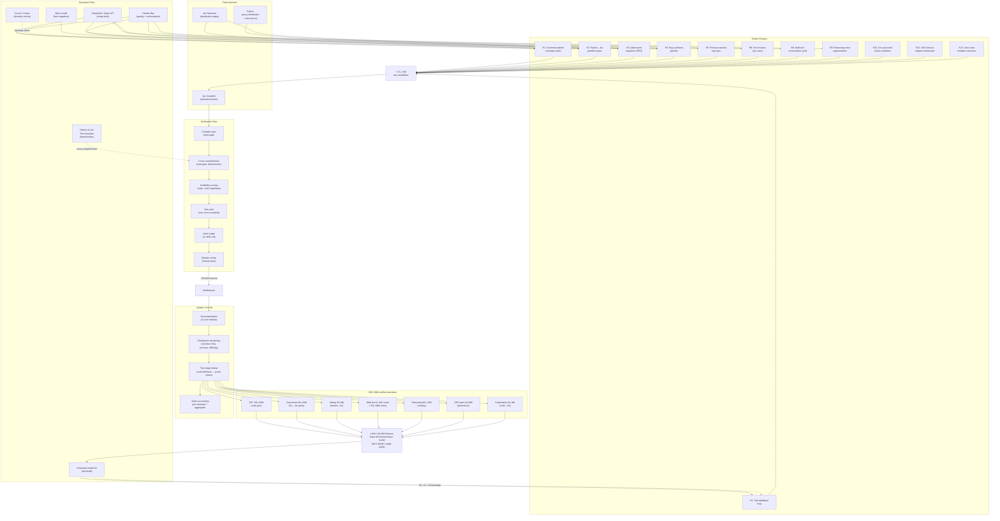

# Synthetic Data Generation Workflow

```mermaid
---
config:
  flowchart:
    nodeSpacing: 60
    rankSpacing: 80
    padding: 30
  themeVariables:
    fontSize: 18px
---
flowchart TD
    subgraph Anchors["Three Anchors"]
        G["Jac Grammar\n(distribution target)"]
        C["Jac Compiler\n(unlimited oracle)"]
        P["Python\n(proxy distribution\n+ test source)"]
    end

    subgraph Generators["Generator Fleet"]
        CL["Claude Max\n(quality + orchestration)"]
        CH["DeepSeek / Qwen API\n(cheap bulk)"]
        BG["Base model\n(free negatives)"]
        FG["Finetuned model vN\n(self-distill)"]
        CU["Cursor / Codex\n(diversity checks)"]
        TC["Python-to-Jac\nTest Compiler\n(deterministic)"]
    end

    subgraph Recipes["Twelve Recipes"]
        R1["R1: Grammar-walked\ncoverage matrix"]
        R2["R2: Python↔Jac\nparallel corpus"]
        R3["R3: Adversarial\nnegatives (DPO)"]
        R4["R4: Bug-synthesis\npipeline"]
        R5["R5: Persona-stacked\ntask gen"]
        R6["R6: Evol-Instruct\n(Jac axes)"]
        R7["R7: Self-distillation\nloop"]
        R8["R8: Multi-turn\nconversation synth"]
        R9["R9: Reasoning-trace\naugmentation"]
        R10["R10: Doc-grounded\nlesson synthesis"]
        R11["R11: OSS-Instruct\nsnippet-seeded gen"]
        R12["R12: Zero-seed\ntemplate extraction"]
    end

    G --> R1
    P --> R2
    G --> R3

    CL --> R1 & R4 & R8 & R9
    CH --> R2 & R4 & R5 & R6
    BG --> R3
    FG --> R7
    CU -.->|diversity check| R2
    TC -.->|cross-compiled tests| V1B

    R1 & R2 & R3 & R4 & R5 & R6 & R7 & R8 & R9 & R10 & R11 & R12 --> RAW["~1.5–2.5M\nraw candidates"]

    subgraph Verification["Verification Gate"]
        V1["Compiler pass\n(hard gate)"]
        V1B["Cross-compiled tests\n(hard gate, deterministic)"]
        VCR["Credibility scoring\n(code↔test PageRank)"]
        V2["Test suite\n(non-cross-compiled)"]
        V3["Idiom judge\n(vs skills.md)"]
        V4["Sample review\n(manual spot)"]
    end

    RAW --> C --> V1 --> V1B --> VCR --> V2 --> V3 --> V4

    V4 -->|~20-40% survive| VER["Verified pool"]

    subgraph QC["Quality Controls"]
        DC["Decontamination\n(vs eval holdout)"]
        DM["Distribution monitoring\n(construct freq, persona, difficulty)"]
        DD["Two-stage dedup\n(code MinHash → prose cosine)"]
        TOK["Token accounting\n(per-example + aggregate)"]
    end

    VER --> DC --> DM --> DD --> TOK

    subgraph Output["~300–500k verified examples"]
        SFT["SFT 150–250k\n(code gen)"]
        CONV["Conversion 80–150k\n(Py↔Jac pairs)"]
        DBG["Debug 30–60k\n(broken→fix)"]
        MT["Multi-turn 8–20k convs\n(~50–100k turns)"]
        RSN["Reasoning 60–120k\n(overlay)"]
        DPO["DPO pairs 40–80k\n(preference)"]
        EXP["Explanation 20–40k\n(code→NL)"]
    end

    DD --> SFT & CONV & DBG & MT & RSN & DPO & EXP

    SFT & CONV & DBG & MT & RSN & DPO & EXP --> FT["LoRA / QLoRA finetune\nbake-off-selected base model\n(MLX 48GB / single A100)"]

    FT --> FG
    FG -.->|"v0→v1→v2 bootstrap"| R7
```
