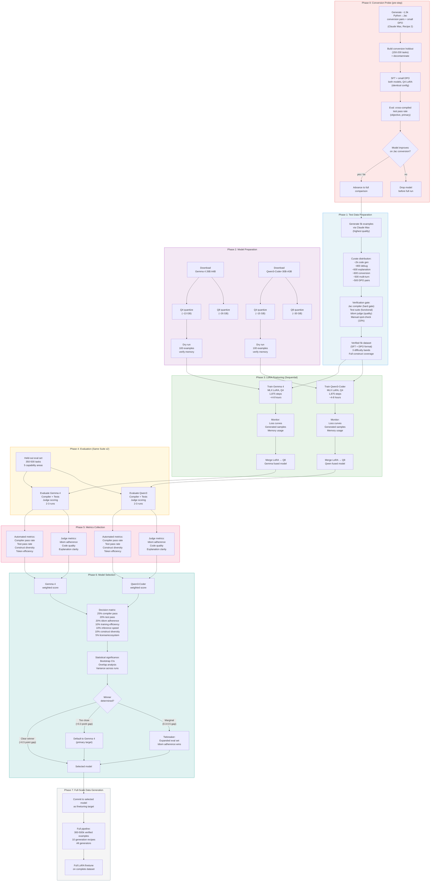

# Model Testing Pipeline Workflow

```mermaid
---
config:
  flowchart:
    nodeSpacing: 60
    rankSpacing: 80
    padding: 30
  themeVariables:
    fontSize: 18px
---
flowchart TD
    subgraph Probe["Phase 0: Conversion Probe (pre-step)"]
        PGEN["Generate ~1.5k Python→Jac\nconversion pairs + small DPO\n(Claude Max, Recipe 2)"]
        PGEN --> PHOLD["Build conversion holdout\n(150-200 tasks)\n+ decontaminate"]
        PHOLD --> PTRAIN["SFT + small DPO\nboth models, Q4 LoRA\n(identical config)"]
        PTRAIN --> PEVAL["Eval: cross-compiled\ntest pass rate\n(objective, primary)"]
        PEVAL --> PDEC{"Model improves\non Jac conversion?"}
        PDEC -->|"yes / tie"| ADVANCE["Advance to full comparison"]
        PDEC -->|"no"| DROP["Drop model\nbefore full run"]
    end

    ADVANCE --> GEN

    subgraph DataPrep["Phase 1: Test Data Preparation"]
        GEN["Generate 5k examples\nvia Claude Max\n(highest quality)"]
        
        GEN --> DIST["Curate distribution:\n~2k code gen\n~800 debug\n~600 explanation\n~600 conversion\n~500 multi-turn\n~500 DPO pairs"]
        
        DIST --> VERIFY["Verification gate:\nJac compiler (hard gate)\nTest suite (functional)\nIdiom judge (quality)\nManual spot-check (10%)"]
        
        VERIFY --> DATASET["Verified 5k dataset\n(SFT + DPO format)\n3 difficulty bands\nFull construct coverage"]
    end

    subgraph ModelPrep["Phase 2: Model Preparation"]
        DL1["Download\nGemma 4 26B A4B"]
        DL2["Download\nQwen3-Coder-30B-A3B"]
        
        DL1 --> Q4_1["Q4 quantize\n(~13 GB)"]
        DL2 --> Q4_2["Q4 quantize\n(~15 GB)"]
        
        DL1 --> Q8_1["Q8 quantize\n(~26 GB)"]
        DL2 --> Q8_2["Q8 quantize\n(~30 GB)"]
        
        Q4_1 --> DRY1["Dry run\n100 examples\nverify memory"]
        Q4_2 --> DRY2["Dry run\n100 examples\nverify memory"]
    end

    subgraph Training["Phase 3: LoRA Finetuning (Sequential)"]
        DATASET --> TRAIN1["Train Gemma 4\nMLX LoRA, Q4\n1,875 steps\n~4-8 hours"]
        DATASET --> TRAIN2["Train Qwen3-Coder\nMLX LoRA, Q4\n1,875 steps\n~4-8 hours"]
        
        DRY1 --> TRAIN1
        DRY2 --> TRAIN2
        
        TRAIN1 --> MON1["Monitor:\nLoss curves\nGenerated samples\nMemory usage"]
        TRAIN2 --> MON2["Monitor:\nLoss curves\nGenerated samples\nMemory usage"]
        
        MON1 --> FUSE1["Merge LoRA → Q8\nGemma fused model"]
        MON2 --> FUSE2["Merge LoRA → Q8\nQwen fused model"]
    end

    subgraph Evaluation["Phase 4: Evaluation (Same Suite x2)"]
        EVAL_SET["Held-out eval set\n350-500 tasks\n5 capability areas"]
        
        FUSE1 --> EVAL1["Evaluate Gemma 4\nCompiler + Tests\nJudge scoring\n2-3 runs"]
        FUSE2 --> EVAL2["Evaluate Qwen3\nCompiler + Tests\nJudge scoring\n2-3 runs"]
        
        EVAL_SET --> EVAL1
        EVAL_SET --> EVAL2
    end

    subgraph Metrics["Phase 5: Metrics Collection"]
        EVAL1 --> AUTO1["Automated metrics:\nCompiler pass rate\nTest pass rate\nConstruct diversity\nToken efficiency"]
        EVAL2 --> AUTO2["Automated metrics:\nCompiler pass rate\nTest pass rate\nConstruct diversity\nToken efficiency"]
        
        EVAL1 --> JUDGE1["Judge metrics:\nIdiom adherence\nCode quality\nExplanation clarity"]
        EVAL2 --> JUDGE2["Judge metrics:\nIdiom adherence\nCode quality\nExplanation clarity"]
    end

    subgraph Decision["Phase 6: Model Selection"]
        AUTO1 & JUDGE1 --> SCORE1["Gemma 4\nweighted score"]
        AUTO2 & JUDGE2 --> SCORE2["Qwen3-Coder\nweighted score"]
        
        SCORE1 & SCORE2 --> MATRIX["Decision matrix:\n25% compiler pass\n20% test pass\n20% idiom adherence\n10% training efficiency\n10% inference speed\n10% construct diversity\n5% license/ecosystem"]
        
        MATRIX --> STATS["Statistical significance:\nBootstrap CIs\nOverlap analysis\nVariance across runs"]
        
        STATS --> WINNER{"Winner\ndetermined?"}
        
        WINNER -->|"Clear winner\n(>0.5 point gap)"| SELECT["Selected model"]
        WINNER -->|"Too close\n(<0.3 point gap)"| DEFAULT["Default to Gemma 4\n(primary target)"]
        WINNER -->|"Marginal\n(0.3-0.5 gap)"| TIEBREAK["Tiebreaker:\nExpanded eval set\nIdiom adherence wins"]
        
        TIEBREAK --> SELECT
        DEFAULT --> SELECT
    end

    subgraph FullScale["Phase 7: Full-Scale Data Generation"]
        SELECT --> COMMIT["Commit to selected model\nas finetuning target"]
        
        COMMIT --> FULLGEN["Full pipeline:\n300-500k verified examples\n10 generation recipes\nAll generators"]
        
        FULLGEN --> FULLTRAIN["Full LoRA finetune\non complete dataset"]
    end

    style Probe fill:#fde8e8,stroke:#E53935
    style DataPrep fill:#e8f4f8,stroke:#2196F3
    style ModelPrep fill:#f3e8f4,stroke:#9C27B0
    style Training fill:#e8f4e8,stroke:#4CAF50
    style Evaluation fill:#fff8e1,stroke:#FF9800
    style Metrics fill:#fce4ec,stroke:#E91E63
    style Decision fill:#e0f2f1,stroke:#009688
    style FullScale fill:#f5f5f5,stroke:#607D8B
```
