# Results — Python→Jac Conversion Finetune Probe

Full measured results of the mini finetune probe: take a small open base model that
has never seen Jac, LoRA‑finetune it on our synthetic **Python→Jac** dataset on a
single Apple‑Silicon Mac (48 GB, MLX), and measure **base‑vs‑finetuned** on a
held‑out, decontaminated test set. Two models were run end‑to‑end:

- **Qwen** — `Qwen/Qwen3-Coder-30B-A3B-Instruct` (30B MoE, ~3B active)
- **Gemma** — `google/gemma-4-26b-a4b-it` (26B MoE, ~4B active)

Every number below was produced by the all‑Jac harness in `srccurrent/jacgen/`
(`eval_probe.jac`, `idiom_eval.jac`). The gate is **`jac run`** — a conversion is
"correct" only if it **compiles, executes, and its output matches** the recorded
behavioral test cases. No human grading, no `jac check` leniency.

> Graph images in this folder are copies of `results/<model>/*.png` (the live
> `results/` tree is gitignored; these copies are committed so they're visible here).

---

## Table of contents

1. [How to read these results](#1-how-to-read-these-results)
2. [Headline](#2-headline)
3. [Function tier — behavioral correctness](#3-function-tier--behavioral-correctness)
4. [Function tier — idiom judge (the honest caveat)](#4-function-tier--idiom-judge-the-honest-caveat)
5. [Graph tier — where idiom actually moves](#5-graph-tier--where-idiom-actually-moves)
6. [Token efficiency](#6-token-efficiency)
7. [Training curves — Qwen](#7-training-curves--qwen)
8. [Training curves — Gemma](#8-training-curves--gemma)
9. [Qwen vs Gemma — side by side](#9-qwen-vs-gemma--side-by-side)
10. [What this proves](#10-what-this-proves)
11. [Reproduce](#11-reproduce)

---

## 1. How to read these results

Three metrics, measured at three stages (**base** = stock model, **SFT** = after
supervised finetune, **DPO** = after preference finetune on top of SFT):

| Metric | Source | Means |
|---|---|---|
| **test‑pass %** | `eval_probe.jac` | conversion compiles + runs + output matches the behavioral cases. **The primary signal.** |
| **runs %** | `eval_probe.jac` | conversion compiles + executes (output may still be wrong). |
| **transpile‑similarity** | `idiom_eval.jac` | ROUGE‑L of the model's Jac vs the *mechanical* `jac py2jac` of the same Python. **1.0 = it just transpiled** (Python‑shaped); **lower = it rewrote into idiomatic Jac.** |
| **idiom‑construct count** | `idiom_eval.jac` | number of graph‑spatial / Jac‑native markers (`node`, `edge`, `walker`, `visit`, `++>`, `spawn`, abilities) per output. |

Two held‑out sets, both unseen during training:

- **Function holdout — 150 tasks.** Mined Python functions (factorial, fib, string
  ops, vector math…), decontaminated against the training set (14‑gram shingle
  overlap < 0.5), disjoint corpus offsets. Tests **correctness**.
- **Graph holdout — 13 tasks.** Authored graph/tree/state‑machine problems whose
  Python is a dict + stack traversal but whose *idiomatic* Jac builds **nodes/edges
  and spawns a walker**. Aggregations are disjoint from the graph training tasks
  (generalization, not memorization). Tests **idiom**.

---

## 2. Headline

> A stock 30B / 26B model produces **0 %** runnable Jac. After LoRA‑SFT on our
> synthetic data, **93–94 %** of held‑out conversions are behaviorally correct —
> and on graph‑shaped tasks where idiomatic Jac genuinely diverges from a naive
> transpile, Qwen reaches **100 % idiomatic** among its correct outputs after DPO.

| | Qwen | Gemma |
|---|---|---|
| Function test‑pass, base → SFT | **0 % → 94 %** | **0 % → 93 %** |
| Function generation length, base → SFT | 34.7k → 16.3k tokens | 76.8k → 19.2k tokens |
| Graph correct, base → SFT → DPO | **0 % → 46 % → 61 %** | **0 % → 15 % → 15 %** |
| Graph of‑correct idiomatic, SFT → DPO | 83 % → **100 %** | 100 % → 100 % |

---

## 3. Function tier — behavioral correctness

150 unseen function‑conversion tasks. Primary metric = **cross‑compiled test‑pass %**.

| stage | Qwen runs % | Qwen test‑pass % | Gemma runs % | Gemma test‑pass % |
|---|---|---|---|---|
| **base** (stock) | 0 % (0/150) | **0 %** (0/150) | 1 % (1/150) | **0 %** (0/150) |
| **SFT** | 97 % (146/150) | **94 %** (141/150) | 96 % (145/150) | **93 %** (140/150) |
| **DPO** | 96 % (145/150) | **93 %** (140/150) | 96 % (145/150) | **93 %** (140/150) |

**Reading it:**
- Both stock models produce **essentially zero runnable Jac** — confirming the core
  premise: models trained on Python/JS/C have no working prior for Jac.
- A single LoRA‑SFT pass takes both to **>90 % behaviorally correct**. The synthetic
  data teaches correct Jac, and it teaches it fast (see learning curves §7–8: ~96 %
  by checkpoint 200).
- DPO holds correctness flat on functions (93 %). It neither helps nor hurts here —
  the reason is in §4.

---

## 4. Function tier — idiom judge (the honest caveat)

Behavioral pass % can't tell *idiomatic* Jac from *Python‑shaped* Jac that merely
runs. The idiom judge (`idiom_eval.jac`) measures that: similarity to the mechanical
transpile (**high = Python‑shaped**, low = rewritten into idiomatic Jac).

| stage | of‑correct idiomatic | transpile‑similarity | idiom constructs / output |
|---|---|---|---|
| **Qwen SFT** | 0 % (1/142) | **0.968** | 0.0 |
| **Qwen DPO** | 1 % (2/140) | 0.959 | 0.0 |
| **Gemma DPO** | 0 % (1/140) | 0.957 | 0.0 |

**The finding (this is a feature of the task, not a model defect):** on standalone
functions the SFT model essentially learned to **transpile** — similarity stays at
~0.96 and DPO doesn't move it. Why? **Pure functions have no idiom headroom.** For
`factorial`, `fib`, `normalize_vector`, idiomatic Jac *is* the mechanical transpile —
there is no meaningfully different idiomatic answer to push toward. The idiom axis
only exists for **graph‑shaped** problems. DPO trained perfectly (preference accuracy
1.0, reward margin 7.4) — the argmax just had nowhere better to go. So we built a tier
that does have headroom → §5.

---

## 5. Graph tier — where idiom actually moves

13 unseen graph/tree tasks. Idiomatic Jac here means **nodes + edges + a walker**,
which diverges hard from a naive dict‑and‑stack transpile (reference idiomatic‑vs‑
transpile similarity ≈ **0.26**, vs 0.97 for functions). This is where DPO can work.

### Qwen — full base → SFT → DPO progression

| metric (13 graph tasks) | base | SFT (31 graph seeds) | **DPO (24 graph pairs)** |
|---|---|---|---|
| correct (runs + matches) | **0 %** | 46 % (6/13) | **61 %** (8/13) |
| of correct → idiomatic | — | 83 % (5/6) | **100 %** (8/8) |
| transpile‑similarity | — | 0.457 | **0.338** (→ 0.26 ref) |
| idiom constructs / output | 0.0 | 4.5 | **6.75** |

Qwen goes from *cannot do graph conversion at all* → SFT produces it (46 %, mostly
idiomatic) → **DPO lifts correctness to 61 % AND makes 100 % of correct outputs
idiomatic**, with similarity dropping toward the 0.26 idiomatic reference. This is the
central result: **data with real idiom headroom + DPO on real‑divergence pairs
measurably pushes "runs" → "idiomatic."**

### Gemma — same direction, weaker magnitude

| metric (13 graph tasks) | base | SFT | DPO |
|---|---|---|---|
| correct (runs + matches) | **0 %** | 15 % (2/13) | 15 % (2/13) |
| of correct → idiomatic | — | 100 % (2/2) | 100 % (2/2) |
| transpile‑similarity | — | 0.667 | 0.667 |
| idiom constructs / output | — | 0.0 | 0.0 |

Gemma learns the graph idiom far less than Qwen on the same data: only 15 % correct,
similarity 0.667 (barely under the 0.7 idiomatic threshold), 0 detected graph
constructs, and DPO doesn't move it. Function behavior is on par with Qwen (§3), but
**graph idiom acquisition is model‑dependent** — Qwen3‑Coder is the stronger learner
of Jac's data‑spatial constructs from this dataset. (Both graph runs used the same 31
train / 13 holdout tasks; only the base model differs.)

---

## 6. Token efficiency

Finetuning doesn't just make outputs correct — it makes them **shorter** (stock models
ramble; finetuned models emit tight Jac). Measured on the 150 function holdout.

| | base gen tokens | SFT gen tokens | SFT tokens‑to‑correct | eval tok/s |
|---|---|---|---|---|
| **Qwen** | 34,753 | 16,314 (**−53 %**) | 106 / correct | ~63 |
| **Gemma** | 76,800 | 19,182 (**−75 %**) | 126 / correct | ~43 |

Stock Gemma rambled more than 2× Qwen (76.8k vs 34.7k tokens for the same 150 tasks);
after SFT both converge to a tight ~16–19k. `tokens‑to‑correct` = average generation
tokens spent per behaviorally‑correct conversion.

---

## 7. Training curves — Qwen

LoRA SFT, 600 iters, `configs/lora.yaml` (rank 16, 16 layers, lr 2e‑5, batch 2).
Learning curve = per‑checkpoint test‑pass % on a 30‑task holdout subset, evaluated
**after** training (sequential, one model in RAM — the live concurrent eval OOMs a 30B
run on 48 GB, see HANDOFF gotcha #10).

**Holdout test‑pass % by checkpoint:** 93 → 96 → 96 → 96 → 96 → 96 (iters 100→600).
The model reaches ~96 % by iter 200 then plateaus — **it learns Jac almost immediately;
extra iters don't help.**

| | |
|---|---|
| 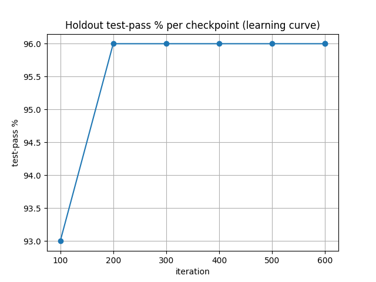 | 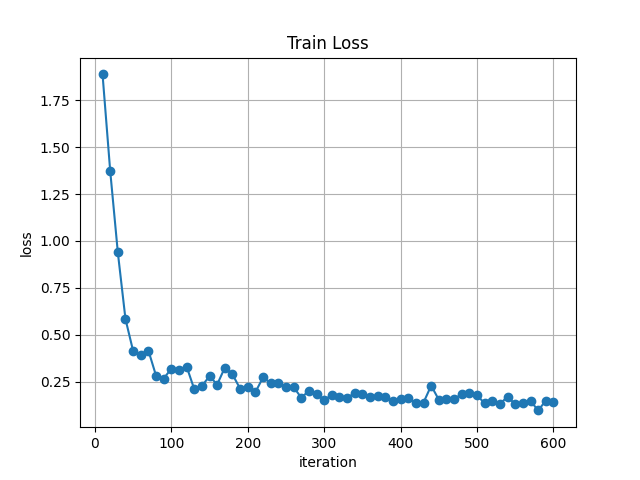 |
| **Learning curve** — holdout test‑pass % per checkpoint (rising then flat). | **Train loss** — drops fast and smooth, no instability. |
| 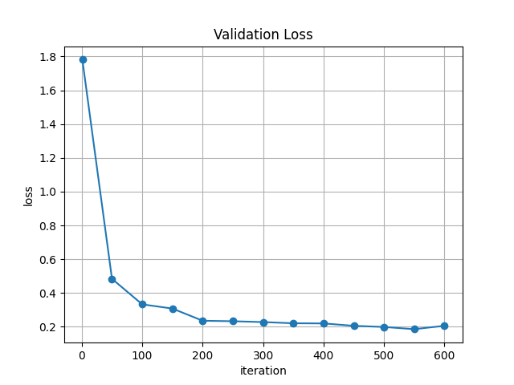 | 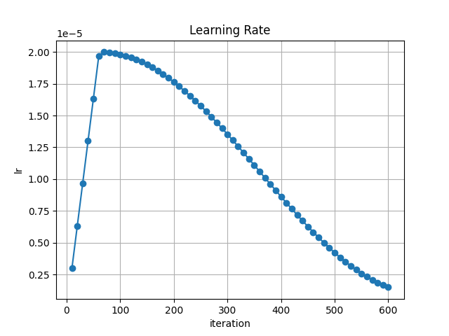 |
| **Validation loss** — tracks train loss (no overfit blow‑up). | **Learning rate** — warmup + schedule. |
| 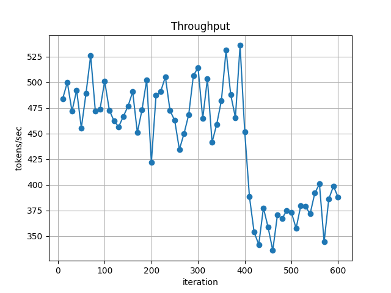 | 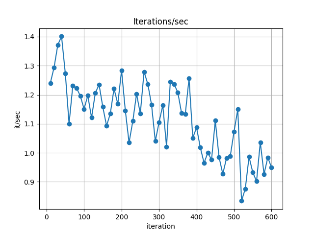 |
| **Throughput (tokens/sec)** during training. | **Throughput (iters/sec)** during training. |
| 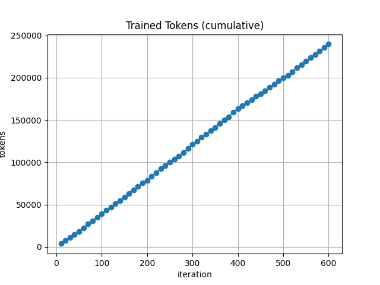 | 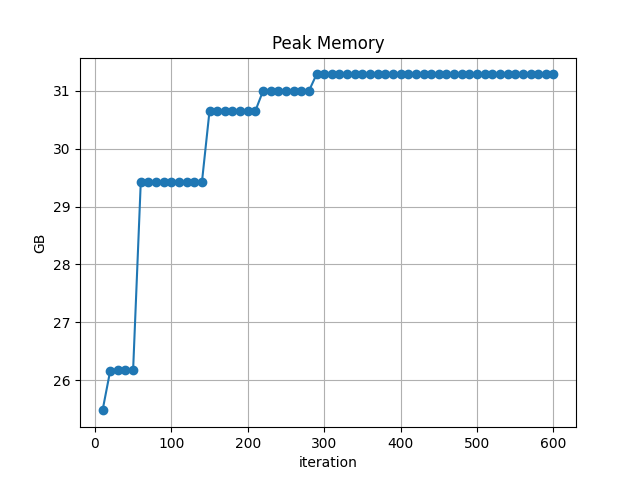 |
| **Cumulative trained tokens.** | **Peak memory** — stays under the 48 GB ceiling (~28 GB). |

---

## 8. Training curves — Gemma

Same harness, same config, same data — only the base model differs.

**Holdout test‑pass % by checkpoint:** 90 → 96 → 96 → 96 → 96 → 96 (iters 100→600).
Nearly identical convergence to Qwen on the function tier: ~96 % by iter 200, flat
after. (The divergence between the two models is on the *graph* tier, §5 — not visible
in these function‑tier curves.)

| | |
|---|---|
| 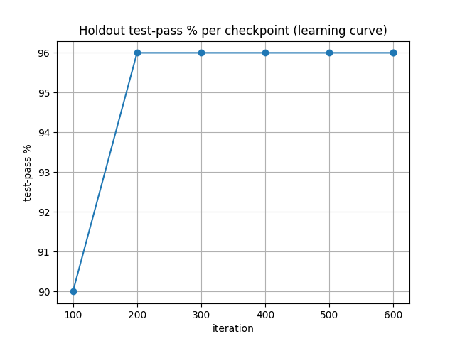 | 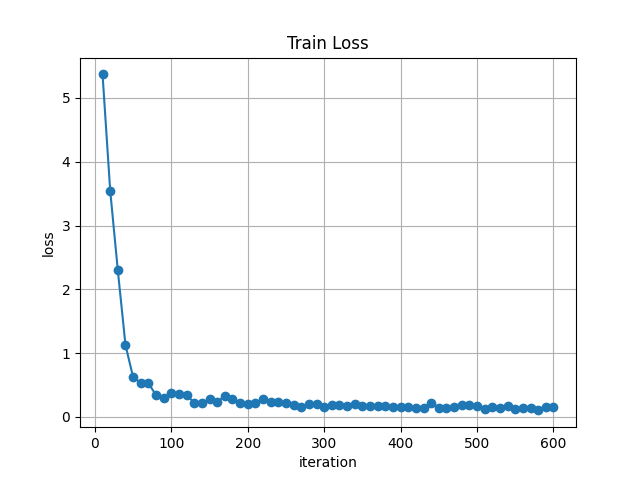 |
| **Learning curve** — holdout test‑pass % per checkpoint. | **Train loss.** |
| 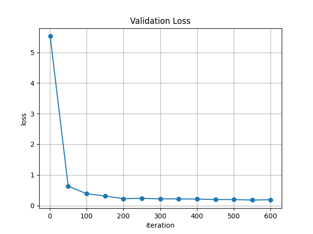 |  |
| **Validation loss.** | **Learning rate.** |
| 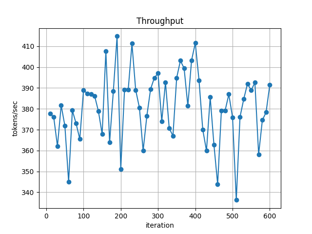 | 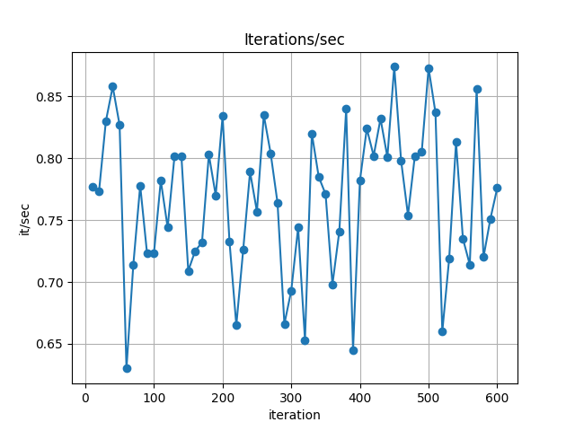 |
| **Throughput (tokens/sec).** | **Throughput (iters/sec).** |
| 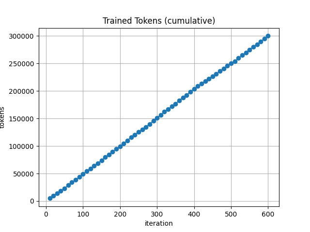 | 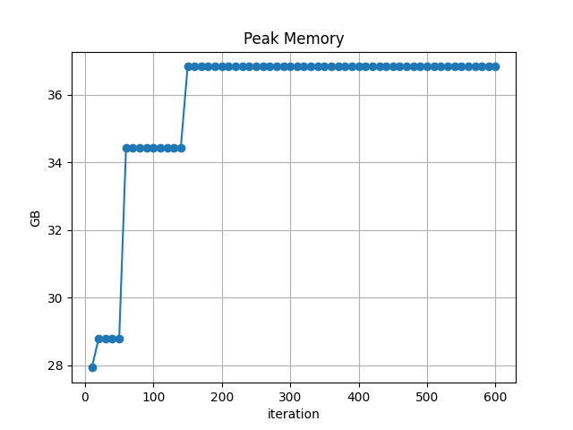 |
| **Cumulative trained tokens.** | **Peak memory** (~28 GB peak; fits 48 GB). |

---

## 9. Qwen vs Gemma — side by side

| dimension | Qwen3‑Coder‑30B | Gemma‑4‑26B | winner |
|---|---|---|---|
| Function test‑pass (SFT) | 94 % | 93 % | ~tie |
| Function convergence | ~96 % @ iter 200 | ~96 % @ iter 200 | tie |
| Stock verbosity | 34.7k tokens | 76.8k tokens | Qwen (leaner stock) |
| SFT token efficiency | −53 % | −75 % | Gemma (bigger cut) |
| **Graph correct (SFT→DPO)** | **46 % → 61 %** | 15 % → 15 % | **Qwen (large margin)** |
| **Graph idiom acquisition** | sim 0.46→0.34, 6.75 constructs | sim 0.67, 0 constructs | **Qwen** |

**Verdict:** the two are interchangeable on *function correctness*, but **Qwen3‑Coder
is the clearly stronger learner of Jac's idiomatic graph constructs** from this
dataset. Qwen is the recommended base for the idiom‑sensitive coding agent.

---

## 10. What this proves

1. **Synthetic, compiler‑validated data teaches a model correct Jac.** Both 30B/26B
   models go from **0 % → ~94 %** behavioral test‑pass on unseen, decontaminated
   tasks — from a single LoRA pass on a laptop‑class machine.
2. **Correctness ≠ idiom, and we can measure the difference.** On functions the model
   learns to *transpile* (sim 0.97) — not a defect, just the absence of idiom headroom.
   The idiom judge exposes this honestly.
3. **Where idiom headroom exists, the model learns idiom — and DPO sharpens it.** On
   graph‑shaped tasks, Qwen goes 0 % → 46 % → 61 % correct and **83 % → 100 %
   idiomatic** among correct outputs, similarity falling toward the 0.26 idiomatic
   reference. The DPO machinery is proven and reusable.
4. **Idiom acquisition is model‑dependent.** Same data, same harness: Qwen learns the
   graph idiom strongly, Gemma weakly. Base‑model choice matters for idiom, not just
   correctness.

**Next levers (all proven‑ready):** scale graph structural variety (binary trees,
linked‑list chains, weighted edges) via `graph_data/gen_graph_struct.py`; push graph
DPO further on top of SFT; expand the graph holdout for tighter idiom statistics.

---

## 11. Reproduce

```bash
./setup_env.sh && source .venv/bin/activate     # venv + jaclang + mlx-lm + matplotlib
./check.sh                                       # toolchain + dataset sanity

# Full SFT probe (quantize → base eval → train → fuse → finetuned eval → graphs):
./run_probe.sh Qwen/Qwen3-Coder-30B-A3B-Instruct qwen
./run_probe.sh google/gemma-4-26b-a4b-it        gemma

# DPO stage on top of SFT:
./run_dpo.sh qwen
./run_dpo.sh gemma

# Graph‑tier idiom eval (target the graph holdout via JAC_HOLDOUT):
JAC_HOLDOUT=dataset/eval_holdout/graph_conversion.jsonl \
JAC_EVAL_MODE=mlx JAC_EVAL_MODEL=models/qwen-jac-fused-q8 \
jac run srccurrent/jacgen/idiom_eval.jac
```

Outputs land in `results/<model>/` (gitignored). The committed copies of the graphs
live in this folder (`resultsft/<model>/`). Full architecture, every module, and all
gotchas: [`../docs/modeltesting/HANDOFF.md`](../docs/modeltesting/HANDOFF.md).

---

### Raw result files (source of every number above)

| File | Contents |
|---|---|
| `results/qwen/base.txt` · `finetuned.txt` | Qwen function base / SFT behavioral |
| `results/qwen/idiom-finetuned.txt` | Qwen function idiom judge (sim 0.968) |
| `results/qwen/graph-idiom-retrain2.txt` | Qwen graph SFT (46 %) |
| `results/qwen/dpo/finetuned.txt` · `graph-idiom.txt` | Qwen DPO function (93 %) / graph (61 %) |
| `results/gemma/base.txt` · `finetuned.txt` | Gemma function base / SFT behavioral |
| `results/gemma/graph-idiom-sft.txt` | Gemma graph SFT (15 %) |
| `results/gemma/dpo/finetuned.txt` · `graph-idiom.txt` | Gemma DPO function / graph |
| `results/<model>/metrics.jsonl` | per‑checkpoint learning curve |
