# CPT-v2 workflow

Operational runbook for this sub-pipeline. Design/rationale of record is [design.md](design.md) — this file is the phase-by-phase map + mermaid diagram, same convention as the top-level `03-new/docs/workflow.md` (which this attempt slots into as an expanded Phase 1/2/Checkpoint-1). Nothing here is implemented yet — status markers below are all `[ ]` until real work lands.

```mermaid
---
config:
  flowchart:
    nodeSpacing: 50
    rankSpacing: 70
  themeVariables:
    fontSize: 15px
---
flowchart TD
    subgraph V1["CPT-v1 (closed, NULL)"]
        V1R["18/20 MCQ, byte-identical to base\nsee cpt-v1-training-results.md"]
    end

    subgraph B1["Corpus build v2"]
        direction TB
        SRC["docs 1.96M + osp_paper 35K\n+ blogs 64K + rehearsal ~230K\nCODE DROPPED (was 992K in v1)"]
        CHUNK["md_chunks + split_paragraphs\n(fence-aware, reused from v1 fix)"]
        CHID["assign meta.chunk_id\n(sha1 of file+section+text[:80])"]
        SRC --> CHUNK --> CHID
    end

    V1 -.->|hypothesis: dilution + instrument mismatch| B1

    subgraph B2["Curation pass (new)"]
        direction TB
        SHINGLE["shingle dedup\n(14-gram, within-source)"]
        FABLE_C["Fable subagent\nkeep / drop / upweight\nbatched 50 chunks, per source"]
        CURJSON["curation.json\n{chunk_id: verdict+reason}"]
        SHINGLE --> FABLE_C --> CURJSON
    end

    CHID --> B2

    subgraph B3["Decontam + pack"]
        DECON["14-gram containment >=0.5\nvs RL holdouts (reused)"]
        APPLY["apply_curation.py\ndrop / upweight rows"]
        PACK["pack_source: EOS-join,\noverlap-on-truncation, 4096-tok windows"]
        MANIFEST["manifest.json"]
        DECON --> APPLY --> PACK --> MANIFEST
    end

    CURJSON --> B3

    subgraph T1["Training: epoch-loop (new)"]
        direction TB
        SCHED["one cosine schedule,\ncomputed for 12-epoch ceiling,\nbefore leg 1 runs"]
        LEG["run leg N\n(1 epoch, resume-adapter-file\nfrom leg N-1)"]
        CKPT["checkpoint\n(*_adapters.safetensors)"]
        CF["CF-check\n16-task harness"]
        GATE{"leg <= 6?\n(floor, protects leg 6 too)"}
        GATE2{"CF == 16/16?"}
        SONNET["Sonnet leg review\n(advisory: loss delta,\nsample gens, log only)"]
        SCHED --> LEG --> CKPT --> CF --> GATE
        GATE -->|yes, floor active| SONNET
        GATE -->|no, past floor| GATE2
        GATE2 -->|pass| SONNET
        SONNET -->|leg < 12| LEG
        GATE2 -->|fail: stop-loss| STOP["halt, keep last\n16/16 checkpoint"]
    end

    MANIFEST --> T1
    T1 -->|leg 12 reached, or stop-loss| ACCEPT_T["cpt-v2 checkpoint\nfused for eval"]

    subgraph E0["Eval question bank (new, reusable)"]
        DOCS_FINAL["final packed docs corpus\n(post-curation)"]
        FABLE_Q["Fable subagent:\n1-2 open-ended Q per chunk"]
        QBANK["questions.json\n~100 Q, linked to source_chunk_id"]
        DOCS_FINAL --> FABLE_Q --> QBANK
    end

    MANIFEST -.-> E0

    subgraph EA["Track A: convergence"]
        GEN_A["greedy decode:\nbase, cpt-v1, cpt-v2\nvs jac-gpt oracle"]
        EMBED["local sentence-transformer\n(all-mpnet / BGE)"]
        COS["cosine similarity\nmean + per-Q win-rate vs base"]
        GEN_A --> EMBED --> COS
    end

    subgraph EB["Track B: win/loss"]
        BLIND["Sonnet blind pairwise:\nCPT-v2 vs jac-gpt,\nvs ground-truth passage,\norder-randomized"]
        WL["win/loss/tie count"]
        BLIND --> WL
    end

    QBANK --> EA
    QBANK --> EB
    ACCEPT_T --> EA
    ACCEPT_T --> EB

    subgraph ORACLE["jac-gpt oracle"]
        CLONE["clone Agentic-AI/jac-gpt-fullstack\n03-new/cpt_train/jac_gpt_oracle/"]
        ENV[".env: OPENAI_API_KEY\n(gitignored, never global)"]
        BOOT["jac start main.jac\ndrive jacServer endpoints"]
        CLONE --> ENV --> BOOT
    end

    ORACLE -.-> EA
    ORACLE -.-> EB

    subgraph VERDICT["Acceptance"]
        BAR["Track A: beats base+v1 by real margin\nAND\nTrack B: wins/ties >=50% vs jac-gpt"]
        COS --> BAR
        WL --> BAR
    end

    style V1 fill:#ffebee,stroke:#c62828
    style B1 fill:#e8f4fd,stroke:#2196F3
    style B2 fill:#fff8e1,stroke:#FFC107
    style B3 fill:#e8f4fd,stroke:#2196F3
    style T1 fill:#fff3e0,stroke:#FF9800
    style E0 fill:#f3e5f5,stroke:#9C27B0
    style EA fill:#e8eaf6,stroke:#3F51B5
    style EB fill:#e8eaf6,stroke:#3F51B5
    style ORACLE fill:#efebe9,stroke:#795548
    style VERDICT fill:#c8e6c9,stroke:#4CAF50
```

---

## Phase B1 — Corpus build v2

Rebuild `03-new/dataset/cpt-v2/` (new path, doesn't touch v1's `03-new/dataset/cpt/`) with `build_cpt.py --drop-code --rehearsal-frac 0.111 --out 03-new/dataset/cpt-v2`. Reuses the fence-aware chunker and overlap-on-truncation packer proven in the v1 rebuild — see `design.md` §2.1 for the exact flag semantics. New: every row gets a stable `meta.chunk_id` so the curation pass (B2) and question-gen (E0) can reference chunks reliably.

**Not started.**

## Phase B2 — Curation pass

Cheap shingle-based within-source dedup flags near-duplicate candidates first (reuses `decontam()`'s 14-gram machinery, chunk-against-chunk instead of chunk-against-holdout). A Fable subagent then judges keep/drop/upweight per chunk, batched 50-at-a-time per source, writing `curation.json` with a logged reason per verdict. See `design.md` §3 for what Fable is and isn't trusted to judge (content quality: yes; cross-file duplicate detection at scale: no, that's the shingle pass).

**Not started.**

## Phase B3 — Decontam + pack

Unchanged decontam (14-gram containment ≥0.5 vs `02-rl-grpo` holdouts) runs on the curated row set. `apply_curation.py` (new, small, deterministic — not LLM-authored) applies drop/upweight verdicts before `pack_source`. Emits `manifest.json` — Studio's `cpt.sv.jac` DATA tab pattern (read manifest live, no restart needed) should extend to this path once implementation starts.

**Not started.**

## Phase T1 — Training: epoch-loop

The core mechanism change from v1. One cosine LR schedule is computed once, for a 12-epoch ceiling, before leg 1 ever runs — not regenerated per leg (design.md §4.2 explains why: regenerating per leg would mean every epoch decays to floor and jumps back to peak, fighting the point of cosine decay entirely). Each leg is one epoch, resumed from the previous leg's checkpoint via the existing `--resume-adapter-file` mechanism already built into `cpt.sv.jac`.

Stop rule (design.md §4.3, exact numbers you approved):
- **Floor 6** — no stop-loss halt before leg 6, log-only if CF dips early.
- **Target 8** — expected landing zone.
- **Ceiling 12** — hard cap, matches the pre-generated schedule's total.
- Past the floor: CF-check `<16/16` halts immediately, keeps the last `16/16` leg's checkpoint.

Sonnet reviews each leg's checkpoint (loss delta, sample generations, log-only — advisory, doesn't gate) — appended to `03-new/results/cpt-v2/leg_reviews.md`.

**Not started.** Blocked on: `mlx_lm.lora` resume-schedule-position verification (design.md §9), `cpt.sv.jac` multi-leg `CPT_TOTAL_ITERS` rework (design.md §4.4) — both implementation-phase items, not decided by this doc.

## Phase E0 — Eval question bank

Fable chunks the **final** (post-curation) packed docs corpus and generates 1-2 open-ended questions per chunk, sampled to ~100 total, saved with a `source_chunk_id` link back to ground truth. Reusable across future CPT attempts, same convention as the v1 20-question MCQ bank.

**Not started.**

## Phase EA / EB — Dual-track eval

Both tracks share the same ~100-question bank, score it two different ways:

- **Track A (convergence)**: base / cpt-v1 / cpt-v2 all answer, embedded locally (sentence-transformers, no API cost), cosine similarity to jac-gpt's answer. Answers "did CPT-v2 move toward jac-gpt's grounding, more than v1 did." Capped at 1.0 = tying jac-gpt — cannot show a win.
- **Track B (win/loss)**: CPT-v2 vs jac-gpt, blind (order-randomized, unlabeled) Sonnet judge scoring against the actual doc passage, not against jac-gpt's phrasing. This is the track that can show "CPT-v2 beats jac-gpt" — see design.md §6.3 for why blinding matters and the honest expectation that jac-gpt's RAG grounding has a structural edge on simple factual lookups specifically.

**Not started.**

## Phase ORACLE — jac-gpt setup

Clone `Agentic-AI/jac-gpt-fullstack` to `03-new/cpt_train/jac_gpt_oracle/` (gitignored). `.env` with `OPENAI_API_KEY` at the clone's own root (auto-loads via its existing `python-dotenv` dependency) — never exported globally, never committed. Drive `jacServer` endpoints programmatically once booted.

**Not started.** Needs your `OPENAI_API_KEY` when this phase starts (design.md §9).

## Phase VERDICT — Acceptance

CPT-v2 accepted only if Track A beats both base and cpt-v1 by a real (non-noise) margin **and** Track B wins/ties ≥50% of questions against jac-gpt. Either track nulling gets reported plainly, same discipline as CPT-v1's null.

---

## Checklist

- [ ] `build_cpt.py` gets `--drop-code`, `--rehearsal-frac`, `--out` flags
- [ ] `meta.chunk_id` added to every built row
- [ ] Shingle within-source dedup pass written
- [ ] Fable curation subagent run, `curation.json` produced
- [ ] `apply_curation.py` written
- [ ] CPT-v2 corpus built (`03-new/dataset/cpt-v2/`), manifest emitted
- [ ] `mlx_lm.lora` resume-schedule-position behavior verified
- [ ] Leg-config generator written (single 12-epoch-ceiling schedule, per-leg iter slices)
- [ ] `cpt.sv.jac` reworked for multi-leg cumulative-total tracking
- [ ] Epoch-loop training run: legs 1-6 (floor, unconditional)
- [ ] Epoch-loop training run: legs 7-12 (stop-loss active) or earlier halt
- [ ] Sonnet leg reviews logged for every completed leg
- [ ] CPT-v2 checkpoint fused for eval
- [ ] `jac-gpt-fullstack` cloned, booted, `OPENAI_API_KEY` in place
- [ ] Fable question bank generated (~100 Q, `source_chunk_id` linked)
- [ ] Track A cosine-sim script written, run
- [ ] Track B Sonnet-judge script written, run
- [ ] Acceptance verdict recorded, `03-new/docs/workflow.md` top-level diagram updated to reflect outcome
