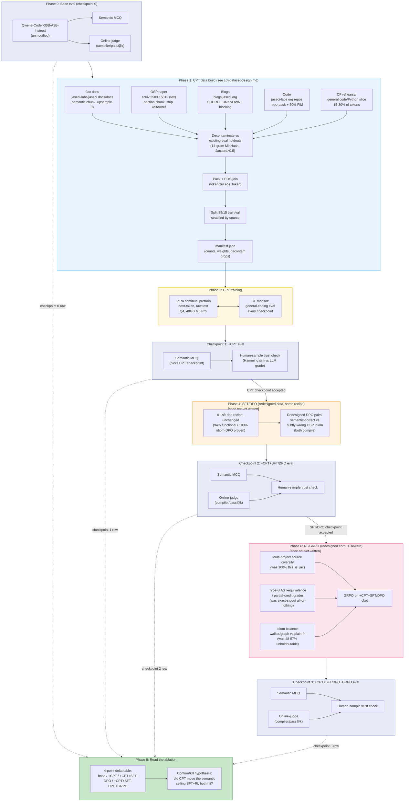

# Attempt 03 Workflow: CPT → SFT/DPO → GRPO

Operational runbook for the full stack. Architecture/ablation/model/eval design of record is [design.md](design.md); CPT data spec is [cpt-dataset-design.md](cpt-dataset-design.md). SFT/DPO and RL/GRPO redesign specs are follow-ups (not yet written — Phase 4 and Phase 6 below are placeholders until those land).

---

## Phase 0 — Base eval (checkpoint 0)

Run unmodified Qwen3-Coder-30B-A3B-Instruct through both eval tracks (semantic MCQ + online-judge). This is the floor every later checkpoint is read against — same discipline as the RL ladder's rung-0.

## Phase 1 — CPT data build

Full detail in [cpt-dataset-design.md](cpt-dataset-design.md). Summary:

1. **Collect 4 sources**: Jac docs (md, semantic-chunked, 3x upsample), OSP paper (tex, section-chunked), blogs (**source location still unresolved — blocking item**), code (jaseci-labs org repos, repo-packed + 50% FIM).
2. **Add CF-rehearsal slice**: general code/Python data, target 15-30% of total CPT tokens (exact ratio TBD by sweep).
3. **Decontaminate** every source against existing eval holdouts (`02-rl-grpo` RL corpus, `01-sft-dpo` eval holdout) — 14-gram MinHash, Jaccard >0.5 flagged/dropped. Most load-bearing on the code source.
4. **Pack**: concatenate documents/chunks, join with the real tokenizer EOS token, truncate final chunk per pack.
5. **Split** 85/15 train/val, stratified by `meta.source`.
6. **Emit manifest**: per-source counts, upsample weights applied, decontam drops, tokenizer/EOS version.

**Gates everything downstream** — no CPT checkpoint exists until this build is done.

## Phase 2 — CPT training

LoRA continual pretrain (next-token, raw text) on the packed CPT dataset, Q4 on 48GB M5 Pro. Track a general-coding regression eval (CF monitor) at every checkpoint alongside training loss — any drop is a stop signal, matches the CF guard in [design.md](design.md) Stage 1.

**DONE (2026-07-14) — `cpt-v1`.** 2586/2586 iters (3 epochs, 862 train windows), 6h49m, exit 0. Train loss −18.5%, val loss −24.4%, moving together (no overfit signature). Peak mem 30.4GB/48GB. Config: `03-new/cpt_train/config.yaml`. Adapter: `03-new/adapters/cpt-v1/` (gitignored). Fused: `models/qwen-cpt-v1-fused-q4`, registered in Studio chat as **Qwen · CPT-v1**. Launched + monitored live through Studio's 03 CPT → TRAIN tab (`studio/cpt.sv.jac`). Full writeup: [cpt-v1-training-results.md](cpt-v1-training-results.md). **CF regression check (2026-07-14): PASS.** 16-task general-Python coding benchmark (`03-new/cpt_train/cf_check/`), exact-output graded — `qwen-q4` 16/16 vs `qwen-cpt-v1` 16/16, zero regression. See [analysis.md](analysis.md).

## Checkpoint 1 — +CPT eval

Semantic MCQ picks the CPT checkpoint to carry forward (cheapest signal, no compiler in the loop). Human-sample trust check (Hamming similarity vs. LLM-graded result on the same subset) must pass before trusting the MCQ result at scale — per [design.md](design.md)'s eval section.

## Phase 4 — SFT/DPO (redesigned data)

*Spec not yet written — this phase is a placeholder until the SFT/DPO redesign follow-up (`design.md` sequencing item 2) lands.* Planned shape: reuse the `01-sft-dpo` LoRA recipe/hyperparameters unchanged; redesign DPO pair composition to contrast semantically-correct vs. subtly-wrong OSP idiom (both compile) instead of syntax-fix pairs. Runs on top of the accepted CPT checkpoint.

## Checkpoint 2 — +CPT+SFT/DPO eval

Full track: semantic MCQ + online-judge (compiler/pass@k, reusing the `02-rl-grpo` harness) + human trust check.

## Phase 6 — RL/GRPO (redesigned corpus+reward)

*Spec not yet written — placeholder until the RL/GRPO redesign follow-up (`design.md` sequencing item 3) lands.* Planned shape: fix the 3 diagnosed `02-rl-grpo` corpus limits — multi-project source diversity (break the 100% `this_is_jac` ceiling), Type-B AST-equivalence/partial-credit grading (replace exact-stdout all-or-nothing), deliberate walker/graph-idiom balance (break the 48-57%-in-one-file concentration). GRPO runs on the accepted +CPT+SFT/DPO checkpoint. New falsifiable hypothesis, not a re-test of the closed `02-rl-grpo` null.

## Checkpoint 3 — +CPT+SFT/DPO+GRPO eval

Same full track as checkpoint 2.

## Phase 8 — Read the ablation

Build the 4-point delta table (base / +CPT / +CPT+SFT-DPO / +CPT+SFT-DPO+GRPO) across both semantic MCQ and behavioral pass rate. Confirms or kills the core hypothesis: does CPT move the semantic ceiling that both SFT and GRPO were previously bumping into (`design.md`'s Problem section)? If checkpoint 3 shows GRPO still flat above checkpoint 2 even with CPT underneath, that's a cleaner, stronger null than the one already recorded in `02-rl-grpo/RL_FINDINGS.md`.

---

## Checklist

- [x] Blog source location resolved (jaseci-labs/jaseci-blogs)
- [x] General-code rehearsal corpus picked + license-checked (codeparrot-clean-valid)
- [x] jaseci-labs org repo inventory enumerated (17 Jac repos, code_gate in manifest.json)
- [ ] Phase 0 base eval recorded (both tracks)
- [x] Phase 1 CPT dataset built, manifest emitted, decontam clean
- [x] Phase 2 CPT training run complete (2586/2586 iters, train loss -18.5%, val loss -24.4% — see `cpt-v1-training-results.md`). **CF regression check PASS** (16/16 both models, zero delta — `analysis.md`).
- [ ] Checkpoint 1 MCQ + trust check recorded, CPT checkpoint accepted
- [ ] SFT/DPO redesign spec written (gates Phase 4)
- [ ] Phase 4 SFT/DPO run, Checkpoint 2 full eval recorded
- [ ] RL/GRPO redesign spec written (gates Phase 6)
- [ ] Phase 6 GRPO run, Checkpoint 3 full eval recorded
- [ ] Phase 8 ablation table built, hypothesis confirmed/killed
