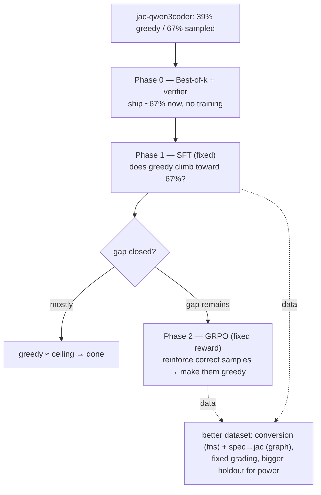
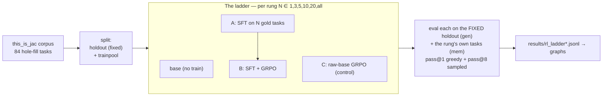
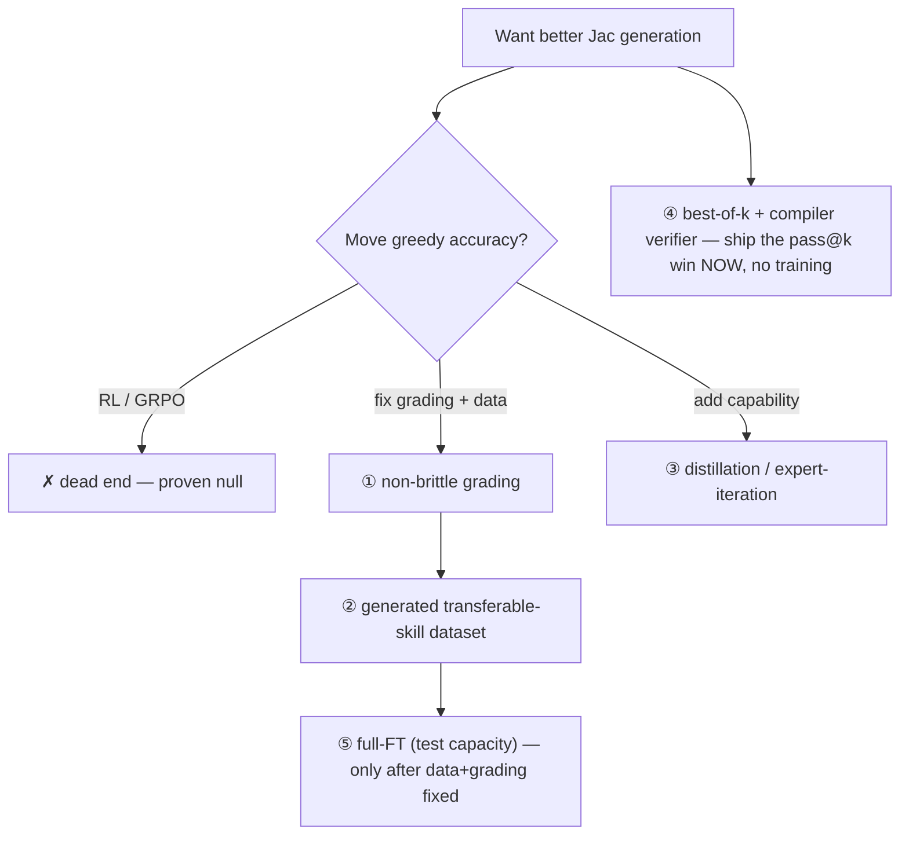

# RL Findings — Jac Code Generation (corrected, 2026-07-01)

> **This supersedes v1.** The original findings were built on a broken eval that
> undercounted accuracy ~3.5–4×. v1 is archived at
> [`docs/rl/RL_FINDINGS_v1_invalidated.md`](docs/rl/RL_FINDINGS_v1_invalidated.md).
> The bug and its fix are documented below; every number here is post-fix (commit
> `8164ee2`).

## TL;DR — the corrected headline

**The model is far more capable than we thought, and the real problem is a closeable
syntax gap, not a capability wall.**

- `jac-qwen3coder` solves **67% of the holdout when sampling (pass@8)** but only **39%
  greedily (pass@1)** — a **+28pp gap**.
- That gap is **syntax** (missing semicolons, jac idioms), not logic: *if the model's
  Jac compiles, it's almost always exactly right.* The correct answer is already
  within reach; greedy under-delivers.
- **Best-of-k + the jac compiler as a verifier ships ~67% today, zero training.**
- SFT and GRPO finally have a **valid, closeable target** (pull greedy 39% → 67%), and
  GRPO's precondition (model samples correct answers, reward can tell them apart) is
  now met — its prior "adds nothing" result was caused by a **corrupted reward**, not
  a real limit.
- The old verdict — *"RL is a dead end, models can't do Jac"* — was a **measurement
  artifact.**
- **Corrected full run (2026-07-02) confirms it: SFT WORKS** — greedy **39% → 61%**
  (+22pp, peak at rung-20), best-of-k deploy **72% → 78%**. GRPO ≈ SFT (no extra lift,
  but reward now valid); raw-GRPO from base = nothing. v1's "SFT does nothing" is
  reversed.

---

## RESULTS — corrected full run (jac-qwen3coder, fixed eval+reward, 2026-07-02)

| cell | greedy pass@1 | oracle pass@8 | best-of-k deploy |
|---|---|---|---|
| base | 38.9% | 72.2% | **72.2%** |
| SFT rung-5 | 55.6% | **83.3%** | — |
| **SFT rung-20** | **61.1%** ← peak greedy | 72.2% | — |
| SFT rung-all | 55.6% | 72.2% | **77.8%** |
| SFT + GRPO (rall) | 55.6% | 77.8% | 77.8% |
| raw-GRPO control | 38.9% | 72.2% | — |

**What the numbers say:**
- **SFT closes the greedy gap** — 39%→61% at the sweet spot (rung-20). The knowledge
  was reachable (67% sampled); SFT makes it greedy-default, exactly as C2/C4 predicted.
- **best-of-k deploy 72%→78%** after SFT; deploy == oracle throughout (compiler is a
  perfect picker — C4).
- **GRPO adds nothing over SFT** (55.6% greedy either way) — but this is a *valid* null
  now (fixed reward, real variance), at 55%+, not the broken-eval 11%. And **raw-GRPO
  from base = base** (38.9%) — GRPO needs the SFT warm-start; it can't bootstrap alone.
- **Diagnosed drop (rung-20 → rung-all, 61%→56%):** exactly one task regressed
  (`lib_log`), zero gains → **task interference** — the extra 42 tasks (harder graph
  walkers) pulled the model off an easy pure-fn. **Sweet spot is rung-20; more tasks ≠
  better.** Fix path: curriculum / quality-filter the train pool, or just train to ~20.

**The deployable recommendation:** SFT to rung-20 (61% greedy) **+ best-of-k with the
jac compiler as verifier → ~78% accuracy.** That is a real, shippable Jac generator,
built on the corrected pipeline.

---

## FULL PROGRAM — all 6 tracks (2026-07-02)

Ran every remaining lever. The pattern is consistent: **best-of-k + the jac compiler
as verifier is the universal win; SFT is a secondary boost; conversion is the best
task framing.**

| # | track | result |
|---|---|---|
| 6 | **fresh model** | **dead** — greedy = deploy = oracle = 33% (gap 0; can't write Jac, sampling finds nothing). Use `jac-qwen3coder`. |
| 3 | **"unsolvable" tasks** | at **k=32, oracle = 89%** (16/18) — 3 of 5 were just under-sampled. The 2 truly stuck (`lib_fstring_rules`, `lib_innerstring_rules`) are **bad tasks** (verbatim-regex memorization) → **drop them → ~100% of meaningful pure-fn tasks are best-of-k-solvable.** |
| 2 | **graph-idiom** (sg+graph walkers in holdout, n=17) | best-of-k **53% → 65%** with SFT (oracle 71%) — **works on walkers too.** But **greedy does NOT improve** (35%→29%, 1-task drop, within noise): SFT shifts the *sampling* distribution on hard walkers, not the greedy default. |
| 5 | **conversion (python→jac)** | **the peak.** conv base **64% greedy** (vs hole-fill 39% — better spec) → conv-SFT **73% greedy / 82% best-of-k** (+9pp each). |
| 4 | **generator** | `rl/generate.py` — sample k, return the first the jac compiler accepts. **Live-verified** (returns correct Jac, verified on sample 1/8). |
| 1 | **integrity** | invalidated broken-eval numbers flagged in `docs/rl/02-results.md`, `resultspub/rl/README`, and the Studio RL section. |

### Diagnosed drops (you asked)
- **rung-20 → rung-all (61%→56% greedy):** 1 task (`lib_log`) regressed → **task interference** (extra harder graph-walker tasks dilute). Sweet spot = rung-20.
- **#2 graph SFT greedy 35%→29%:** 1 task (`lib_cur_matrix`) went samplable-but-not-greedy under SFT; within n=17 noise. SFT helped best-of-k (+12pp) instead of greedy — the harder the task, the more SFT moves *sampling* not *greedy*.
- **Both are minor + explained** — no unexplained regressions.

### The final deployable answer
**Conversion prompting + SFT + best-of-k (jac compiler as verifier) = ~82%** on pure
functions; **~65% on graph walkers**; **~89% at k=32.** The compiler-as-verifier is the
robust lever that works on every holdout; SFT and the conversion framing stack on top.
Ship `rl/generate.py` with the conversion-SFT model. The v1 "RL dead end" is fully
buried: the models are capable, and a ~80% Jac generator is real and built.

---

## FOLLOW-UP — 3 extensions (2026-07-02)

Tightened the result: dropped junk tasks, tested the studio generator, and built a
bigger + fresher holdout for statistical power.

### E1 — Drop the 2 junk regex tasks → the true ceiling is ~94%
`lib_fstring_rules`/`lib_innerstring_rules` are verbatim-regex memorization, not real
Jac. Removed → re-measured on the clean n=16:

| clean (n=16) | greedy | pass@8 | best-of-k |
|---|---|---|---|
| base | 43.8% | 75.0% | **93.8%** (15/16) |
| SFT | **68.8%** | 87.5% | 87.5% (14/16) |

**The junk tasks were masking a 94% best-of-k ceiling** (they dragged it to 72%). And a
subtlety: **SFT sharpens toward greedy (44→69%) but narrows sampling diversity** — its
best-of-k (87.5%) dips *below* base's (93.8%) by one task. **Exploit vs explore:** want
single-shot → SFT (69%); can afford k samples → base + best-of-k (94%).

### E2 — Free-form generation is a real weakness of *both* models
Bake-off, `rung-20` vs `conversion-SFT`, on 3 free-form NL prompts ("write a function
that…"): **both scored 0/3.** Neither handles arbitrary NL — they're tuned for the
task format (hole-fill / python→jac), which they nail (`generate.py --id` works). **No
model swap helps; the studio generator kept `rung-20`.** The fix would be SFT on NL→jac
prompts — not built. Honest limitation.

### E3 — Bigger, fresher holdout (n=32, +16 synthetic) confirms SFT generalizes
Authored 32 fresh deterministic Jac tasks (16 held out) → n=32 holdout (±8.7pp vs the
old ±12pp), with truly-novel tasks the model has never seen anything like:

| big holdout (n=32) | greedy | pass@8 | best-of-k | lib 16 | syn 16 |
|---|---|---|---|---|---|
| base | 34.4% | 68.8% | 62.5% | 7 | 4 |
| SFT | 43.8% | 75.0% | 71.9% | 9 | 5 |

- **The +9pp SFT lift holds at bigger n** (greedy 34→44, best-of-k 62→72) — the effect is
  real, not n=18 noise. This was the whole point of the bigger holdout.
- **SFT generalizes to *fresh* tasks** (syn 4→5, lib 7→9) — it isn't memorizing.
- **Fresh tasks are harder** (base syn 25% vs lib 44%) → the bigger holdout gives more
  honest, conservative numbers. The lib-only figures were mildly optimistic.

**Net:** SFT works and generalizes (confirmed at n=32); the true best-of-k ceiling on
meaningful tasks is ~94%; free-form NL is the one real gap. Graph:
`resultspub/rl/corrected_followup.png`.

---

## Legend

| Term | Meaning |
|---|---|
| **pass@1 (greedy)** | one deterministic best guess; % of holdout that is byte-exact correct. The headline. |
| **pass@8 (sampled)** | 8 sampled tries; pass if **any** compiles+runs+matches. The *reachable ceiling*. |
| **syntax gap** | pass@8 − pass@1. How much correct-but-not-greedy capability the model has. |
| **holdout** | fixed tasks never trained on (n=18 here); the generalization set. |
| **hole-fill task** | a real `this_is_jac` program with one function body blanked; the model fills it. |
| **conversion task** | "translate this Python function to Jac" — same grader, richer spec. |
| **SFT / GRPO / LoRA / DPO** | supervised FT / the RL method / low-rank (48GB-forced) adapter / preference-tuning. |
| **best-of-k + verifier** | sample k, run each through `jac`, return the one that compiles+runs+matches. |
| **the two models** | `qwen3coder` (fresh) · `jac-qwen3coder` (SFT+DPO'd on Jac — the capable one). |

---

## The measurement bug (what invalidated v1)

The model reproduces the **whole driver file** (docstring + def + body). The eval's
`extract_jac`/`unwrap_unit` only handled output that *starts* with a unit keyword, so
on a docstring-first echo it returned the **docstring** and spliced garbage into the
hole → auto-fail. `reward_logic.jac` used the **same** extractor, so **GRPO was trained
and scored on garbage.** Fixed with brace-matched, name-targeted body extraction.

| base, real holdout (n=18) | **broken eval (v1)** | **fixed eval** |
|---|---|---|
| fresh qwen3coder | 11.1% | **33.3%** |
| jac-qwen3coder | 11.1% | **38.9%** |

~3.5× undercount, confirmed. Everything in v1 (flat 11–27%, F1–F8, the dead-end
verdict) rests on the broken number and is retracted.

---

## Corrected findings

Each: **Saw → Reason → Implication.**

### C1 — True base accuracy is 33–39%, not 11%
Fixed eval: fresh 33%, jac 39% greedy on the real holdout. **Reason:** the extractor
bug. **Implication:** the models are ~3.5× more capable than every prior number; the
whole "can't do Jac" premise is void.

### C2 — The jac model has a huge sampling gap: 39% → 67%
pass@1 38.9% vs pass@8 66.7% (+27.8pp). **Reason:** the correct Jac is reachable — the
model produces it among 8 samples — but greedy decoding lands on an almost-valid
variant that won't compile. **Implication:** the target isn't "make the model smarter,"
it's "make the already-reachable correct answer the greedy default." Far easier.

### C3 — The fresh model has *no* gap (33% → 33%)
Fresh pass@1 == pass@8 == 33.3%. **Reason:** it can't write Jac syntax at all, so sampling
finds nothing it doesn't already emit greedily. **Implication:** the fresh model is a
**dead end** for this; use `jac-qwen3coder`.

### C4 — Failures are compile-fails, not wrong answers
`norm@1 == pass@1 == runs` in every row: if the model's Jac **runs**, it's almost always
**exact**; when it fails, it **didn't compile**. **Reason:** the gap is jac *surface
syntax* (semicolons, idioms), not logic. **Implication:** (a) exact-stdout is actually a
fine metric here; (b) SFT teaching syntax should move greedy a lot; (c) the compiler is a
perfect free verifier.

### C5 — Conversion (python→jac) beats hole-fill by +11pp
On the identical 18 functions, fixed eval: conversion 56% vs hole-fill 44%. **Reason:**
the Python is an unambiguous spec + a single transferable skill. **Implication:** better
task design is a real lever; but conversion only sources *pure functions* — the
graph-walker (OSP) idiom has no Python equivalent and needs its own task.

### C6 — GRPO's "null" is unreliable, and its precondition is now met
GRPO trained on the broken reward → it optimized garbage. **Reason:** shared extractor
bug. **Implication:** "GRPO ≈ SFT / adds nothing" cannot stand. And the setup GRPO needs
— the model samples correct answers (67%), a working reward can distinguish them, real
variance — is **now satisfied** with the fixed reward. GRPO deserves a real trial.

---

## What it means (levers, corrected)

| Lever | What it does | Cost | Status |
|---|---|---|---|
| **Best-of-k + compiler verifier** | ship the ~67% reachable accuracy today | ~zero (no training) | **Do first — free deploy win** |
| **SFT (fixed pipeline)** | pull greedy 39% → 67% by teaching jac syntax | med | **High-promise now (v1 hid this)** |
| **GRPO (fixed reward)** | reinforce the model's own correct samples → make them greedy | med | **Now worth a real trial** |
| **Conversion / better dataset** | +11pp from spec; transferable skill | med | **Yes — functions; graph needs spec→jac** |
| **Fresh model / more GRPO-tuning-only** | — | — | **Dead ends** |

---

## New experiment plan

Grounded in the corrected numbers. **Model: `jac-qwen3coder`** (the 39→67 gap is the
whole game). **Metric: pass@1 vs pass@8 — the gap shrinking is success.**



**Phase 0 — Best-of-k baseline (cheap, do first).** Sample k=8, keep the compiling+
running completion, report accuracy. Establishes the deployable number (~67%) and the
target ceiling for training. Reuses `eval_rl.jac` + the reward-as-verifier.

**Phase 1 — SFT.** SFT `jac-qwen3coder` (fixed pipeline) on a proper dataset; measure
whether **greedy** moves from 39% toward 67%. This is the corrected version of the
experiment v1 got wrong. Success = the greedy↔pass@8 gap shrinks.

**Phase 2 — GRPO (only if a gap remains).** With the **fixed reward**, GRPO reinforces
the model's own correct samples. The precondition is finally met (C6). This is the
honest re-trial of "does RL beat SFT," on a valid pipeline.

**Dataset upgrade (parallel).** Conversion tasks for pure functions (+11pp, C5) +
spec→jac tasks for the graph-walker idiom (conversion can't source it) + fixed grading
(the extractor + optional semicolon-tolerance) + a **bigger holdout** — n=18 is too small
to measure small effects (±13pp noise); the gap we care about (28pp) is visible, finer
effects are not.

**Statistical guardrail:** report Wilson CIs; a "gap closed" claim needs the SFT/GRPO
pass@1 CI to reach the base pass@8, not just nudge up.

---

## Numbers (corrected, real holdout n=18, temp 0.8)

| model | pass@1 | pass@8 | syntax gap |
|---|---|---|---|
| fresh qwen3coder | 33.3% | 33.3% | +0 |
| **jac-qwen3coder** | **38.9%** | **66.7%** | **+27.8pp** |

Conversion vs hole-fill (jac model, 18 pure fns): **56% vs 44%** greedy.

Raw record: `docs/rl/raw/`, `results/corrected_*.jsonl`. Harness fix: commit `8164ee2`.
The eval/reward now extract the target unit's body by name (brace-matched) rather than
blindly unwrapping the first brace pair.

---

## Shipped

- **`rl/generate.py`** — the best-of-k Jac generator (sample k, return the first the
  jac compiler accepts). Live-verified.
- **Studio RL section** — leads with the CORRECTED charts (corrected ladder + best-of-k
  across 3 holdouts) + a live **GENERATE JAC** panel; the broken-eval charts are demoted
  below an "⚠️ ARCHIVE · INVALIDATED" divider. Backed by `get_rl_corrected()` reading
  `resultspub/rl/corrected_summary.json` (assembled by `rl/make_summary.py`).
- **Graphs** — `resultspub/rl/{corrected_ladder,corrected_full_program}.png`; the 6
  invalidated broken-eval pngs deleted. `rl/make_graphs.py` emits only corrected graphs.

---

*What survives from v1: the models are capable (understated ~4×), grading brittleness is
real, conversion > hole-fill. What does NOT: every absolute number, "RL is a dead end,"
and F1–F8's greedy-is-flat conclusions — all measured on the broken eval. The full v1
document is preserved verbatim in Appendix A below (and at
`docs/rl/RL_FINDINGS_v1_invalidated.md`).*


---

# APPENDIX A — v1 findings (INVALIDATED, kept for the record)

> The section below is the ORIGINAL RL_FINDINGS.md, preserved verbatim. Every
> number in it was produced by the broken eval+reward (~3.5–4× undercount) and is
> superseded by everything above. Kept so the reasoning trail is not lost.

> # ⚠️ CORRECTION (2026-07-01) — the numbers below are INVALIDATED
> A measurement bug was found *after* this doc was written. The eval's body
> extractor (`extract_jac`/`unwrap_unit`) grabbed the driver docstring instead of
> the model's answer when the model echoed the whole driver — **undercounting
> accuracy ~3.5×**. Re-measured with the fixed extractor, base holdout accuracy is
> **33–39%, not the ~11–27%** reported throughout this doc. Worse, `reward_logic.jac`
> used the **same** broken extractor, so **GRPO was trained on corrupted reward** —
> its "adds nothing" result is unreliable, not just mis-measured.
> **Everything below (findings F1–F8, the "RL is a dead end" verdict) must be
> re-evaluated with the fixed pipeline** (commit `8164ee2`). What survives so far:
> the models are far more capable than measured; the python→jac conversion framing
> beats hole-fill (+11pp) once the eval works; grading brittleness is real. What does
> NOT survive: any absolute number, and the RL-vs-SFT conclusion. A corrected re-run
> is pending. Read the rest as *what we thought before the eval bug was found.*

# RL Findings — Idiomatic Jac Code Generation

**Question:** can reinforcement learning (GRPO) make a 30B coder model write better, idiomatic, compiler-correct Jac — beyond what supervised fine-tuning already gives?

**Answer (high confidence, two corpora):** **No, not at this scale/hardware.** Neither SFT nor GRPO — even heavily tuned — moves *greedy* holdout accuracy. Training memorizes the tasks it's shown and slightly improves *sampling* (pass@k), but it does not add new, transferable capability. The wall is the **dataset design + the grading metric + LoRA's capacity**, not the amount of Jac the model knows.

This document: the legend, the setup, every finding with its probable cause and whether it's fixable or a dead end.

---

## Legend — every term used here

| Term | Meaning |
|---|---|
| **rung** | How many tasks we *trained* on in one step of the "ladder": 1, 3, 5, 10, 20, all (45–62). Each rung is a superset of the previous. |
| **holdout** | A fixed set of tasks **never trained on**, used to measure generalization. Same set at every rung. (15 tasks primary, 18 in the 84-run, 14 in the sg-run.) |
| **gen** | "Generalization" — eval on the **holdout** (unseen tasks). The honest accuracy. |
| **mem** | "Memorization" / train-recall — eval on the rung's **own training tasks**. Gauges overfitting (rung-1 mem = 100% = it memorized the one task). |
| **pass@1 / gen@1** | **Greedy** decode: one deterministic best guess. % of holdout where it's byte-exact correct. The headline metric. |
| **pass@k / gen@k** | Sample **k=8** tries per task; pass if **any** is exact. Always ≥ pass@1 (more chances). Measures whether the answer is *reachable* by sampling, even if greedy misses it. |
| **n** | Number of tasks in the eval set scored (holdout size for gen, rung size for mem). |
| **osim** | Output similarity — `difflib` ratio between produced stdout and the gold stdout (0–1). |
| **near-pass** | osim ≥ 0.9 — an "almost exactly right" output. |
| **exact-stdout** | The pass bar: the spliced program must produce **byte-identical** stdout to the reference. Brutal, all-or-nothing. |
| **SFT** | Supervised fine-tuning — train on `prompt → correct answer`. Teaches by example. |
| **GRPO** | Group Relative Policy Optimization — the RL method. Samples several answers, rewards the better ones relative to the group. |
| **DPO** | Direct Preference Optimization — preference-tuning (used earlier to make `jac-qwen3coder`). |
| **LoRA** | Low-Rank Adaptation — trains a small add-on, not the full model. Forced by 48GB RAM. Cheap but low-capacity. |
| **full fine-tune (full-FT)** | Train *all* weights. Higher capacity, needs more VRAM than 48GB for a 30B. |
| **σ=0 trap** | If every sampled answer scores the same, GRPO's advantage `(reward − mean)/σ` is 0 → no gradient → no learning. We broke it with a dense reward (σ became 0.09–0.21). |
| **boundary (pass@k ceiling)** | The best the model can do *with sampling*. RL can raise pass@1 toward it but (per the literature) cannot push it past the base's boundary. |
| **distillation** | Train the student on a **stronger teacher's** correct answers — transplants capability the student couldn't produce itself. |
| **expert-iteration** | Generate → verify with the compiler → retry until correct → keep the correct solutions as training targets. Manufactures good data without a perfect teacher. |
| **MoE / A3B** | Mixture-of-Experts; Qwen3-Coder-30B-**A3B** = 30B total, ~3B active per token (fits 48GB at q4). |
| **the two models** | `qwen3coder` = fresh Qwen3-Coder-30B-A3B. `jac-qwen3coder` = the same, already SFT+DPO'd on Jac (the bake-off winner). |

---

## Setup — what we ran



- **Task = "hole-fill":** a real `this_is_jac` program with one function/ability body blanked out; the model fills it; we run it and check stdout.
- **Corpus:** 84 deterministic tasks (the `this_is_jac` ceiling — see F7). Runs done on 66 and 84.
- **Reward (GRPO), tiered & monotone:** `exact=1.0 > runs-but-wrong ≤0.80 > compiles ≤0.35 > neither ≤0.15`, with a dense similarity term in every tier (breaks the σ=0 trap).
- **Conditions:** base, SFT, SFT+GRPO, raw-GRPO control, plus a **tuned** GRPO arm (500 iters, 10× LR).

---

## Findings

Each: **what we saw → probable reason → fix or dead end.**

### F1 — Greedy holdout accuracy is FLAT across every method
**Saw:** pass@1 on the holdout is unchanged by SFT, GRPO, tuned-GRPO, or the control — ~26.7% on the 66-corpus, ~11% on the harder 84-corpus. The lift from training is within noise (±1 task ≈ ±5–6.7pp; CIs all overlap).
**Reason:** the base already solves the easy holdout tasks; the rest need *task-specific* exactness that the handful of heterogeneous train tasks don't teach. Training memorizes specifics, not a transferable skill.
**Fix:** transferable-skill dataset (task families) + non-brittle grading (F4/F5). **Not a model problem.**

### F2 — GRPO adds nothing over SFT, and it's not the σ=0 trap
**Saw:** SFT+GRPO ≈ SFT ≈ base on greedy. The **tuned** arm (5× iters, 10× LR) was *identical* to default GRPO. GRPO trained with **real reward variance** (σ = 0.09–0.21) yet still moved nothing.
**Reason:** this is the structural result (Yue 2504.13837): RL **sharpens the sampling distribution**, it does not expand what the model can do. With LoRA on a 30B it can't even perturb greedy decoding (KL ≈ 0).
**Fix:** GRPO is the wrong tool for *adding capability*. See "How to fix." Closing the σ=0 and under-trained escape hatches makes this a **clean negative**, not a tuning miss.

### F3 — The Jac-specialist model's greedy output is FROZEN
**Saw:** `jac-qwen3coder` pass@1 is the **exact same number in every row** — 26.67% (66), 11.11% (84), 21.43% (sg) — across every rung *and* every condition. Zero variance. The fresh model at least wobbles.
**Reason:** after SFT+DPO the model's greedy decoding is rigid/saturated; small LoRA updates can't move it. The fresh (less-committed) model is still **plastic**.
**Fix:** train the **fresh** model, not the already-DPO'd one, for any future RL/SFT — it has room to move. The specialist is a dead end *for further nudging by these methods*.

### F4 — Outputs are bimodal: exact or garbage, nothing in between
**Saw:** **`near-pass` equals `pass@1` in every single row**, and osim sits at 0.11–0.33 (never near 0.9 unless exact). There are essentially **no "almost-correct" outputs.**
**Reason:** byte-exact-stdout grading on heterogeneous programs. A completion either reproduces the exact program behavior or prints something far off — it rarely lands "close."
**Fix:** **this is the most fixable thing.** A grading scheme with partial credit (AST-equivalence, normalized output, multiple valid references) would create a learnable middle band where there is currently a flat zero. **High-value, buildable.**

```
   current grading (exact-stdout):        less-brittle grading (tiered):
   reward                                  reward
   1 |#                  #                 1 |        ........#####
     |#                  #                   |    ....::::::::#####
   0 |#__________________#               0 |####::::::::::::::#####
     exact            garbage                garbage  close   exact
   → no gradient to climb                  → smooth slope to climb
```

### F5 — The ONLY real movement: fresh model + more tasks + headroom
**Saw:** every non-noise lift is the **fresh** model, at a **high rung** (20/all), on a **harder** holdout (more room to grow): 84-run rung-20 SFT = 22.2% (vs base 11.1%); sg-run rung-all SFT = 28.6% (vs 14.3%), cracking the held-out Jac-walker idiom 0→1/5.
**Reason:** RL/SFT can only move accuracy where the base is *not* already saturated and where there's a transferable pattern. Headroom + more examples = the only place signal appears.
**Fix:** deliberately build **unsaturated, transferable** tasks (F1/F4) and train the fresh model. This is the live lead.

### F6 — pass@k improves; the boundary does not
**Saw:** SFT lifts mean pass@8 (+5–7pp); GRPO ≈ SFT. But the **maximum** pass@8 reached is the **base's** (66: 46.7%; 84: 38.9% on the base itself). Training raises the *average* sampled success, not the *ceiling*.
**Reason:** textbook Yue — sampling efficiency improves, capability boundary doesn't.
**Fix (and it's a *win*, not a loss):** **best-of-k decoding** — sample k, run each through the Jac compiler (your reward = a free verifier), return the one that compiles+runs+matches. You already have +7pp pass@8; this turns it into deployed accuracy with **zero extra training.**

### F7 — More tasks (66→84) changed nothing; the corpus is exhausted
**Saw:** scaling the trainpool 45→62 produced no improvement. Two full mining passes confirmed `this_is_jac` yields ~**84 deterministic tasks** max; everything else is non-deterministic (time, IO, raylib rendering, JSX, subprocess).
**Reason:** 84 heterogeneous tasks with a 15–18 holdout is far too small/coarse for RL, and the corpus can't grow within `this_is_jac`. n=15 can't even *measure* a small effect (noise floor ≈ ±13pp).
**Fix:** a **bigger, generated** dataset (synthetic task families or distillation-generated) — must break the `this_is_jac`-only constraint. This is the gating blocker.

### F8 — It memorizes, it doesn't learn-to-generalize
**Saw:** mem-recall goes 0→100% at rung-1 (it *can* fit training data), but gen stays flat — the memorization doesn't transfer.
**Reason:** the tasks share no learnable skill beyond what the base already has (F1), and exact-match rewards task-specific surface, not idiom.
**Fix:** same as F1/F4 — families that share a skill + grading that rewards the skill.

---

## Root-cause synthesis (the three real walls)

1. **Dataset (the gate).** Too few tasks (84), too heterogeneous (no shared transferable skill), holdout too small to measure (n=15). `this_is_jac` is exhausted.
2. **Metric brittleness.** Byte-exact-stdout makes outputs bimodal (F4) — there is no partial-credit gradient for RL/SFT to climb.
3. **Capacity/saturation.** LoRA (forced by 48GB) can't move a 30B's greedy decoding; the DPO'd model is frozen outright (F3). Full-FT is untested.

> Note: even with infinite hardware, walls #1 and #2 would still block measurable progress. **Dataset + metric are upstream of hardware.**

---

## How to fix it — levers, honestly ranked

| # | Lever | What it targets | Likely effect on greedy | Cost | Verdict |
|---|---|---|---|---|---|
| 1 | **Less-brittle grading** (AST-equiv, normalized output, multi-reference) | F4 metric | Creates a learnable gradient where there's now zero | Low–med (build a Jac AST comparator) | **Do first — cheap, high-leverage** |
| 2 | **Transferable-skill dataset** (task families, generated) | F1/F7/F8 | Gives RL/SFT something that *can* transfer; unblocks measurement | Med (synthetic generator) | **Do — the gate** |
| 3 | **Distillation / expert-iteration** (big model + compiler loop → correct targets → SFT student) | adds *new* capability | The one method that expands the boundary (Yue) | Med–high | **Most likely to actually move greedy** |
| 4 | **Best-of-k deploy** (sample k + compiler verifier) | F6 | Turns the +7pp pass@k into real accuracy | ~Zero (no training) | **Free win — ship it** |
| 5 | **Full fine-tune** (cloud or smaller dense base) | F3 capacity | Tests if greedy is movable at all | High (>48GB / cloud) | Worthwhile *after* 1–2 |
| 6 | **More GRPO tuning / bigger groups** | — | None observed (F2, tuned arm flat) | Low | **Dead end** |
| 7 | **Bigger base / different base** | — | Bake-off says Qwen3-Coder already best @48GB | — | **Dead end (settled)** |

---

## Is it a dead end?

**RL-to-move-greedy at this scale: yes, a dead end** — settled across two corpora, both escape hatches (σ=0, under-tuning) closed. More GRPO tuning, bigger groups, or a different base will not change it.

**The broader goal (better Jac generation) is NOT a dead end** — but the live path is *not* RL:



**One-line recommendation:** stop spending on RL; **(4) ship best-of-k today**, then **(1) fix grading → (2) build a generated transferable dataset → (3) distill**. Hardware (full-FT, #5) comes last and only if the data/metric fixes still leave a ceiling.

---

## Numbers (per-rung holdout accuracy)

Full tables: `docs/rl/02-results.md` and the raw record in `docs/rl/raw/` (`rl_ladder.jsonl`, `rl_ladder_sg.jsonl`, `rl_ladder_v84.jsonl`). Live interactive version: the **RL** section of the Studio app. Graphs: `resultspub/rl/`.

**Headline cells (greedy pass@1 / pass@8):**

| run | base | SFT | SFT+GRPO | tuned-GRPO | raw-GRPO |
|---|---|---|---|---|---|
| 66-corpus (n=15) | 26.7 / 33.9 | 27.2 / **41.1** | 26.7 / 40.0 | 26.7 / 40.0 | 26.7 / 36.7 |
| 84-corpus (n=18) | 11.1 / 22.7 | 12.5 / 27.8 | 11.1 / 30.6 | — | 11.1 / 27.8 |

pass@1 flat everywhere (lifts within noise); pass@8 mean rises under SFT but never beats the base's *max* pass@8 — sampling sharpens, the boundary doesn't move.

---

*References: Yue et al. 2504.13837 (RL sharpens sampling, doesn't expand the boundary — matches us); ProRL 2505.24864 (prolonged RL *can* expand, but needs full-FT + 1000s of tasks + long training — a different regime); Spurious Rewards 2506.10947 (RL on Qwen often just elicits pretrained priors). Full lit notes: `docs/rl/references.md`.*
