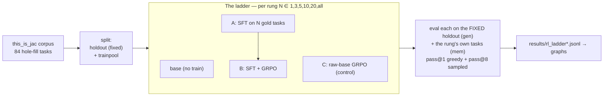
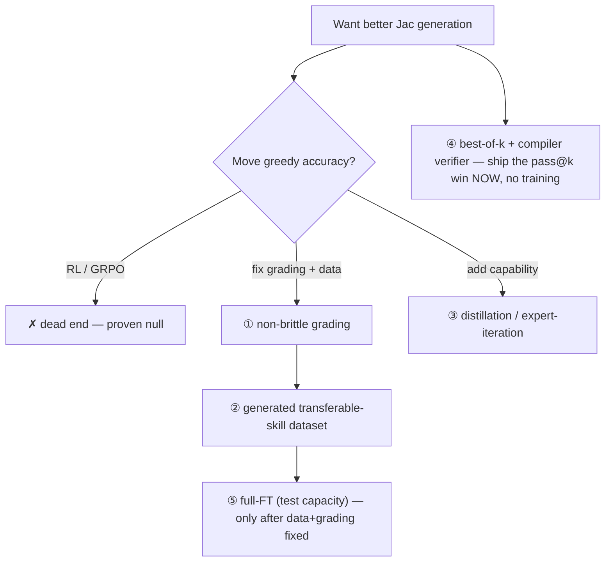

> # ⚠️ CORRECTION (2026-07-01) — the numbers below are INVALIDATED
> A measurement bug was found *after* this doc was written. The eval's body
> extractor (`extract_jac`/`unwrap_unit`) grabbed the driver docstring instead of
> the model's answer when the model echoed the whole driver — **undercounting
> accuracy ~3.5×**. Re-measured with the fixed extractor, base holdout accuracy is
> **33–39%, not the ~11–27%** reported throughout this doc. Worse, `reward_logic.jac`
> used the **same** broken extractor, so **GRPO was trained on corrupted reward** —
> its "adds nothing" result is unreliable, not just mis-measured.
> **Everything below (findings F1–F8, the "RL is a dead end" verdict) must be
> re-evaluated with the fixed pipeline** (commit `8164ee2`). What survives so far:
> the models are far more capable than measured; the python→jac conversion framing
> beats hole-fill (+11pp) once the eval works; grading brittleness is real. What does
> NOT survive: any absolute number, and the RL-vs-SFT conclusion. A corrected re-run
> is pending. Read the rest as *what we thought before the eval bug was found.*

# RL Findings — Idiomatic Jac Code Generation

**Question:** can reinforcement learning (GRPO) make a 30B coder model write better, idiomatic, compiler-correct Jac — beyond what supervised fine-tuning already gives?

**Answer (high confidence, two corpora):** **No, not at this scale/hardware.** Neither SFT nor GRPO — even heavily tuned — moves *greedy* holdout accuracy. Training memorizes the tasks it's shown and slightly improves *sampling* (pass@k), but it does not add new, transferable capability. The wall is the **dataset design + the grading metric + LoRA's capacity**, not the amount of Jac the model knows.

This document: the legend, the setup, every finding with its probable cause and whether it's fixable or a dead end.

---

## Legend — every term used here

| Term | Meaning |
|---|---|
| **rung** | How many tasks we *trained* on in one step of the "ladder": 1, 3, 5, 10, 20, all (45–62). Each rung is a superset of the previous. |
| **holdout** | A fixed set of tasks **never trained on**, used to measure generalization. Same set at every rung. (15 tasks primary, 18 in the 84-run, 14 in the sg-run.) |
| **gen** | "Generalization" — eval on the **holdout** (unseen tasks). The honest accuracy. |
| **mem** | "Memorization" / train-recall — eval on the rung's **own training tasks**. Gauges overfitting (rung-1 mem = 100% = it memorized the one task). |
| **pass@1 / gen@1** | **Greedy** decode: one deterministic best guess. % of holdout where it's byte-exact correct. The headline metric. |
| **pass@k / gen@k** | Sample **k=8** tries per task; pass if **any** is exact. Always ≥ pass@1 (more chances). Measures whether the answer is *reachable* by sampling, even if greedy misses it. |
| **n** | Number of tasks in the eval set scored (holdout size for gen, rung size for mem). |
| **osim** | Output similarity — `difflib` ratio between produced stdout and the gold stdout (0–1). |
| **near-pass** | osim ≥ 0.9 — an "almost exactly right" output. |
| **exact-stdout** | The pass bar: the spliced program must produce **byte-identical** stdout to the reference. Brutal, all-or-nothing. |
| **SFT** | Supervised fine-tuning — train on `prompt → correct answer`. Teaches by example. |
| **GRPO** | Group Relative Policy Optimization — the RL method. Samples several answers, rewards the better ones relative to the group. |
| **DPO** | Direct Preference Optimization — preference-tuning (used earlier to make `jac-qwen3coder`). |
| **LoRA** | Low-Rank Adaptation — trains a small add-on, not the full model. Forced by 48GB RAM. Cheap but low-capacity. |
| **full fine-tune (full-FT)** | Train *all* weights. Higher capacity, needs more VRAM than 48GB for a 30B. |
| **σ=0 trap** | If every sampled answer scores the same, GRPO's advantage `(reward − mean)/σ` is 0 → no gradient → no learning. We broke it with a dense reward (σ became 0.09–0.21). |
| **boundary (pass@k ceiling)** | The best the model can do *with sampling*. RL can raise pass@1 toward it but (per the literature) cannot push it past the base's boundary. |
| **distillation** | Train the student on a **stronger teacher's** correct answers — transplants capability the student couldn't produce itself. |
| **expert-iteration** | Generate → verify with the compiler → retry until correct → keep the correct solutions as training targets. Manufactures good data without a perfect teacher. |
| **MoE / A3B** | Mixture-of-Experts; Qwen3-Coder-30B-**A3B** = 30B total, ~3B active per token (fits 48GB at q4). |
| **the two models** | `qwen3coder` = fresh Qwen3-Coder-30B-A3B. `jac-qwen3coder` = the same, already SFT+DPO'd on Jac (the bake-off winner). |

---

## Setup — what we ran



- **Task = "hole-fill":** a real `this_is_jac` program with one function/ability body blanked out; the model fills it; we run it and check stdout.
- **Corpus:** 84 deterministic tasks (the `this_is_jac` ceiling — see F7). Runs done on 66 and 84.
- **Reward (GRPO), tiered & monotone:** `exact=1.0 > runs-but-wrong ≤0.80 > compiles ≤0.35 > neither ≤0.15`, with a dense similarity term in every tier (breaks the σ=0 trap).
- **Conditions:** base, SFT, SFT+GRPO, raw-GRPO control, plus a **tuned** GRPO arm (500 iters, 10× LR).

---

## Findings

Each: **what we saw → probable reason → fix or dead end.**

### F1 — Greedy holdout accuracy is FLAT across every method
**Saw:** pass@1 on the holdout is unchanged by SFT, GRPO, tuned-GRPO, or the control — ~26.7% on the 66-corpus, ~11% on the harder 84-corpus. The lift from training is within noise (±1 task ≈ ±5–6.7pp; CIs all overlap).
**Reason:** the base already solves the easy holdout tasks; the rest need *task-specific* exactness that the handful of heterogeneous train tasks don't teach. Training memorizes specifics, not a transferable skill.
**Fix:** transferable-skill dataset (task families) + non-brittle grading (F4/F5). **Not a model problem.**

### F2 — GRPO adds nothing over SFT, and it's not the σ=0 trap
**Saw:** SFT+GRPO ≈ SFT ≈ base on greedy. The **tuned** arm (5× iters, 10× LR) was *identical* to default GRPO. GRPO trained with **real reward variance** (σ = 0.09–0.21) yet still moved nothing.
**Reason:** this is the structural result (Yue 2504.13837): RL **sharpens the sampling distribution**, it does not expand what the model can do. With LoRA on a 30B it can't even perturb greedy decoding (KL ≈ 0).
**Fix:** GRPO is the wrong tool for *adding capability*. See "How to fix." Closing the σ=0 and under-trained escape hatches makes this a **clean negative**, not a tuning miss.

### F3 — The Jac-specialist model's greedy output is FROZEN
**Saw:** `jac-qwen3coder` pass@1 is the **exact same number in every row** — 26.67% (66), 11.11% (84), 21.43% (sg) — across every rung *and* every condition. Zero variance. The fresh model at least wobbles.
**Reason:** after SFT+DPO the model's greedy decoding is rigid/saturated; small LoRA updates can't move it. The fresh (less-committed) model is still **plastic**.
**Fix:** train the **fresh** model, not the already-DPO'd one, for any future RL/SFT — it has room to move. The specialist is a dead end *for further nudging by these methods*.

### F4 — Outputs are bimodal: exact or garbage, nothing in between
**Saw:** **`near-pass` equals `pass@1` in every single row**, and osim sits at 0.11–0.33 (never near 0.9 unless exact). There are essentially **no "almost-correct" outputs.**
**Reason:** byte-exact-stdout grading on heterogeneous programs. A completion either reproduces the exact program behavior or prints something far off — it rarely lands "close."
**Fix:** **this is the most fixable thing.** A grading scheme with partial credit (AST-equivalence, normalized output, multiple valid references) would create a learnable middle band where there is currently a flat zero. **High-value, buildable.**

```
   current grading (exact-stdout):        less-brittle grading (tiered):
   reward                                  reward
   1 |#                  #                 1 |        ........#####
     |#                  #                   |    ....::::::::#####
   0 |#__________________#               0 |####::::::::::::::#####
     exact            garbage                garbage  close   exact
   → no gradient to climb                  → smooth slope to climb
```

### F5 — The ONLY real movement: fresh model + more tasks + headroom
**Saw:** every non-noise lift is the **fresh** model, at a **high rung** (20/all), on a **harder** holdout (more room to grow): 84-run rung-20 SFT = 22.2% (vs base 11.1%); sg-run rung-all SFT = 28.6% (vs 14.3%), cracking the held-out Jac-walker idiom 0→1/5.
**Reason:** RL/SFT can only move accuracy where the base is *not* already saturated and where there's a transferable pattern. Headroom + more examples = the only place signal appears.
**Fix:** deliberately build **unsaturated, transferable** tasks (F1/F4) and train the fresh model. This is the live lead.

### F6 — pass@k improves; the boundary does not
**Saw:** SFT lifts mean pass@8 (+5–7pp); GRPO ≈ SFT. But the **maximum** pass@8 reached is the **base's** (66: 46.7%; 84: 38.9% on the base itself). Training raises the *average* sampled success, not the *ceiling*.
**Reason:** textbook Yue — sampling efficiency improves, capability boundary doesn't.
**Fix (and it's a *win*, not a loss):** **best-of-k decoding** — sample k, run each through the Jac compiler (your reward = a free verifier), return the one that compiles+runs+matches. You already have +7pp pass@8; this turns it into deployed accuracy with **zero extra training.**

### F7 — More tasks (66→84) changed nothing; the corpus is exhausted
**Saw:** scaling the trainpool 45→62 produced no improvement. Two full mining passes confirmed `this_is_jac` yields ~**84 deterministic tasks** max; everything else is non-deterministic (time, IO, raylib rendering, JSX, subprocess).
**Reason:** 84 heterogeneous tasks with a 15–18 holdout is far too small/coarse for RL, and the corpus can't grow within `this_is_jac`. n=15 can't even *measure* a small effect (noise floor ≈ ±13pp).
**Fix:** a **bigger, generated** dataset (synthetic task families or distillation-generated) — must break the `this_is_jac`-only constraint. This is the gating blocker.

### F8 — It memorizes, it doesn't learn-to-generalize
**Saw:** mem-recall goes 0→100% at rung-1 (it *can* fit training data), but gen stays flat — the memorization doesn't transfer.
**Reason:** the tasks share no learnable skill beyond what the base already has (F1), and exact-match rewards task-specific surface, not idiom.
**Fix:** same as F1/F4 — families that share a skill + grading that rewards the skill.

---

## Root-cause synthesis (the three real walls)

1. **Dataset (the gate).** Too few tasks (84), too heterogeneous (no shared transferable skill), holdout too small to measure (n=15). `this_is_jac` is exhausted.
2. **Metric brittleness.** Byte-exact-stdout makes outputs bimodal (F4) — there is no partial-credit gradient for RL/SFT to climb.
3. **Capacity/saturation.** LoRA (forced by 48GB) can't move a 30B's greedy decoding; the DPO'd model is frozen outright (F3). Full-FT is untested.

> Note: even with infinite hardware, walls #1 and #2 would still block measurable progress. **Dataset + metric are upstream of hardware.**

---

## How to fix it — levers, honestly ranked

| # | Lever | What it targets | Likely effect on greedy | Cost | Verdict |
|---|---|---|---|---|---|
| 1 | **Less-brittle grading** (AST-equiv, normalized output, multi-reference) | F4 metric | Creates a learnable gradient where there's now zero | Low–med (build a Jac AST comparator) | **Do first — cheap, high-leverage** |
| 2 | **Transferable-skill dataset** (task families, generated) | F1/F7/F8 | Gives RL/SFT something that *can* transfer; unblocks measurement | Med (synthetic generator) | **Do — the gate** |
| 3 | **Distillation / expert-iteration** (big model + compiler loop → correct targets → SFT student) | adds *new* capability | The one method that expands the boundary (Yue) | Med–high | **Most likely to actually move greedy** |
| 4 | **Best-of-k deploy** (sample k + compiler verifier) | F6 | Turns the +7pp pass@k into real accuracy | ~Zero (no training) | **Free win — ship it** |
| 5 | **Full fine-tune** (cloud or smaller dense base) | F3 capacity | Tests if greedy is movable at all | High (>48GB / cloud) | Worthwhile *after* 1–2 |
| 6 | **More GRPO tuning / bigger groups** | — | None observed (F2, tuned arm flat) | Low | **Dead end** |
| 7 | **Bigger base / different base** | — | Bake-off says Qwen3-Coder already best @48GB | — | **Dead end (settled)** |

---

## Is it a dead end?

**RL-to-move-greedy at this scale: yes, a dead end** — settled across two corpora, both escape hatches (σ=0, under-tuning) closed. More GRPO tuning, bigger groups, or a different base will not change it.

**The broader goal (better Jac generation) is NOT a dead end** — but the live path is *not* RL:



**One-line recommendation:** stop spending on RL; **(4) ship best-of-k today**, then **(1) fix grading → (2) build a generated transferable dataset → (3) distill**. Hardware (full-FT, #5) comes last and only if the data/metric fixes still leave a ceiling.

---

## Numbers (per-rung holdout accuracy)

Full tables: `docs/rl/02-results.md` and the raw record in `docs/rl/raw/` (`rl_ladder.jsonl`, `rl_ladder_sg.jsonl`, `rl_ladder_v84.jsonl`). Live interactive version: the **RL** section of the Studio app. Graphs: `resultspub/rl/`.

**Headline cells (greedy pass@1 / pass@8):**

| run | base | SFT | SFT+GRPO | tuned-GRPO | raw-GRPO |
|---|---|---|---|---|---|
| 66-corpus (n=15) | 26.7 / 33.9 | 27.2 / **41.1** | 26.7 / 40.0 | 26.7 / 40.0 | 26.7 / 36.7 |
| 84-corpus (n=18) | 11.1 / 22.7 | 12.5 / 27.8 | 11.1 / 30.6 | — | 11.1 / 27.8 |

pass@1 flat everywhere (lifts within noise); pass@8 mean rises under SFT but never beats the base's *max* pass@8 — sampling sharpens, the boundary doesn't move.

---

*References: Yue et al. 2504.13837 (RL sharpens sampling, doesn't expand the boundary — matches us); ProRL 2505.24864 (prolonged RL *can* expand, but needs full-FT + 1000s of tasks + long training — a different regime); Spurious Rewards 2506.10947 (RL on Qwen often just elicits pretrained priors). Full lit notes: `docs/rl/references.md`.*
