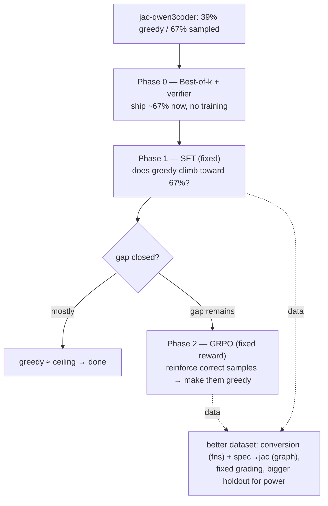

# RL Findings — Jac Code Generation (corrected, 2026-07-01)

> **This supersedes v1.** The original findings were built on a broken eval that
> undercounted accuracy ~3.5–4×. v1 is archived at
> [`docs/rl/RL_FINDINGS_v1_invalidated.md`](docs/rl/RL_FINDINGS_v1_invalidated.md).
> The bug and its fix are documented below; every number here is post-fix (commit
> `8164ee2`).

## TL;DR — the corrected headline

**The model is far more capable than we thought, and the real problem is a closeable
syntax gap, not a capability wall.**

- `jac-qwen3coder` solves **67% of the holdout when sampling (pass@8)** but only **39%
  greedily (pass@1)** — a **+28pp gap**.
- That gap is **syntax** (missing semicolons, jac idioms), not logic: *if the model's
  Jac compiles, it's almost always exactly right.* The correct answer is already
  within reach; greedy under-delivers.
- **Best-of-k + the jac compiler as a verifier ships ~67% today, zero training.**
- SFT and GRPO finally have a **valid, closeable target** (pull greedy 39% → 67%), and
  GRPO's precondition (model samples correct answers, reward can tell them apart) is
  now met — its prior "adds nothing" result was caused by a **corrupted reward**, not
  a real limit.
- The old verdict — *"RL is a dead end, models can't do Jac"* — was a **measurement
  artifact.**

---

## Legend

| Term | Meaning |
|---|---|
| **pass@1 (greedy)** | one deterministic best guess; % of holdout that is byte-exact correct. The headline. |
| **pass@8 (sampled)** | 8 sampled tries; pass if **any** compiles+runs+matches. The *reachable ceiling*. |
| **syntax gap** | pass@8 − pass@1. How much correct-but-not-greedy capability the model has. |
| **holdout** | fixed tasks never trained on (n=18 here); the generalization set. |
| **hole-fill task** | a real `this_is_jac` program with one function body blanked; the model fills it. |
| **conversion task** | "translate this Python function to Jac" — same grader, richer spec. |
| **SFT / GRPO / LoRA / DPO** | supervised FT / the RL method / low-rank (48GB-forced) adapter / preference-tuning. |
| **best-of-k + verifier** | sample k, run each through `jac`, return the one that compiles+runs+matches. |
| **the two models** | `qwen3coder` (fresh) · `jac-qwen3coder` (SFT+DPO'd on Jac — the capable one). |

---

## The measurement bug (what invalidated v1)

The model reproduces the **whole driver file** (docstring + def + body). The eval's
`extract_jac`/`unwrap_unit` only handled output that *starts* with a unit keyword, so
on a docstring-first echo it returned the **docstring** and spliced garbage into the
hole → auto-fail. `reward_logic.jac` used the **same** extractor, so **GRPO was trained
and scored on garbage.** Fixed with brace-matched, name-targeted body extraction.

| base, real holdout (n=18) | **broken eval (v1)** | **fixed eval** |
|---|---|---|
| fresh qwen3coder | 11.1% | **33.3%** |
| jac-qwen3coder | 11.1% | **38.9%** |

~3.5× undercount, confirmed. Everything in v1 (flat 11–27%, F1–F8, the dead-end
verdict) rests on the broken number and is retracted.

---

## Corrected findings

Each: **Saw → Reason → Implication.**

### C1 — True base accuracy is 33–39%, not 11%
Fixed eval: fresh 33%, jac 39% greedy on the real holdout. **Reason:** the extractor
bug. **Implication:** the models are ~3.5× more capable than every prior number; the
whole "can't do Jac" premise is void.

### C2 — The jac model has a huge sampling gap: 39% → 67%
pass@1 38.9% vs pass@8 66.7% (+27.8pp). **Reason:** the correct Jac is reachable — the
model produces it among 8 samples — but greedy decoding lands on an almost-valid
variant that won't compile. **Implication:** the target isn't "make the model smarter,"
it's "make the already-reachable correct answer the greedy default." Far easier.

### C3 — The fresh model has *no* gap (33% → 33%)
Fresh pass@1 == pass@8 == 33.3%. **Reason:** it can't write Jac syntax at all, so sampling
finds nothing it doesn't already emit greedily. **Implication:** the fresh model is a
**dead end** for this; use `jac-qwen3coder`.

### C4 — Failures are compile-fails, not wrong answers
`norm@1 == pass@1 == runs` in every row: if the model's Jac **runs**, it's almost always
**exact**; when it fails, it **didn't compile**. **Reason:** the gap is jac *surface
syntax* (semicolons, idioms), not logic. **Implication:** (a) exact-stdout is actually a
fine metric here; (b) SFT teaching syntax should move greedy a lot; (c) the compiler is a
perfect free verifier.

### C5 — Conversion (python→jac) beats hole-fill by +11pp
On the identical 18 functions, fixed eval: conversion 56% vs hole-fill 44%. **Reason:**
the Python is an unambiguous spec + a single transferable skill. **Implication:** better
task design is a real lever; but conversion only sources *pure functions* — the
graph-walker (OSP) idiom has no Python equivalent and needs its own task.

### C6 — GRPO's "null" is unreliable, and its precondition is now met
GRPO trained on the broken reward → it optimized garbage. **Reason:** shared extractor
bug. **Implication:** "GRPO ≈ SFT / adds nothing" cannot stand. And the setup GRPO needs
— the model samples correct answers (67%), a working reward can distinguish them, real
variance — is **now satisfied** with the fixed reward. GRPO deserves a real trial.

---

## What it means (levers, corrected)

| Lever | What it does | Cost | Status |
|---|---|---|---|
| **Best-of-k + compiler verifier** | ship the ~67% reachable accuracy today | ~zero (no training) | **Do first — free deploy win** |
| **SFT (fixed pipeline)** | pull greedy 39% → 67% by teaching jac syntax | med | **High-promise now (v1 hid this)** |
| **GRPO (fixed reward)** | reinforce the model's own correct samples → make them greedy | med | **Now worth a real trial** |
| **Conversion / better dataset** | +11pp from spec; transferable skill | med | **Yes — functions; graph needs spec→jac** |
| **Fresh model / more GRPO-tuning-only** | — | — | **Dead ends** |

---

## New experiment plan

Grounded in the corrected numbers. **Model: `jac-qwen3coder`** (the 39→67 gap is the
whole game). **Metric: pass@1 vs pass@8 — the gap shrinking is success.**

**Phase 0 — Best-of-k baseline (cheap, do first).** Sample k=8, keep the compiling+
running completion, report accuracy. Establishes the deployable number (~67%) and the
target ceiling for training. Reuses `eval_rl.jac` + the reward-as-verifier.

**Phase 1 — SFT.** SFT `jac-qwen3coder` (fixed pipeline) on a proper dataset; measure
whether **greedy** moves from 39% toward 67%. This is the corrected version of the
experiment v1 got wrong. Success = the greedy↔pass@8 gap shrinks.

**Phase 2 — GRPO (only if a gap remains).** With the **fixed reward**, GRPO reinforces
the model's own correct samples. The precondition is finally met (C6). This is the
honest re-trial of "does RL beat SFT," on a valid pipeline.

**Dataset upgrade (parallel).** Conversion tasks for pure functions (+11pp, C5) +
spec→jac tasks for the graph-walker idiom (conversion can't source it) + fixed grading
(the extractor + optional semicolon-tolerance) + a **bigger holdout** — n=18 is too small
to measure small effects (±13pp noise); the gap we care about (28pp) is visible, finer
effects are not.

**Statistical guardrail:** report Wilson CIs; a "gap closed" claim needs the SFT/GRPO
pass@1 CI to reach the base pass@8, not just nudge up.

---

## Numbers (corrected, real holdout n=18, temp 0.8)

| model | pass@1 | pass@8 | syntax gap |
|---|---|---|---|
| fresh qwen3coder | 33.3% | 33.3% | +0 |
| **jac-qwen3coder** | **38.9%** | **66.7%** | **+27.8pp** |

Conversion vs hole-fill (jac model, 18 pure fns): **56% vs 44%** greedy.

Raw record: `docs/rl/raw/`, `results/corrected_*.jsonl`. Harness fix: commit `8164ee2`.
The eval/reward now extract the target unit's body by name (brace-matched) rather than
blindly unwrapping the first brace pair.

---

*What survives from v1: the models are capable (understated ~4×), grading brittleness is
real, conversion > hole-fill. What does NOT: every absolute number, "RL is a dead end,"
and F1–F8's greedy-is-flat conclusions — all measured on the broken eval.*
