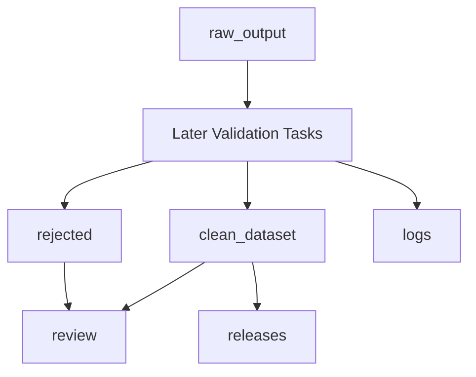

# Dataset Foundation

This document is the Task 1 source of truth for the Jac synthetic dataset structure. It defines where artifacts live, which metadata every example carries, how records are named, and what Jac context must be available before prompt design, validation planning, generation, or release work begins.

The target release range is 10,000-15,000 clean examples across exactly these categories:

- `code_gen`
- `debug`
- `explanation`
- `conversion`
- `trajectory`

Task 1 does not define category prompt templates, category output schemas, compiler validation implementation, generation loops, deduplication logic, or release manifests. Those are handled by later tasks.

## Dataset Storage Policy

All dataset artifacts should live under a future `dataset/` root. Raw, clean, rejected, review, log, and release artifacts must remain separate by path so that unvalidated material cannot be confused with training-ready examples.



`dataset/raw_output/` stores unvalidated OpenAI API responses and raw trajectory transcripts. Files in this area may contain malformed JSON, compiler-failing Jac, incomplete trajectories, duplicated examples, or other raw material. Nothing in `raw_output/` is training-ready.

`dataset/clean_dataset/` stores examples that pass the required validation gates for their category. A clean example must include required metadata, a stable example ID, and a `context_bundle_version`. Later validation rules define the exact compiler and test gates, but no example with known failed required validation belongs here.

`dataset/rejected/` stores failed generations and discarded trajectories that may be inspected, audited, or recycled. Rejected artifacts must keep enough metadata to explain why they were rejected, including `rejection_reason` when available. Rejected code generation examples with clear compiler errors may later seed debugging examples, but malformed or missing-code records should not be recycled.

`dataset/review/` stores manual review samples, reviewer notes, adjudication records, and review status updates. Review files must reference the relevant example IDs and batch IDs rather than duplicating clean examples as independent source records.

`dataset/logs/` stores process logs for generation, parsing, compiler checks, tests, retries, and deduplication. Logs support reproducibility and failure analysis; they are not examples.

`dataset/releases/` stores frozen dataset versions used by training runs. Release contents should be immutable after version freeze and should reference the exact dataset version consumed by training.

## Category Subdirectories

Each example-bearing storage area must have a subdirectory for every dataset category:

```text
dataset/
  raw_output/
    code_gen/
    debug/
    explanation/
    conversion/
    trajectory/
  clean_dataset/
    code_gen/
    debug/
    explanation/
    conversion/
    trajectory/
  rejected/
    code_gen/
    debug/
    explanation/
    conversion/
    trajectory/
  review/
    code_gen/
    debug/
    explanation/
    conversion/
    trajectory/
  context/
    python_source/
  logs/
    generation/
    parsing/
    compiler/
    test/
    retry/
    deduplication/
  releases/
```

Logs are grouped by process type instead of category by default. Later tasks may add category-specific log partitions if validation or generation tooling needs them.

## Naming Conventions

Category names must be one of `code_gen`, `debug`, `explanation`, `conversion`, or `trajectory`. Use these exact values in paths, IDs, metadata, logs, and review records.

Batch IDs use:

```text
YYYYMMDD-category-seq
```

Example:

```text
20260507-code_gen-001
```

The date is the UTC or agreed project date for the batch, `category` is one allowed category value, and `seq` is a zero-padded three-digit sequence for that category on that date.

Example IDs use:

```text
category-YYYYMMDD-batchSeq-exampleSeq
```

Example:

```text
code_gen-20260507-001-0007
```

The example ID embeds the category and batch sequence so IDs remain unique across categories and batches while still being scannable.

Dataset versions use:

```text
jac-synth-vMAJOR.MINOR.PATCH
```

Example:

```text
jac-synth-v0.1.0
```

Context bundle versions use:

```text
jac-context-vN
```

Example:

```text
jac-context-v1
```

Prompt versions and validator versions are referenced by metadata but designed in later tasks:

```text
prompt-category-vN
validator-vN
```

Examples:

```text
prompt-code_gen-v1
validator-v1
```

## Metadata Schema

Every example record, whether raw, clean, rejected, or under review, must carry the required metadata fields when the field value is known. Clean examples must have every required field populated.

### Required Fields

```json
{
  "id": "string",
  "batch_id": "string",
  "category": "code_gen | debug | explanation | conversion | trajectory",
  "complexity": "simple | medium | hard",
  "compiler_pass": true,
  "test_pass": true,
  "manually_reviewed": false,
  "generator": "openai-api | cursor-jac-mcp | codex-jac-mcp | claude-code-jac-mcp",
  "generation_date": "ISO-8601 timestamp or YYYY-MM-DD date",
  "source_prompt_version": "prompt-category-vN",
  "context_bundle_version": "jac-context-vN",
  "validator_version": "validator-vN",
  "dataset_version": "jac-synth-vMAJOR.MINOR.PATCH"
}
```

Allowed `category` values:

- `code_gen`
- `debug`
- `explanation`
- `conversion`
- `trajectory`

Allowed `complexity` values:

- `simple`
- `medium`
- `hard`

Allowed `generator` values:

- `openai-api`
- `cursor-jac-mcp`
- `codex-jac-mcp`
- `claude-code-jac-mcp`

### Optional Fields

```json
{
  "error_type": "syntax | type | walker | scope | import | semantic",
  "granularity": "line | block | module",
  "trajectory_length_tokens": 6144,
  "dedup_hash": "sha256-or-other-stable-hash",
  "reviewer": "reviewer identifier",
  "review_status": "pending | passed | failed | needs_adjudication",
  "rejection_reason": "short reason for rejection",
  "source_python_id": "python-func-00042",
  "source_test_count": 7,
  "test_coverage_percent": 95,
  "cross_compiled_tests_pass": true,
  "candidate_translation_count": 50,
  "type_inference_method": "runtime_observation"
}
```

Optional fields are category-specific and must not become required for unrelated categories. For example, `error_type` is useful for debugging examples, `granularity` is useful for explanation examples, and `trajectory_length_tokens` is useful for trajectory examples. `source_python_id` links conversion and Python-sourced code_gen examples to their source Python function. `source_test_count`, `test_coverage_percent`, and `cross_compiled_tests_pass` record cross-compiled test validation results following the MultiPL-T methodology. `candidate_translation_count` records how many candidate translations were generated for the source function. `type_inference_method` records how Python types were inferred for Jac type annotations (`runtime_observation`, `pyright_static`, or `none`).

### Clean Code Generation Metadata Example

```json
{
  "id": "code_gen-20260507-001-0007",
  "batch_id": "20260507-code_gen-001",
  "category": "code_gen",
  "complexity": "medium",
  "compiler_pass": true,
  "test_pass": true,
  "manually_reviewed": false,
  "generator": "openai-api",
  "generation_date": "2026-05-07",
  "source_prompt_version": "prompt-code_gen-v1",
  "context_bundle_version": "jac-context-v1",
  "validator_version": "validator-v1",
  "dataset_version": "jac-synth-v0.1.0",
  "dedup_hash": "sha256:example-placeholder"
}
```

### Rejected Trajectory Metadata Example

```json
{
  "id": "trajectory-20260507-001-0003",
  "batch_id": "20260507-trajectory-001",
  "category": "trajectory",
  "complexity": "hard",
  "compiler_pass": false,
  "test_pass": false,
  "manually_reviewed": true,
  "generator": "cursor-jac-mcp",
  "generation_date": "2026-05-07",
  "source_prompt_version": "prompt-trajectory-v1",
  "context_bundle_version": "jac-context-v1",
  "validator_version": "validator-v1",
  "dataset_version": "jac-synth-v0.1.0",
  "trajectory_length_tokens": 9340,
  "reviewer": "manual-reviewer",
  "review_status": "failed",
  "rejection_reason": "final Jac output did not compile"
}
```

## Jac Context Bundle Requirements

A Jac context bundle is a versioned set of references, guidance, and curated examples used by OpenAI prompts and vibe-coding agent sessions with Jac MCP/tooling. It should provide enough current Jac language context that generated examples are idiomatic Jac rather than Python-like code with Jac surface syntax.

Each context bundle version must include:

- Current Jac syntax reference from the Jac MCP documentation, especially `jac://docs/cheatsheet`.
- Jac idioms and pitfalls from `jac://guide/pitfalls`.
- Idiomatic valid examples from `jac://guide/patterns`.
- `skills.md` or equivalent Jac MCP guidance used by the active Jac tooling.
- Examples covering walkers, nodes, edges, abilities, imports, type annotations, standard library usage, and code organization.
- Output schema instructions for the target category, once Task 2 defines those category schemas.
- Filtered Python source function pool with test suites, used as translation sources for `conversion` and Python-sourced `code_gen` examples.

The initial bundle should be named `jac-context-v1`. Increment the version whenever syntax references, guidance, examples, or category schema instructions change in a way that could affect generation quality or validation behavior.

Every generated example must record its `context_bundle_version`. OpenAI API prompt logs, trajectory session notes, and validation logs must record the same context bundle version for the same example or batch. If logs and example metadata disagree, treat the example as not reproducible until reconciled.

If Jac source documents disagree about syntax or idioms, stop generation and update the context bundle before producing more examples. If the bundle is too large for planned OpenAI API calls, reduce batch size before removing Jac guidance.

## Task 1 Validation Checks

- [ ] Every category has a documented storage location under `raw_output/`, `clean_dataset/`, `rejected/`, and `review/`.
- [ ] Metadata can represent all five categories without making special-case fields globally required.
- [ ] Raw, clean, rejected, review, log, and release artifacts are separated by path and cannot be confused by naming.
- [ ] Example IDs are unique across categories and batches by construction.
- [ ] Every example can reference a context bundle version through `context_bundle_version`.
- [ ] Batch IDs, example IDs, dataset versions, context bundle versions, prompt versions, and validator versions have documented formats.

## Failure Guidance

If two categories need incompatible required metadata fields, keep the shared required schema stable and move category-specific fields to optional metadata.

If ID formats become too long or hard to scan, revise them before generation starts. Do not rename IDs after examples have been used in validation logs or review notes without a migration record.

If the Jac context bundle is too large for planned OpenAI API calls, reduce batch size before removing syntax, pitfalls, or idiomatic examples.

If source documents disagree about Jac syntax or idioms, stop and update the context bundle before generating examples.
