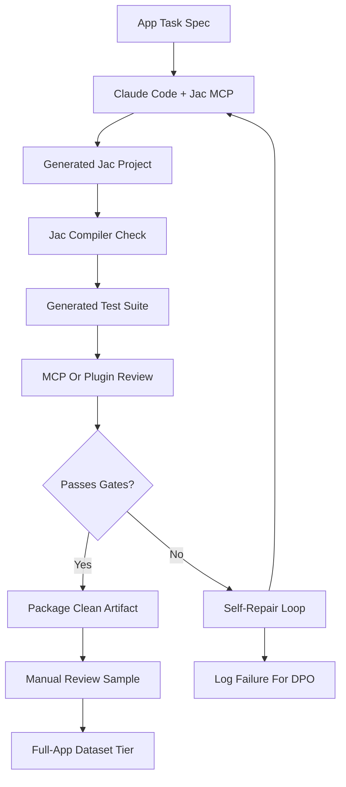

# Full-App Data Generation Strategy

This strategy extends the current Jac synthetic data pipeline from isolated examples and short trajectories into complete app and project generation. The goal is to produce higher-signal data before large-scale generation, pretraining, or supervised fine-tuning by capturing realistic planning, implementation, validation, debugging, and repair workflows around Jac.

The proposed workflow uses Claude Code with the Jac MCP as the main agentic generation environment. Each sample should be treated as a small software project rather than a single code snippet: it should include a product goal, Jac source files, tests, execution or compiler evidence, failure logs when relevant, and a final validated state.

## Motivation

Single-turn examples are useful for syntax, small transformations, explanations, and debugging patterns. Full apps add a different kind of signal:

- Multi-file Jac project structure.
- Realistic dependency and module boundaries.
- Longer-horizon reasoning across planning, coding, testing, and repair.
- Compiler and test feedback loops.
- Agent tool-use trajectories with Jac MCP context.
- Positive and negative traces that can later support SFT, DPO, or process-supervision experiments.

This tier should not replace the existing categories. It should sit above them as a richer generation mode for examples where application-level behavior matters.

## Target Artifact

Each generated project should produce a normalized artifact with:

- `task_spec`: the app request, constraints, expected features, and difficulty.
- `planning_trace`: high-level plan, architecture notes, and chosen design.
- `project_files`: Jac source files, test files, configuration, and README-style usage notes.
- `validation_trace`: compiler output, test output, MCP checks, and any runtime evidence.
- `repair_trace`: failed attempts, error messages, diagnosis, edits, and final resolution.
- `final_state`: the accepted project snapshot and summary of why it passed.
- `preference_pairs`: optional rejected and accepted responses for later DPO.
- `metadata`: model, prompt version, Jac version, MCP version, tools used, timestamps, and reviewer status.

The project should be stored in a way that can be replayed or audited later. The final answer alone is not enough; the useful training signal is the path from task to validated project.

## Generation Workflow

The generator should start from a task specification, ask Claude Code to create a full Jac app, and then run validation. If validation fails, Claude Code should receive the compiler, test, or MCP error output and attempt a repair. Failed intermediate outputs should not be discarded silently. They should be logged as rejected candidates with the corrected version linked as the preferred candidate when the repair succeeds.

## App Categories

Start with small but complete projects before moving to larger apps:

- CLI utilities with parsing, validation, and file or data processing.
- API-style services where Jac objects model routes, handlers, or domain behavior.
- Data processing apps with clear input and output expectations.
- Agentic or graph-oriented Jac programs that use nodes, walkers, and abilities.
- Mini full-stack-style projects where Jac owns backend logic and tests verify behavior.
- Refactoring tasks where an app is generated, intentionally broken, and then repaired.

Each task should define the expected behavior tightly enough that tests can check more than syntax. Vague app prompts will create attractive but unverifiable projects.

## Validation Gates

The Jac compiler is necessary but not sufficient. It can catch syntax and some structural issues, but it cannot prove the generated app has correct logic, complete behavior, or good architecture.

Recommended gates:

- Schema validation: every artifact follows the expected dataset contract.
- Compiler validation: all Jac files compile.
- Test validation: generated tests execute and verify expected behavior.
- Behavior validation: tests include input-output checks or state assertions tied to the task spec.
- MCP validation: Jac MCP or a Claude Code plugin inspects errors, compiler diagnostics, missing files, and project consistency.
- Manual review: a sampled subset is reviewed for idiomatic Jac, realistic app structure, and meaningful tests.
- Deduplication: generated apps are checked for near-duplicate specs, file structures, and implementations.

Compiler-only passing should be marked as a partial pass, not a clean app-level pass.

## Self-Repair Loop

The repair loop should be explicit and bounded:

1. Generate the initial app and tests.
2. Run compiler checks.
3. Run tests or behavior checks.
4. Ask an MCP/plugin reviewer to summarize failures and likely root causes.
5. Feed the failure report back to Claude Code.
6. Let Claude Code patch the project.
7. Re-run validation.
8. Stop after a fixed retry budget and route unresolved projects to rejection or manual review.

The repair prompt should include concrete evidence, not just "fix the bug." Good inputs include compiler diagnostics, failing test names, stack traces, expected versus actual output, and file references.

## MCP Or Plugin-Based Error Checking

A Claude Code plugin or MCP workflow can improve consistency by standardizing how failures are found and returned to the agent. The checker should:

- Run the Jac compiler and collect structured diagnostics.
- Run the project test command and collect failing cases.
- Check that required files exist.
- Check that tests exercise task requirements instead of only importing code.
- Summarize likely causes in a compact machine-readable report.
- Record whether the agent fixed the issue in the next attempt.

This checker should not hide failures. It should preserve raw logs and produce a normalized summary so the repair turn is useful for training.

## DPO Logging

Failed attempts are valuable if they are paired with successful repairs. For DPO, each repair episode can create a preference pair:

- Rejected: the response or project snapshot that failed compilation, tests, or logic checks.
- Chosen: the repaired response or project snapshot that passed validation.
- Preference reason: compiler failure, test failure, missing behavior, poor project structure, or hallucinated Jac usage.
- Evidence: exact validation output that explains why the rejected sample lost.

This is especially useful when the initial answer looks plausible but fails behavior tests. Those cases teach the model to prefer validated, logically correct Jac projects over syntax-only completions.

DPO records should be kept separate from clean SFT records until the training objective is chosen. A repaired project may contribute to SFT, while the failed-versus-fixed pair may contribute to DPO.

## SFT And Pretraining Use

The same full-app artifacts can support different training strategies:

- Pretraining: use clean final project files, app READMEs, tests, and validated Jac code as corpus data.
- SFT: use task specs paired with final validated implementations or full agent trajectories.
- DPO: use failed attempts paired with repaired passing attempts and explicit preference reasons.

Before choosing between pretraining and SFT, run a pilot batch and inspect whether the strongest signal comes from final code, task-to-code pairs, or repair trajectories.

## Pilot Plan

Start with a small pilot before large-scale generation:

1. Create 20-50 full-app task specs across 3-5 categories.
2. Generate each app with Claude Code and Jac MCP.
3. Require compiler and test validation for every accepted project.
4. Allow 1-3 repair attempts per project.
5. Log all failed attempts for possible DPO.
6. Manually review a representative sample.
7. Measure pass rate, repair success rate, duplicate rate, and test quality.
8. Revise prompts, app categories, and validation gates before scaling.

Suggested scale criteria:

- 100% artifact schema pass rate.
- At least 80% compiler pass rate after repair.
- At least 70% behavior-test pass rate after repair.
- Manual review pass rate of at least 80%.
- Clear evidence that tests are checking task-specific behavior.
- DPO logs contain usable rejected/chosen pairs with concrete failure reasons.

## Open Questions

- Which Jac app categories best match the downstream training goal?
- Should tests be generated by the same Claude Code session, a separate verifier model, or a deterministic harness?
- How much repair history should be included in SFT trajectories versus reserved for DPO?
- What retry budget gives useful repairs without creating too much low-quality data?
- Which MCP/plugin checks can be fully automated before manual review?

## MultiPL-T Enhancements

Recipe 2 has been enhanced with cross-compiled test validation, multi-candidate translation, Python source filtering, and type inference following the MultiPL-T paper (Cassano et al. 2024). These additions strengthen the validation pipeline by ensuring that generated Jac code is verified against deterministically compiled tests derived from Python sources, that multiple translation candidates are evaluated per source function, that the Python source pool is filtered for quality and suitability before translation, and that type inference from test execution guides accurate Jac type annotations.

## Recommendation

Run this as a pilot tier before large-scale generation. The current pipeline already has schema, compiler, review, and release concepts; the full-app strategy should extend those gates with stronger behavior tests, structured repair logs, and DPO-ready preference pairs. Scaling should wait until the pilot shows that the generated projects are not only syntactically valid Jac, but also logically correct and testable.
