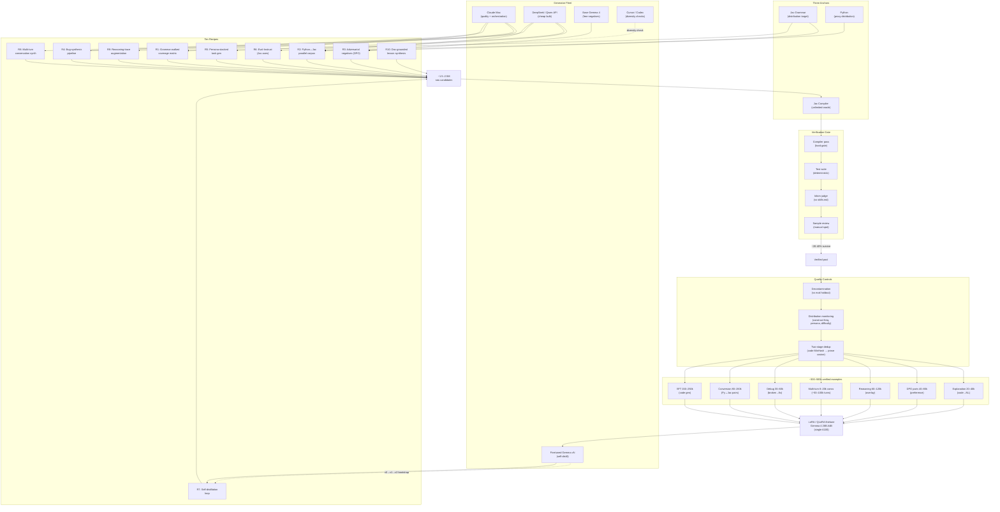

# Synthetic Data Generation Strategy

*A deep dive for finetuning Gemma 4 26B A4B on Jaclang*

| | |
|---|---|
| **Target language** | Jac (Jaseci Labs) |
| **Base model** | Gemma 4 26B A4B Instruct (MoE, 3.8B active) |
| **Finetuning** | Unsloth + LoRA / QLoRA |
| **Verification** | Jac compiler (hard gate), tests, judge, sample review |
| **Constraint** | 100% synthetic data — no real Jac corpus available |
| **Generators on hand** | Claude Code (Max), Cursor, Codex, plus cheap APIs |

---

## Executive summary

This document covers the synthetic-only data generation strategy for finetuning Gemma 4 26B A4B Instruct on Jac. It is structured around three anchors that compensate for the absence of a real Jac corpus, ten compounding generation recipes, an allocation plan across the available generator tools, target volumes, and the quality controls specific to fully-synthetic regimes.

The headline points:

1. Gemma 4 26B A4B is confirmed shipped and well-suited — keep it.
2. The Jac compiler, the Jac grammar, and the Python language together substitute for missing real data.
3. Recipes compose multiplicatively — one verified artifact seeds six different training examples.
4. Claude Max is for quality and orchestration, cheap APIs are for volume, the base Gemma is for free negatives, the finetuned Gemma bootstraps later rounds.

---

## On the base model choice

Gemma 4 was released on April 2, 2026 under Apache 2.0 in four sizes: E2B, E4B, 26B MoE (3.8B active), and 31B dense. The 26B MoE scores 77.1% on LiveCodeBench v6 and 88.3% on AIME 2026, and the 31B dense variant ranks #3 on Arena AI at 1452 Elo. The most relevant gain for this project is on τ2-bench agentic tool use: Gemma 3 27B scored 6.6%, Gemma 4 31B scores 86.4%. The 26B MoE inherits the same agentic training and is the right choice for a coding agent.

The MoE design (3.8B active parameters per token) is what makes LoRA viable on a single A100. Apache 2.0 means the finetuned weights are unrestricted. Hugging Face's engineers reported that the model is strong enough out-of-the-box that they had to look hard for finetuning examples — good news for the agent capabilities (planning, tool use, error recovery) you want to inherit rather than build from scratch.

> **Recommendation.** Keep Gemma 4 26B A4B Instruct as the base. Fallback options if availability becomes an issue: Qwen3-Coder-30B-A3B or DeepSeek-V3.x-Lite. None of the data pipeline below changes if the base model changes.

---

## Three anchors for synthetic-only data

Synthetic-only is the harder regime because the ground-truth distribution that real data provides for free is absent. The pipeline must construct three substitutes:

### 1. The Jac grammar is the distribution anchor

Every language construct must appear in the training data in proportion to how often it would appear in real Jac code. Since no real Jac code exists at scale, the target distribution is defined explicitly, by you, from the grammar and from idiom knowledge. The coverage matrix (Recipe 1) is what enforces this.

### 2. The Jac compiler is the unlimited oracle

Synthetic-only is bearable because rejection sampling is free. Generate 100 candidates, keep the 1 that compiles and passes tests, discard the rest. This lets you use cheap, faster, lower-quality generators for bulk volume — failure is silent and cheap. Every other anchor degrades if the compiler step is skipped or softened.

However, the compiler alone is insufficient. Code that compiles can still produce incorrect results. Following the MultiPL-T approach (Cassano et al. 2024), cross-compiled tests are the second oracle. Tests generated in Python (where LLMs are reliable) are compiled to Jac using a deterministic rule-based test compiler, then run against Jac translations. This eliminates LLM hallucination from the test layer and catches semantic errors that the compiler misses. For deterministic categories, test validation is a hard gate alongside compilation.

### 3. Python is the proxy distribution

Real Jac doesn't exist, but real Python does, and Jac is built on Python. Any frontier model produces idiomatic Python at very high quality. Generating Python tasks at scale and translating them to idiomatic Jac inherits the entire shape of real-world software problems — the kinds of data structures, algorithms, control flows, error patterns, and decomposition strategies that actual programmers reach for. This single bridge is the largest data source available.

---

## The ten generation recipes

Each recipe is a self-contained generation pipeline. They compose: a single seed task from Recipe 1 can yield an SFT example, two DPO pairs via Recipe 3, a debugging trace via Recipe 4, a multi-turn refinement conversation via Recipe 8, a reasoning trace via Recipe 9, and a Python translation pair via Recipe 2. Plan recipes as overlays, not as independent buckets.

### Recipe 1 — Grammar-walked coverage matrix

**Goal:** guarantee that every Jac construct appears in training data.

Parse the Jac grammar into a flat list of constructs (walker, node, edge, ability, archetype, dispatch forms, type annotations, async, etc.). For each construct, define three difficulty bands: *atomic* (the construct in isolation), *idiomatic* (used the way real Jac would use it), *composed* (combined with 2–3 other constructs in a non-trivial program). Roughly 40–80 constructs × 3 bands = 120–240 matrix cells. Target ~500 verified examples per cell. Floor: 60–120k SFT examples from coverage alone.

**Why it matters:** this is the only mechanism that guarantees no language feature is absent from training. Without it, generators converge on the subset of features they happen to find natural — typically the most Python-shaped ones, which is exactly the wrong bias.

### Recipe 2 — Synthetic Python ↔ Jac parallel corpus (MultiPL-T enhanced)

**Goal:** highest-volume single recipe. 100k+ pairs achievable per week. Enhanced with cross-compiled test validation following MultiPL-T (Cassano et al. 2024).

**Step 1: Build a filtered Python source pool.** Do not translate arbitrary Python. Filter aggressively: require docstrings, Pyright type-check passing, return values, no TODO/FIXME markers, no overlap with HumanEval/MBPP/known benchmarks. The MultiPL-T paper reduced 22 million Python functions to 133,000 high-quality candidates through similar filtering. Target: 10,000+ filtered functions as the translation source pool.

**Step 2: Generate unit tests in Python.** Use an LLM to generate unit tests for each filtered Python function. Generate multiple independent test suites per function (5 suites at temperature 0.8). Run tests, discard failing tests, aggregate passing tests. Require at least 90% line coverage. Discard functions that cannot achieve 90% coverage. This step produces the ground-truth behavioral specification for each function.

**Step 3: Infer Python types from test execution.** Run the Python tests and observe argument types and return types at runtime. For each argument position, compute the union type across all tests. Simplify unions to canonical forms (e.g., `Union[int, None]` → `Optional[int]`). These inferred types are injected into the Jac translation prompt so the LLM produces correctly typed Jac code rather than guessing types from identifier names.

**Step 4: Translate Python to idiomatic Jac with multiple candidates.** For each Python function, generate 50–100 candidate Jac translations at high temperature (0.8) using cheap APIs (DeepSeek/Qwen). The prompt includes: the Python function with inferred types, the docstring translated to a Jac comment, the function signature translated to Jac syntax, and the original Python code as reference. Instruct: "Convert this Python code to idiomatic Jac. Do not simply swap syntax — use Jac-native patterns where appropriate." Include relevant `skills.md` sections as idiom context.

**Step 5: Cross-compile tests to Jac.** Compile the Python test assertions to Jac using a deterministic rule-based compiler (not an LLM). This compiler handles `assert f(x) == y` for first-order values (ints, strings, booleans, lists, tuples, dicts). Drop test cases that use Python features without Jac equivalents. If zero test cases survive compilation for a function, flag it for manual review.

**Step 6: Validate translations with cross-compiled tests.** Compile each candidate Jac translation. Run cross-compiled tests against each compilable candidate. Keep all candidates that pass all tests. This is a hard gate — test failure rejects the candidate.

**Step 7: Deduplicate within candidates.** For each source function, the surviving candidates may include near-duplicates (same logic, renamed variables). Deduplicate using ROUGE-L (threshold 0.6) after stripping comments. Keep diverse implementations — two solutions that pass the same tests but use different algorithms (e.g., recursive vs. walker-based) are both valuable.

**Output per pipeline run (3 datasets from 1):**
- (NL, Jac_code) — code generation SFT data
- (Python_code, Jac_code) — conversion training data  
- (Python_code, Jac_code, NL) triples — explanation training data

Failed translations also become DPO negatives. Critically: reject anything that compiles and passes tests but reads like Python with syntax swapped. Use an idiom-judge with `skills.md` as context to score this.

**Why this is the highest-leverage recipe:** the MultiPL-T paper proved that this approach (translate validated Python with test-based filtering) outperforms both self-instruction and training on existing data for low-resource languages. Self-instruction produced 80% buggy code on Racket. Training further on existing data actually hurt performance. Translation with test validation was the only approach that consistently improved all target languages.

### Recipe 3 — Compiler-driven adversarial negatives

**Goal:** teach the model what NOT to write. Critical for low-resource languages.

For every working example, also generate the "tempting wrong version" — what a Python programmer would write without knowing Jac. Prompt: *"Solve this Jac task the way a Python programmer would, using Python idioms applied to Jac syntax."* Compile-check, then:

- **Doesn't compile:** perfect (broken, error, fix) triple where the broken version is the exact mistake the finetuned model is most at risk of making. Use for SFT debugging data and DPO negatives.
- **Compiles but non-idiomatic:** confirm with judge against `skills.md`, pair with idiomatic version for DPO. Model learns to prefer the Jac way over the syntactically-valid-but-wrong way.

A Python-priored base model will fail in exactly these ways. Positive-only training will not fix this — the model needs explicit negative signal. This is one of the highest-leverage recipes for a language with strong neighbour-language interference.

### Recipe 4 — Bug-synthesis pipeline

**Goal:** first-class debugging data and agentic trajectories.

Take a working (task, code) pair. Apply a systematic mutation from a fixed catalog: drop a return type, wrong walker dispatch, mismatched ability signature, off-by-one in traversal, missing edge type declaration, Python-style mutation where Jac wants something else. Run through compiler. Capture (original task, working code, mutated broken code, error message, the fix that recovers).

Then have a generator role-play the debugging trajectory: *"Looking at error X, I notice Y, which suggests Z. Let me try changing W..."* Each multi-turn trajectory becomes agentic training data with the compiler error stream as ground truth. This is also where you build the subagent orchestration data (capability 6) by letting the debugging agent spawn sub-tasks.

### Recipe 5 — Persona-stacked task generation

**Goal:** diversify task framing without diversifying task content.

Build a library of 30–50 personas: "backend engineer migrating Flask," "graduate student exploring graph-spatial computation," "data engineer building ETL," "someone who learned Jac yesterday," "performance engineer optimizing a walker," "tech lead doing code review." For each seed task, generate the prompt from N personas. Same solution, dramatically different surface forms.

Some personas should produce *bad* task descriptions — ambiguous, missing context, contradictory. The training signal there is "agent asks clarifying question, gets answer, implements." Natural task data and clarification-loop training in one pass. Cost is low: underlying solution is unchanged.

### Recipe 6 — Evol-Instruct on Jac-specific axes

**Goal:** increase complexity along controlled dimensions.

- **Deepen:** add a graph-topology constraint ("must work on cyclic graphs", "must handle empty traversals").
- **Broaden:** same problem, different domain (auth flow → recommendation graph → state machine).
- **Constrain:** add a Jac-idiomatic constraint that rules out the obvious Python translation ("must use walker abilities, no top-level functions").
- **Compose:** chain with another task ("after computing X via walker, persist via Y and expose via Z").
- **Invert:** given the solution, generate three alternative problem statements that produce it.

Track lineage. After training, ablate which evolution axes contributed most — that's how you tune the recipe mix for v2.

### Recipe 7 — Self-distillation loop

**Goal:** scale beyond external-model budgets after v0 is trained.

Once v0 of finetuned Gemma exists, fold it back in as a generator. v0 generates → compiler/tests verify → keep what passes → mix into training set → train v1 → repeat. Two non-negotiables: (a) retain some fraction of frontier-model-generated data each round to prevent drift, and (b) do not relax verification — local models will produce subtler errors than frontier models. After 2–3 iterations, v_n contributes data the frontier models wouldn't produce in the same shape.

### Recipe 8 — Multi-turn conversation synthesis

**Goal:** agentic interaction data, not just single-shot completions.

Take a verified (task, code, tests) artifact. Synthesize a realistic conversation: initial task → response → "make it faster" → "what if input is empty" → "add a test for the cyclic case" → "this errored — here's the trace." For each turn, generate the agent's reply *and* re-verify the resulting code. Follow-ups sample from a fixed catalog: refinement, error report, edge case, optimization, refactor, explanation, conversion. One base task → 4–6 follow-ups → ~5 SFT samples per conversation.

### Recipe 9 — Reasoning-trace augmentation

**Goal:** teach the model *why* Jac choices are right, not just what they are.

For every verified (task, code) pair, generate the reasoning that justifies the choices. Critically: include "why this Jac construct, not the Python-natural one." Example: *"I'm using a walker rather than a recursive function because the traversal needs to visit nodes whose existence depends on edges discovered en route — this is the canonical case for walker semantics, where a function would force eager graph materialization."* Design the SFT format to include reasoning as a structured field from day one.

Recent reasoning-aware code-data research has shown this kind of trace can substitute for model scaling — generalizing across architectures and outperforming positive-only datasets at equal sample budgets. Especially important when the base model has wrong priors (Python).

### Recipe 10 — Doc-grounded lesson synthesis

**Goal:** guarantee every documented feature has training data.

For each section of `skills.md` and other internal docs, generate a "lesson pack": 3–5 worked examples illustrating the section's content, 5–10 practice problems with solutions, 5–10 common-mistake examples paired with corrections, 2–3 advanced compositions combining this material with other sections. Doc text goes into the generator's context as authoritative reference. Pair with test-suite generation: each example gets its own test suite, which becomes data for the "write tests for this code" capability.

---

## Tool allocation across generators

Available: Claude Code (Max — your bulk capacity), Cursor, Codex (both limited), plus direct API access to cheap-but-capable open models, plus the base Gemma 4 itself running locally. The right allocation is shaped by where each generator is strongest:

| Generator | Best used for | Why |
|---|---|---|
| **Claude Code (Max)** | Recipe 1 orchestration; Recipe 4 debugging trajectories; Recipe 8 conversations; Recipe 9 reasoning traces; final refinement pass on outputs from cheaper generators. | Quality bar setter. Best at multi-turn reasoning and explanatory prose. Use it where quality matters most. |
| **Cursor / Codex** | Diversity sampling only — alternate samples to confirm an artifact isn't a Claude-ism. Judge-comparison inputs. | Limited usage budget. Reserve for verification and diversity checks, not bulk generation. |
| **DeepSeek-V3.x / Qwen3-Coder (API)** | Bulk Python task generation (Recipe 2); mutation generation (Recipe 4); persona rewrites (Recipe 5); Evol-Instruct evolutions (Recipe 6); N=10 rejection sampling. | Cheap per token, very capable on code. Failure modes are easy to filter — compiler catches them. Perfect when 9 of 10 outputs get discarded. |
| **Base Gemma 4 (local)** | Negative half of DPO pairs in Recipes 2 and 3. Free unlimited generation of "confused Python-priored Jac" — exactly the negatives you want to train against. | Pre-finetune, its outputs ARE the failure mode you're training against. Zero cost, unlimited volume. |
| **Finetuned Gemma v0+** | Recipe 7 self-distillation. Becomes the main generator from v0 onward, with frontier models reserved for quality refinement. | Once trained, v_n is the only generator with native Jac priors. Use it heavily, but always behind compiler + test gates. |

> **Mental model.** Claude is for quality and orchestration. Cheap APIs are for volume. Base Gemma is for free negatives. Finetuned Gemma is for the bootstrap. Never burn Claude budget on tasks that other generators can do behind the compiler gate.

---

## Volume and shape targets

Targets are for *verified, deduplicated, compiler-passed* examples. Generate roughly 5× these numbers before filtering — expect 20–40% compiler-rejection on cheap-generator outputs plus another 20–30% loss to dedup and judge-filtering.

| Subset | Target (verified examples) | Source recipes |
|---|---|---|
| Core code generation SFT | 150–250k | 1, 2, 5, 6, 10 |
| Python ↔ Jac conversion pairs (test-validated) | 80–150k | 2 |
| Debugging (broken → fix) | 30–60k | 3, 4 |
| Multi-turn agentic conversations | 8–20k convs (~50–100k turns) | 4, 8 |
| Reasoning-augmented examples | 60–120k (overlay) | 9 |
| DPO preference pairs | 40–80k | 2, 3, 6 |
| Explanation (code → NL) | 20–40k | 9, 10 |

**Total raw examples after deduplication: ~300–500k.** Generate ~1.5–2.5M before filtering. This scales onto a single A100 LoRA finetune for the 26B MoE base.

---

## Quality controls specific to synthetic-only

Three controls that matter much more in synthetic-only regimes than when real data anchors the distribution. Skipping any of them turns a strong corpus into a brittle one.

### Decontamination must happen before generation, not after

Write the eval set first — canonical Jac tasks, hand-curated or hand-written, that will be used to measure v1. Then exclude any generated example whose task description has high 14-gram overlap with any eval task. In a synthetic regime the underlying problem space is bounded, so the generator stumbling onto eval-shaped problems by chance is more likely than in real-data pipelines. Decontamination after the fact is too late.

### Distribution monitoring on every batch

Maintain a live dashboard of construct usage frequency vs. target, persona distribution vs. target, difficulty band distribution, and n-gram diversity score (trigram entropy across batches). When any metric drifts, the generator has fallen into a rut — adjust prompts. Synthetic generators reliably spike on whatever they find easy; the monitoring is what catches that early.

### Two-stage deduplication: code first, prose second

MinHash dedup at the code level (cheaper) catches the most duplicates. Then check task descriptions across surviving examples for high cosine similarity using a sentence-embedding model. Generators repeat themselves more than expected — same problem described two ways with the same solution, or near-identical code with cosmetic variation.

For Recipe 2 specifically, deduplication happens in three stages: (1) within the 50–100 candidates per source function using ROUGE-L, (2) code-level MinHash across the full conversion dataset, and (3) prose cosine similarity across task descriptions. The first stage is the cheapest and catches the most duplicates because the same source function's translations share structure.

---

> **The compounding insight.** Recipes compose multiplicatively. A single base task from Recipe 1 can yield: 1 SFT example, 2 DPO pairs (via Recipe 3), a debugging trace (Recipe 4), a multi-turn refinement conversation (Recipe 8), a reasoning trace (Recipe 9), and a Python translation (Recipe 2 in reverse). Plan every verified artifact as a seed crystal that grows in multiple directions — that's how volume and diversity emerge from a fully synthetic pipeline.

---

## Open questions to resolve early

- Final list of Jac constructs and their target frequency weights in the coverage matrix — drives everything in Recipe 1.
- Idiom-judge prompt: the exact rubric used to score Jac-vs-Python-style outputs. This is the single most-used judge in the pipeline; worth heavy prompt iteration on its own.
- Eval holdout set composition — should mirror the six target capabilities (generation, debugging, explanation, conversion, agentic, orchestration) at 50–100 tasks each.
- Compiler harness throughput target — for 1.5–2.5M raw candidates, the compiler needs to handle ~5k examples/hour sustained. Confirm this is achievable on the available infra.
- Storage and lineage format — every verified example should carry its full provenance (recipe, generator, seed, evolution path, verification levels passed) for ablation studies later.

---

## End-to-end workflow diagram

