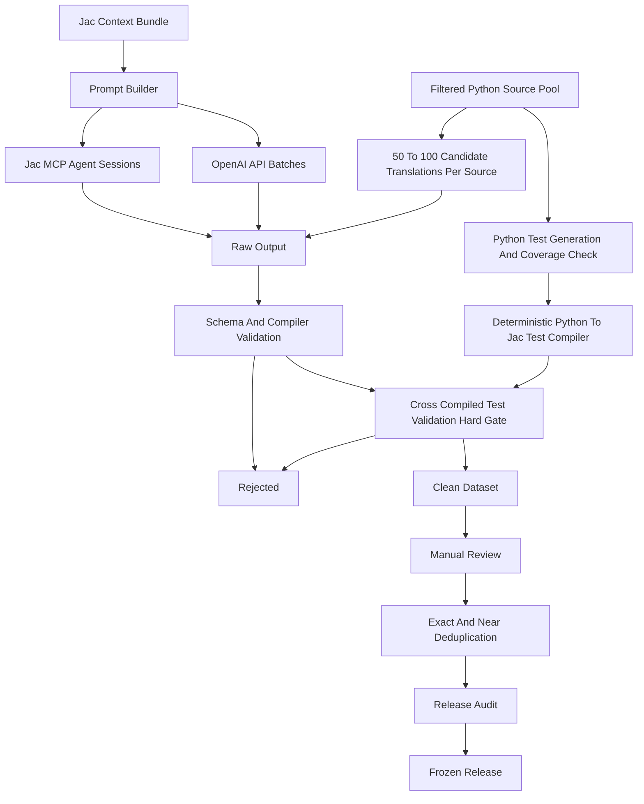

# Pipeline

The pipeline turns Jac context and task specifications into validated dataset artifacts. It uses scripted OpenAI API generation for single-turn examples and Cursor/Jac MCP sessions for agentic trajectories.

## Generation Modes

Scripted single-turn generation covers `code_gen`, `debug`, `explanation`, and `conversion`. `src/data_generation/single_turn_generation.py` builds prompt requests, calls the generation client, validates returned examples, and writes raw, clean, rejected, review, validation, generation, and scale-decision artifacts.

Agentic trajectory generation covers `trajectory`. `src/data_generation/trajectory_generation.py` plans task banks and ingests normalized transcripts that include user turns, assistant turns, tool calls, tool results, final Jac code, and validation evidence.

### Python Source Filtering And Translation

For `conversion` examples and Python-sourced `code_gen` examples, the pipeline uses a filtered pool of high-quality Python functions as source material. Python functions must have docstrings, pass Pyright type-checking, contain no TODO or incomplete markers, avoid benchmark contamination overlap, and have LLM-generated unit tests with at least 90% line coverage. This aggressive filtering follows the MultiPL-T methodology (Cassano et al. 2024) that reduced 22 million Python functions to 133,000 high-quality candidates. For each filtered Python function, 50--100 candidate Jac translations are generated at high temperature. All candidates that pass cross-compiled tests are kept, providing diversity through sampling.

## Context And Prompts

The Jac context bundle is stored under `dataset/context/` and summarized in [`context.md`](context.md). Prompt templates and category schemas live in `src/data_generation/prompt_design.py`. Prompt versions are explicit because scale approval depends on knowing which guardrails produced each batch.

## Validation And Routing

Every batch goes through JSON/schema checks and compiler validation. The validation layer routes records to:

- `dataset/clean_dataset/` when required gates pass.
- `dataset/rejected/` when examples fail hard gates or are useful for later inspection.
- `dataset/review/` when manual review is required.
- `dataset/logs/` for validation, generation, retry, prompt revision, scale decision, audit, and dedupe records.

Cross-compiled test validation is a separate hard gate for deterministic `code_gen` and `conversion` examples. Tests are generated in Python, verified for correctness and coverage, then compiled to Jac using a deterministic rule-based compiler. Examples that fail cross-compiled tests are rejected directly, not routed to manual review.

## Release Flow

Release readiness loads clean candidates, audits metadata and validation evidence, removes exact duplicates, flags near duplicates, builds a manual-review sample, checks target counts, and reports blockers. A frozen release writes clean category files, manifest, audit, review sample, dedupe summary, training-run references, and immutable checksums under `dataset/releases/<version>/`.
