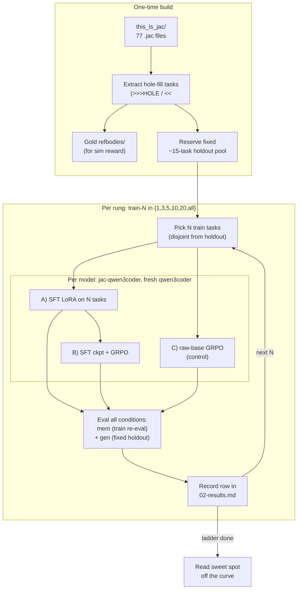

# Jac RL Workflow

Operational runbook for one full ladder run. Strategy is in [strat.md](strat.md); design of record is [01-design.md](01-design.md); numbers land in [02-results.md](02-results.md).

---

**Runner:** Phases 1–2 below are driven by one command — `jac run rl/run_ladder.jac`
(dry by default; `JAC_LADDER_GO=1` to execute). It loops rungs × models × conditions,
reusing `pick_rung.jac` / `build_sft_gold.jac` / `run_rft.sh` / `run_grpo.sh` /
`eval_rl.jac`, and appends rows to `results/rl_ladder.jsonl`. The phases below are the
manual breakdown of what it runs.

## Phase 0 — Build (once)

1. **Extract hole-fill tasks** from every `this_is_jac/*.jac`: wrap one unit body in `# >>>HOLE id="..." instruction="..."` / `# <<<HOLE`. Each task is a complete, deterministic `jac run`-able file. **51 built** (`jac run rl/build_tasks.jac`); ~10–15 more minable.
2. **Capture ground truth:** run each driver as-authored, store its stdout as the expected output.
3. **Emit gold `refbodies/<id>.txt`** (the real body) for the sim reward term.
4. **Reserve the holdout:** pick a **fixed ~15-task pool**, never trained, stratified across the source files (graph / lib / littlex / etc.) so generalization isn't measured on one family. Everything else is the train candidate pool.
5. **Sanity:** every task compiles + runs + matches its own captured stdout before it enters the set.

> Harness must implement the two carried scars before any training: `unwrap_unit` splice and the dense body-sim reward term (see [strat.md](strat.md)).

## Phase 1 — Base eval

Run both models, zero training, on the holdout pool. This is the rung-0 floor every later number is read against.

## Phase 2 — The ladder

For each `train-N` in **1, 3, 5, 10, 20, all-remaining**, for each model (`jac-qwen3coder`, fresh `qwen3coder`):

1. **Pick N train tasks** (disjoint from the holdout pool; superset-grow N so each rung includes the previous rung's tasks).
2. **Condition A — SFT:** LoRA fine-tune on the N tasks → eval.
3. **Condition B — SFT+GRPO:** GRPO on the SFT checkpoint with the dense reward → eval.
4. **Condition C — raw-base GRPO:** GRPO on the un-SFT'd base (control; expect σ=0 stall) → eval.
5. **Eval each condition twice:**
   - **mem** = re-eval the rung's own train tasks (rung 1: this *is* the result, target 100%).
   - **gen** = the fixed holdout pool (comparable across rungs).
6. **Record** the row in [02-results.md](02-results.md): headline exact-stdout pass + diagnostics (graded score, near-pass osim≥0.9, avg-osim).

### Eval grading (per task)
Splice completion into the template at `__HOLE__` (after `unwrap_unit`), `jac run` in an isolated cwd, then:
- **pass** = byte-exact stdout vs expected.
- **near-pass** = osim ≥ 0.9 (continuous output similarity).
- **graded score** = the reward sum `0.25 compiles + 0.25 runs + 0.25 output + 0.10 idiom + 0.15 body-sim`.

## Phase 3 — Read the curve

After the full ladder (no early stop):
- **Sweet spot** = the train-N where fixed-holdout pass plateaus (added tasks stop helping).
- Compare the two models' curves (does prior jac knowledge raise the start / the plateau?).
- Confirm or kill each hypothesis in [strat.md](strat.md).

## Phase 4 — Whole-file track (later)

Only after the hole-fill ladder is mapped. Reuse the same rung structure; tasks regenerate a whole small `.jac` from its docstring/spec, graded AST-equivalence + run + stdout. AST grader designed at that point. This is the step toward "generate new codebases."

---

## Per-rung checklist

- [ ] N train tasks picked, disjoint from holdout, superset of prior rung
- [ ] SFT both models → mem + gen eval recorded
- [ ] SFT+GRPO both models → gen eval recorded
- [ ] raw-base GRPO both models → gen eval recorded (σ=0 control)
- [ ] diagnostics (graded / near-pass / avg-osim) logged beside headline
- [ ] row committed to `02-results.md`
