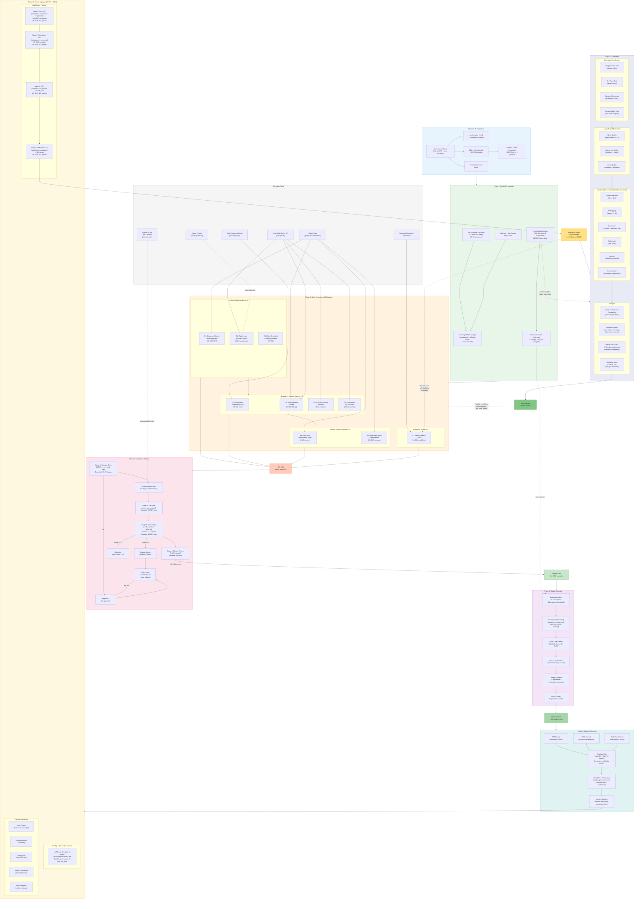

# Whole-Stack Workflow: Data Generation -> Finetuning -> Evaluation

```mermaid
---
config:
  flowchart:
    nodeSpacing: 60
    rankSpacing: 80
    padding: 30
  themeVariables:
    fontSize: 18px
---
flowchart TD
    subgraph P0["Phase 0: Prerequisites"]
        ENV["Environment Setup\n(Python 3.11+, venv, API keys)"]
        JAC_SETUP["Jac Compiler Install\n+ Verification Wrapper"]
        MLX_SETUP["MLX + mlx-lm Install\n+ GPU Verification"]
        MODEL_DL["Gemma 4 26B Download\n+ MLX Convert + Quantize"]
        DIRS["Directory Structure\nSetup"]
        ENV --> JAC_SETUP & MLX_SETUP
        MLX_SETUP --> MODEL_DL
        ENV --> DIRS
    end

    subgraph P1["Phase 1: Context Preparation"]
        GRAMMAR["Jac Grammar Extraction\n+ Construct Catalog\n(40-80 constructs)"]
        SKILLS["skills.md + Doc Corpus\nPreparation"]
        MATRIX["Coverage Matrix Design\n(constructs x 3 difficulty bands\n= 120-240 cells)"]
        EVAL_HOLD["Eval Holdout Creation\n(300-600 tasks, 6 capabilities)\nBEFORE generation"]
        DECONTAM_REF["Decontamination Reference\nAssembly (14-gram shingles)"]
        GRAMMAR --> MATRIX
        SKILLS --> MATRIX
        EVAL_HOLD --> DECONTAM_REF
    end

    P0 --> P1

    subgraph GEN["Generator Fleet"]
        CLAUDE["Claude Max\n(quality + orchestration)"]
        CHEAP["DeepSeek / Qwen API\n(cheap bulk)"]
        BASE_G["Base Gemma 4 (local)\n(free negatives)"]
        FINE_G["Finetuned Gemma vN\n(self-distill)"]
        CURSOR["Cursor / Codex\n(diversity checks)"]
        TC["Python-to-Jac\nTest Compiler\n(deterministic)"]
    end

    subgraph P2["Phase 2: Data Generation (10 Recipes)"]
        direction TB
        subgraph CORE_RECIPES["Core Recipes (Weeks 1-2)"]
            R1["R1: Grammar-Walked\nCoverage Matrix\n(60-120k SFT)"]
            R2["R2: Python-Jac\nParallel Corpus\n(100k+ pairs/week)"]
            R10["R10: Doc-Grounded\nLesson Synthesis\n(15-30k)"]
        end

        subgraph NEG_RECIPES["Negative + Diversity (Weeks 2-3)"]
            R3["R3: Adversarial\nNegatives (DPO)\n(40-80k pairs)"]
            R4["R4: Bug-Synthesis\nPipeline\n(30-60k debug)"]
            R5["R5: Persona-Stacked\nTask Gen\n(3-5x multiplier)"]
            R6["R6: Evol-Instruct\non Jac Axes\n(2-3x evolution)"]
        end

        subgraph OVERLAY_RECIPES["Overlay Recipes (Weeks 3-4)"]
            R8["R8: Multi-Turn\nConversation Synth\n(8-20k convs)"]
            R9["R9: Reasoning-Trace\nAugmentation\n(60-120k overlay)"]
        end

        subgraph BOOTSTRAP["Bootstrap (Week 5+)"]
            R7["R7: Self-Distillation\nLoop\n(10-30k/round free)"]
        end

        CORE_RECIPES --> NEG_RECIPES
        NEG_RECIPES --> OVERLAY_RECIPES
    end

    P1 --> P2
    CLAUDE --> R1 & R4 & R8 & R9
    CHEAP --> R2 & R4 & R5 & R6
    BASE_G --> R3
    CURSOR -.->|diversity check| R2
    TC -.->|cross-compiled tests| V1B
    FINE_G --> R7

    RAW["~1.5-2.5M\nRaw Candidates"]
    CORE_RECIPES & NEG_RECIPES & OVERLAY_RECIPES & BOOTSTRAP --> RAW

    subgraph P3["Phase 3: Verification Pipeline"]
        direction TB
        V1["Stage 1: Compiler Gate\n(HARD -- every code field)\nExpected: 60-80% pass"]
        V1B["Cross-compiled tests\n(hard gate, deterministic)"]
        V2["Stage 2: Test Suite\n(non-cross-compiled)\nExpected: 70-90% pass"]
        V3["Stage 3: Idiom Judge\n(LLM scores vs skills.md)\nScore >= 4 accepted\nExpected: 40-60% pass"]
        V4["Stage 4: Manual Review\n(5-10% sample)\nReviewer checklist"]
        V1 --> V1B --> V2 --> V3 --> V4

        REJ_COMP["Rejected:\nCompiler Fail"]
        REJ_IDIOM["Rejected:\nIdiom Score <= 2"]
        REV_BORDER["Review Queue:\nBorderline Cases"]
        RETRY["Retry Logic\n(2 attempts for\nminor failures)"]

        V1 -->|fail| REJ_COMP
        V3 -->|score <= 2| REJ_IDIOM
        V3 -->|score == 3| REV_BORDER
        REJ_COMP --> RETRY
        REV_BORDER --> RETRY
        RETRY -->|still fail| REJ_COMP
    end

    RAW --> P3

    VER["Verified Pool\n~0.4-0.8M examples"]
    V4 -->|"~20-40% survive"| VER

    subgraph P4["Phase 4: Quality Controls"]
        DC["Decontamination\nvs Eval Holdout\n(14-gram overlap check)"]
        DM["Distribution Monitoring\n(construct freq, persona,\ndifficulty, trigram entropy)"]
        DD1["Code-Level Dedup\n(MinHash, Jaccard > 0.85)"]
        DD2["Prose-Level Dedup\n(Cosine similarity > 0.92)"]
        BAL["Category Balance\nEnforcement\n(vs target proportions)"]
        REG["Batch Quality\nRegression Checks"]
        DC --> DM --> DD1 --> DD2 --> BAL --> REG
    end

    VER --> P4
    DECONTAM_REF -.->|reference set| DC

    CLEAN["Clean Dataset\n~300-500k verified"]
    REG --> CLEAN

    subgraph P5["Phase 5: Dataset Assembly"]
        FMT_SFT["SFT Format\n(messages JSONL)"]
        FMT_DPO["DPO Format\n(chosen/rejected pairs)"]
        FMT_MT["Multi-Turn Format\n(conversation arrays)"]
        SPLIT["Stratified Split\nTrain 90% / Val 5% / Test 5%\n(by category, difficulty, recipe)"]
        META["Metadata + Provenance\n(recipe, generator, seed,\nevolution path, verification)"]
        MANIFEST["Version Manifest\n(counts, checksums,\nprompt versions)"]
        FMT_SFT & FMT_DPO & FMT_MT --> SPLIT
        SPLIT --> META --> MANIFEST
    end

    CLEAN --> P5

    subgraph P6["Phase 6: Finetuning (Mac M5 Pro + MLX)"]
        direction TB
        subgraph TRAIN_STAGES["Multi-Stage Training"]
            S1["Stage 1: Core SFT\n(code gen + conversion + explanation)\n~200-350k examples\nLR: 5e-5, 2-3 epochs"]
            S2["Stage 2: Specialized SFT\n(debugging + reasoning)\n~80-150k examples\nLR: 3e-5, 2-3 epochs"]
            S3["Stage 3: DPO\n(preference alignment)\n~40-80k pairs\nLR: 1e-5, 1-2 epochs"]
            S4["Stage 4: Multi-Turn SFT\n(agentic conversations)\n~8-20k convs\nLR: 2e-5, 2-3 epochs"]
            S1 --> S2 --> S3 --> S4
        end

        subgraph TRAIN_CONFIG["Config: LoRA on Q4 Gemma"]
            LORA_CFG["LoRA rank 32, alpha 64\nTargets: q/k/v/o/gate/up/down_proj\nBatch 2, grad accum 16\nMax seq 4096"]
        end

        subgraph MONITORING["Training Monitoring"]
            LOSS["Loss Curves\n(train + val per stage)"]
            GRAD["Gradient Norms\n+ Clipping"]
            CKPT["Checkpoints\nevery 500 steps"]
            MEM["Memory Monitoring\n(Activity Monitor)"]
            EARLY["Early Stopping\n(val loss plateau)"]
        end
    end

    MANIFEST --> P6

    TRAINED["Finetuned Model\n(LoRA adapters\non Q4 Gemma 4 26B)"]
    S4 --> TRAINED

    TRAINED -.->|"v0 -> v1 -> v2\nself-distillation\nbootstrap"| R7

    subgraph P7["Phase 7: Evaluation"]
        direction TB
        subgraph AUTO["Automated Benchmarks"]
            COMP_EVAL["Compiler Pass Rate\n(target > 90%)"]
            TEST_EVAL["Test Pass Rate\n(target > 80%)"]
            COV_EVAL["Construct Coverage\n(all features used?)"]
            SYN_EVAL["Syntax Validity Rate\n(line-level analysis)"]
        end

        subgraph JUDGE_EVAL["Judge-Based Evaluation"]
            IDIOM_EVAL["Idiom Quality\n(target mean >= 4.0)"]
            REASON_EVAL["Reasoning Quality\n(accuracy + insight)"]
            CODE_QUAL["Code Quality\n(readability + efficiency)"]
        end

        subgraph CAP_BENCH["Capability Benchmarks (50-100 tasks each)"]
            BENCH_GEN["Code Generation\n(NL -> Jac)"]
            BENCH_DBG["Debugging\n(broken -> fix)"]
            BENCH_CVT["Conversion\n(Python -> idiomatic Jac)"]
            BENCH_EXP["Explanation\n(Jac -> NL)"]
            BENCH_AGT["Agentic\n(multi-step planning)"]
            BENCH_ORC["Orchestration\n(sub-agent coordination)"]
        end

        subgraph ANALYSIS["Analysis"]
            BASE_CMP["Base vs Finetuned\nComparison\n(per-category delta)"]
            ABLATION["Ablation Studies\n(per-recipe, per-stage,\ndata volume curves)"]
            REGRESS["Regression Check\n(Python/general coding\nperformance retained?)"]
            STATS["Statistical Rigor\n(2-3 runs, CIs,\npass@k, McNemar)"]
        end

        AUTO --> JUDGE_EVAL --> CAP_BENCH --> ANALYSIS
    end

    TRAINED --> P7
    EVAL_HOLD -.->|"holdout tasks\n(never trained on)"| P7

    RESULTS["Final Results\n+ Model Release"]
    ANALYSIS --> RESULTS

    RESULTS -.->|"if quality insufficient:\nrevise recipes,\nadd data, retrain"| P2

    style P0 fill:#e8f4fd,stroke:#2196F3
    style P1 fill:#e8f5e9,stroke:#4CAF50
    style P2 fill:#fff3e0,stroke:#FF9800
    style P3 fill:#fce4ec,stroke:#E91E63
    style P4 fill:#f3e5f5,stroke:#9C27B0
    style P5 fill:#e0f2f1,stroke:#009688
    style P6 fill:#fff8e1,stroke:#FFC107
    style P7 fill:#e8eaf6,stroke:#3F51B5
    style GEN fill:#f5f5f5,stroke:#9E9E9E
    style RAW fill:#ffccbc,stroke:#FF5722
    style VER fill:#c8e6c9,stroke:#4CAF50
    style CLEAN fill:#a5d6a7,stroke:#388E3C
    style TRAINED fill:#ffe082,stroke:#F57F17
    style RESULTS fill:#81c784,stroke:#2E7D32
```
