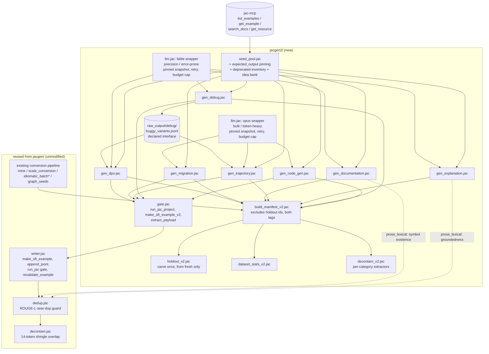
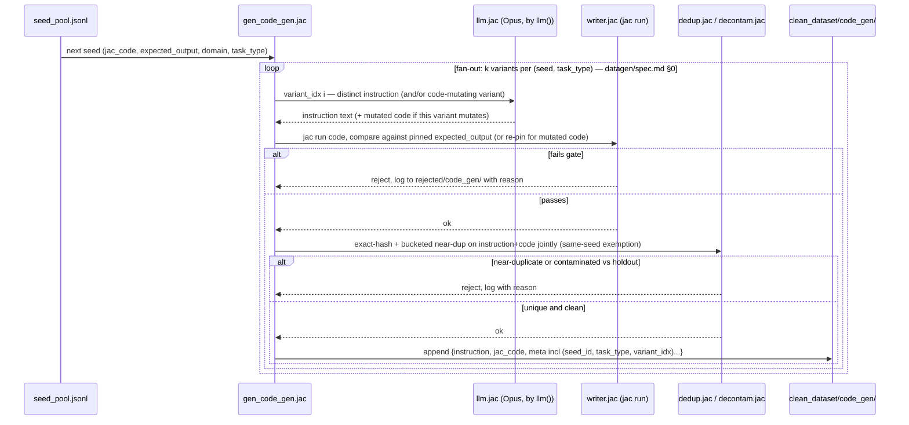
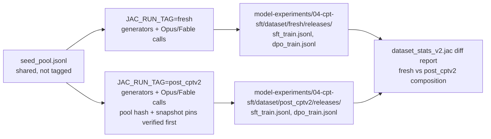

# datagen/workflow.md — Pipeline Mechanics

Companion to `spec.md` (task catalog) and `../spec.md` (architecture). This
file is the mechanical run order, module dependency graph, and per-call
sequence for `model-experiments/01-sft-dpo/sft_dpo/jacgen2/`.

## 1. Module dependency graph



## 2. Run order

**Partial order, not free order** (the earlier "generators can run in any
order" claim was wrong — two documented data flows depend on `gen_debug`'s
`buggy_variants.jsonl`: `gen_dpo`'s correctness/auth/typing axes and
`gen_trajectory`'s `debug_session` type). Required order:
`seed_pool` → `gen_debug` → everything else in any order →
`build_manifest_v2` last.

```bash
export JAC_RUN_TAG=fresh   # or post_cptv2 — NO default; modules hard-fail if unset
# run from repo root (jacgen convention: repo-root-relative paths)

# fresh build only — pool is frozen+hashed afterwards; post_cptv2 verifies the hash instead
jac run model-experiments/01-sft-dpo/sft_dpo/jacgen2/seed_pool.jac           # seed_pool.jsonl (shared, expected_output pinned per seed)

jac run model-experiments/01-sft-dpo/sft_dpo/jacgen2/gen_debug.jac           # -> .../debug/ + raw_output/debug/buggy_variants.jsonl (FIRST — others consume it)
jac run model-experiments/01-sft-dpo/sft_dpo/jacgen2/gen_code_gen.jac        # -> model-experiments/04-cpt-sft/dataset/$JAC_RUN_TAG/clean_dataset/code_gen/
jac run model-experiments/01-sft-dpo/sft_dpo/jacgen2/gen_explanation.jac     # -> .../explanation/
jac run model-experiments/01-sft-dpo/sft_dpo/jacgen2/gen_trajectory.jac      # -> .../trajectory/   (reads buggy_variants.jsonl)
jac run model-experiments/01-sft-dpo/sft_dpo/jacgen2/gen_documentation.jac   # -> .../documentation/
jac run model-experiments/01-sft-dpo/sft_dpo/jacgen2/gen_migration.jac       # -> .../migration/
jac run model-experiments/01-sft-dpo/sft_dpo/jacgen2/gen_dpo.jac             # -> .../dpo/          (reads buggy_variants.jsonl; see dpo-plan.md)

# conversion category: SNAPSHOT, not live pointer (fresh build only):
#   copy the conversion records to model-experiments/04-cpt-sft/dataset/shared/conversion_slice.jsonl,
#   record row-count + sha256 in the manifest. post_cptv2's build reads the snapshot
#   and hard-fails on hash mismatch. (Upstream 01-sft-dpo/dataset/ is gitignored,
#   single-copy, and its rebuild chain TRUNCATES — a live pointer would let the two
#   builds silently read different data.)

jac run model-experiments/01-sft-dpo/sft_dpo/jacgen2/build_manifest_v2.jac   # -> .../releases/sft_train.jsonl (excludes holdout ids, BOTH tags)
jac run model-experiments/01-sft-dpo/sft_dpo/jacgen2/holdout_v2.jac          # fresh build only: carve per-category holdouts, fixed thereafter
jac run model-experiments/01-sft-dpo/sft_dpo/jacgen2/dataset_stats_v2.jac    # composition report
jac run model-experiments/01-sft-dpo/sft_dpo/jacgen2/decontam_v2.jac         # contamination audit vs old + new holdouts
```

Note on `conversion`: reused unmodified from `jacgen/`, **not**
independently regenerated per run-tag the way the other six categories are —
`fresh` and `post_cptv2` releases share the same snapshotted conversion
slice. Deliberate asymmetry: re-running the miner against a live HF dataset
would introduce corpus-drift noise with no benefit, since conversion has no
LLM-creative component to vary between runs (transpile + compiler gate,
deterministic given the same source rows).

## 3. Per-example generation sequence (one `gen_code_gen.jac` call)



`gen_debug.jac`, `gen_explanation.jac`, and `gen_dpo.jac` follow the same
shape but call the Fable wrapper instead of Opus (`../spec.md` §4.1).
`gen_debug.jac` has two gate calls (buggy variant must fail, fixed variant
must pass) instead of one, and appends each accepted buggy variant to
`buggy_variants.jsonl`. `gen_trajectory.jac` calls the Opus wrapper (one
call produces the whole conversation) and gates only the final turn.
`gen_explanation.jac`/`gen_documentation.jac` replace the `jac run` gate
with the `prose_lexical` checks described in `../spec.md` §7.

## 4. Run-tag isolation, visually



The diff report in step 4 is the confound-mitigation step referenced in
`../workflow.md` §comparison protocol: since the two datasets are
independently LLM-generated (not the same content reused), some of the
downstream eval delta between the two SFT runs could be dataset-generation
noise rather than a real CPT effect. Comparing `task_type` distribution,
per-category example counts, and rejection rates between the two releases
gives a sanity check — if the two datasets look statistically similar in
composition, the shared-seed-pool design has done its job and the eval delta
is more likely attributable to the base model, not the data.

## 5. Cost / scale accounting

10,000-15,000 examples × 2 independent run-tags, split by model per `../spec.md`
§4.1. Calls ≈ accepted examples × (1 + rejection rate) — figures below are
accepted-example floors:

- **Opus** (`code_gen` + `trajectory` + `migration`): ~4,500 `code_gen`
  (1 call/example-variant, minus the `error_message_authoring` slice which
  is Fable) + ~1,250 `trajectory` (**1 call/example** — one call writes the
  whole 3-6-turn conversation, but each call is long; budget ~3-4x normal
  output tokens/call) + ~500 `migration` (1 call/example, whole-file
  outputs — budget ~2x tokens/call) → roughly **6,250 calls per run-tag,
  ~12,500 total across both tags**. Opus still carries the token-heavy
  load — fewer calls than Fable-adjacent arithmetic suggests, but the
  trajectory/migration calls are the longest in the pipeline.
- **Fable** (`debug` + `explanation` + `documentation` + `gen_dpo` + the
  ungated-prose task-type overrides): ~2,000 `debug` + ~1,250
  `explanation` + ~750 `documentation` + **~1,375 DPO calls** (only the
  idiomatic ~1,000 and graph_native ~375 axes need fresh generation — the
  correctness/auth_security/typing axes (~1,125 pairs) are assembled free
  from `buggy_variants.jsonl`, per `dpo-plan.md` §2.3-2.5) + the
  `error_message_authoring`/`code_critique` slices (inside the code_gen/
  debug counts) → roughly **5,400-5,800 calls per run-tag, ~11,000-11,500
  total across both tags**.

Grand total ≈ **24,000-25,000 calls across both tags** before rejection
overhead. `conversion` contributes no LLM calls at all (snapshotted
deterministic pipeline).

Recommended sequencing to control spend: run the pilot (step 3 of
`../spec.md` §8 rollout, ~20-30 examples per category, both models) first,
read `dataset_stats_v2.jac`'s token-usage-per-batch log
(`model-experiments/04-cpt-sft/dataset/$JAC_RUN_TAG/logs/generation/`, following
the existing `dataset/logs/generation/` convention from `jac-context-v1.md`,
broken out per model) to get actual per-example cost **and rejection rate**
for Opus and Fable separately, then extrapolate before committing to the
full run for either tag. Use the Message Batches API for the Opus bulk
tier (`../spec.md` §4).

## 6. Idempotency / resumability

Every generator appends rather than overwrites (matching `writer.jac`'s
`append_jsonl` convention), and every example carries its full
`(seed_id, task_type, variant_idx)` key. A generator run can be safely
re-invoked after a partial failure (network error, rate limit) — it skips
**keys** already present in that run-tag's `clean_dataset/<category>/`
output before making a fresh Opus or Fable call. (Skipping on `seed_id`
alone would cap fan-out at one example per seed — `datagen/spec.md` §0.1.)
Per-call failures are captured, not fatal: an errored call routes to
`rejected/` with reason and the batch continues (`../spec.md` §4 llm.jac
contract). This mirrors the existing `jacgen/verify_dataset.jac`
non-destructive re-validation pattern rather than introducing a new
resumability mechanism.
