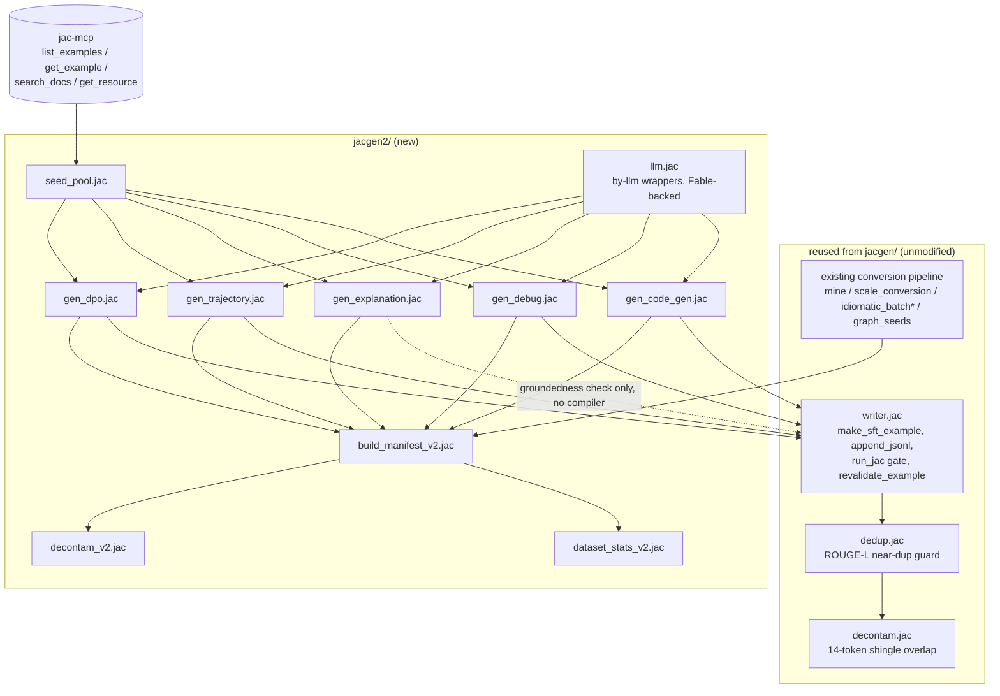
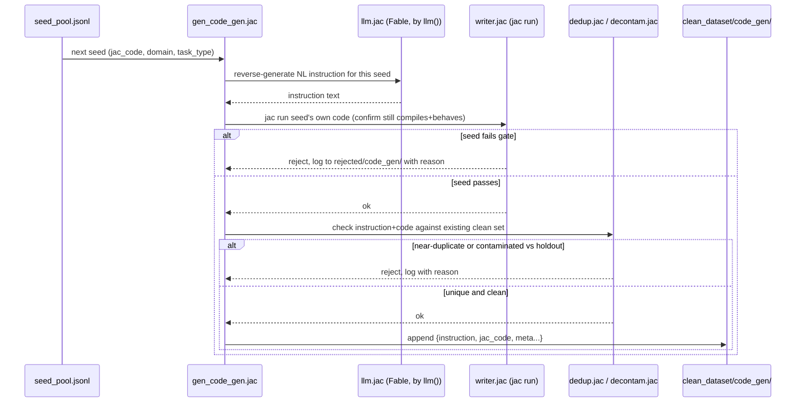
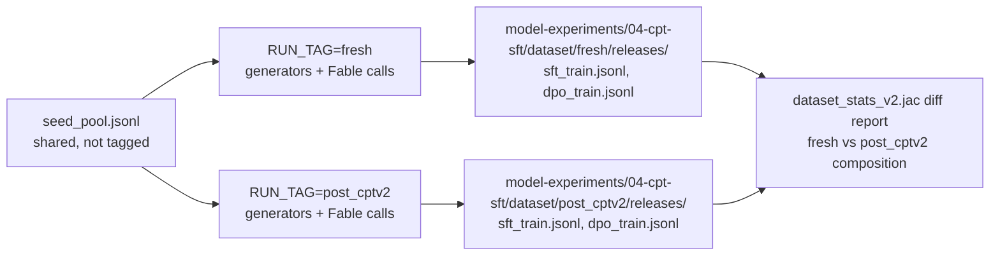

# datagen/workflow.md — Pipeline Mechanics

Companion to `spec.md` (task catalog) and `../spec.md` (architecture). This
file is the mechanical run order, module dependency graph, and per-call
sequence for `model-experiments/01-sft-dpo/sft_dpo/jacgen2/`.

## 1. Module dependency graph



## 2. Run order

Seed pool is built once per run-tag pass (or reused if unchanged — see §4).
Generators can run in any order relative to each other; they don't depend on
each other's output, only on the seed pool. `build_manifest_v2.jac` must run
last since it consumes every category's clean output.

```bash
export RUN_TAG=fresh   # or post_cptv2

jac run model-experiments/01-sft-dpo/sft_dpo/jacgen2/seed_pool.jac          # seed_pool.jsonl (shared, not run-tag-scoped)

jac run model-experiments/01-sft-dpo/sft_dpo/jacgen2/gen_code_gen.jac        # -> model-experiments/04-cpt-sft/dataset/$RUN_TAG/clean_dataset/code_gen/
jac run model-experiments/01-sft-dpo/sft_dpo/jacgen2/gen_debug.jac           # -> .../debug/
jac run model-experiments/01-sft-dpo/sft_dpo/jacgen2/gen_explanation.jac     # -> .../explanation/
jac run model-experiments/01-sft-dpo/sft_dpo/jacgen2/gen_trajectory.jac      # -> .../trajectory/
jac run model-experiments/01-sft-dpo/sft_dpo/jacgen2/gen_dpo.jac             # -> .../dpo/ (see dpo-plan.md)

# conversion category: existing jacgen/ pipeline, unchanged, run separately
# (already produces model-experiments/01-sft-dpo/dataset/sft.jsonl + sft_auto.jsonl — build_manifest_v2
#  reads those directly, does not regenerate them per run-tag)

jac run model-experiments/01-sft-dpo/sft_dpo/jacgen2/build_manifest_v2.jac   # -> model-experiments/04-cpt-sft/dataset/$RUN_TAG/releases/sft_train.jsonl
jac run model-experiments/01-sft-dpo/sft_dpo/jacgen2/dataset_stats_v2.jac    # composition report
jac run model-experiments/01-sft-dpo/sft_dpo/jacgen2/decontam_v2.jac         # contamination audit vs eval holdouts
```

Note on `conversion`: because it's reused unmodified from `jacgen/`, it is
**not** independently regenerated per run-tag the way the other four
categories are. `fresh` and `post_cptv2` releases share the same conversion
slice. This is a deliberate asymmetry — re-running the conversion miner
against a live HF dataset a second time would introduce corpus-drift noise
(HF row ordering / availability can change) with no benefit, since conversion
generation has no LLM-creative component to vary between runs in the first
place (it's transpile + compiler gate, deterministic given the same source
rows).

## 3. Per-example generation sequence (one `gen_code_gen.jac` call)



`gen_debug.jac` follows the same shape but with two gate calls (buggy variant
must fail, fixed variant must pass) instead of one. `gen_trajectory.jac`
gates only the final turn. `gen_explanation.jac` replaces the `jac run` gate
with the lexical groundedness check described in `../spec.md` §7.

## 4. Run-tag isolation, visually



The diff report in step 4 is the confound-mitigation step referenced in
`../workflow.md` §comparison protocol: since the two datasets are
independently LLM-generated (not the same content reused), some of the
downstream eval delta between the two SFT runs could be dataset-generation
noise rather than a real CPT effect. Comparing `task_type` distribution,
per-category example counts, and rejection rates between the two releases
gives a sanity check — if the two datasets look statistically similar in
composition, the shared-seed-pool design has done its job and the eval delta
is more likely attributable to the base model, not the data.

## 5. Cost / scale accounting

10,000-15,000 examples × 2 independent run-tags = up to ~20,000-30,000 Fable
generation calls total (roughly 1 call per example for `code_gen`/`debug`/
`explanation`, up to ~6 calls per `trajectory` example for multi-turn
unrolling — budget `trajectory` at ~4x its raw example count in call volume).
`conversion` contributes no LLM calls (reused deterministic pipeline).

Recommended sequencing to control spend: run the pilot (§5 of `../spec.md`
rollout plan, ~20-30 examples per category) first, read `dataset_stats_v2.jac`'s
token-usage-per-batch log (`model-experiments/04-cpt-sft/dataset/$RUN_TAG/logs/generation/`,
following the existing `dataset/logs/generation/` convention from
`jac-context-v1.md`) to get an actual per-example cost, then extrapolate
before committing to the full 10,000-15,000 run for either tag.

## 6. Idempotency / resumability

Every generator appends rather than overwrites (matching `writer.jac`'s
`append_jsonl` convention), and every example carries a `seed_id`. A
generator run can be safely re-invoked after a partial failure (network
error, rate limit) — it should skip `seed_id`s already present in that
run-tag's `clean_dataset/<category>/` output before making a fresh Fable
call. This mirrors the existing `jacgen/verify_dataset.jac` non-destructive
re-validation pattern rather than introducing a new resumability mechanism.
