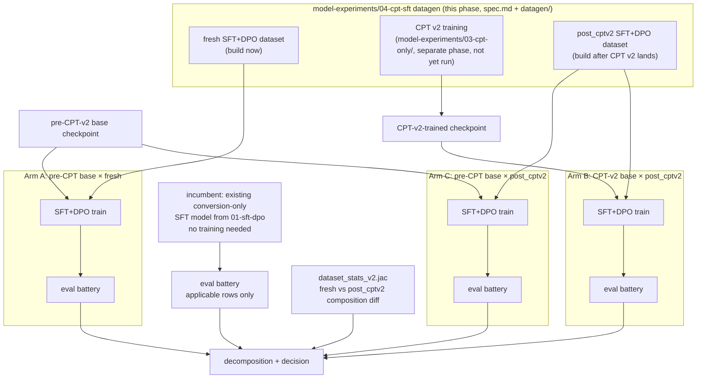

# workflow.md — Three-Arm CPT-Effect Protocol

Root workflow. Companion to `spec.md` (umbrella design), `datagen/spec.md`
+ `datagen/workflow.md` (how the two datasets get built), `dpo-plan.md`
(the DPO half of each dataset). This file covers what happens **after**
both the `fresh` and `post_cptv2` datasets exist: three SFT training arms,
a no-training incumbent reference, and the comparison that answers "did CPT
v2 actually do anything."

> Revision note (2026-07-20 audit): originally a two-test protocol. An
> experiment-design audit found that with two independently generated
> datasets, the A-vs-B delta confounds CPT effect with dataset-generation
> noise — the two variables change together. Rather than dropping the
> second dataset (a deliberate design choice: each build is a full,
> self-contained product of its era's pipeline), the protocol adds **Arm C**
> (pre-CPT base × `post_cptv2` dataset), which decomposes the delta into a
> dataset-noise component and a CPT component. Cost: one extra overnight
> LoRA SFT run + one eval pass — cheap next to the generation budget.

## 1. Why this is the right instrument

`model-experiments/03-cpt-only/docs/cpt-2/design.md` found CPT-v1 moved free-generation vocabulary
but left MCQ concept-recognition completely unmoved (18/20 byte-identical
before/after) — the diagnosis was partly an *instrument* problem: MCQ can't
see a shift in generation capability. SFT-then-eval on a real coding task
distribution is a better instrument for exactly the capability CPT is
supposed to move: can the model *write* correct, idiomatic Jac.

## 2. Overall flow

Arm A has no dependency on CPT v2 landing — it runs as soon as the `fresh`
dataset (`spec.md` §8 rollout) is built. Arms B and C are blocked on the
`post_cptv2` dataset, which is blocked on CPT v2 training
(`model-experiments/03-cpt-only/`'s responsibility, out of this phase's scope).

## 3. The four measurement points

| Arm | Base | Dataset | What it isolates |
|---|---|---|---|
| **Incumbent** | (already trained) `01-sft-dpo` conversion-only SFT checkpoint | 588-example manifest (historical) | reference floor — no training needed, just run the applicable eval rows. Without this, "B beat A" could hold while both lose to the cheap old model, and nobody would know |
| **A** | pre-CPT-v2 | `fresh` | what full 7-category SFT delivers on the current base |
| **C** | pre-CPT-v2 | `post_cptv2` | **C − A = dataset-generation noise** at fixed base — the confound, measured directly |
| **B** | CPT-v2 | `post_cptv2` | **B − C = CPT-v2 effect** at fixed dataset — the treatment, cleanly attributed |

All SFT arms use the identical training recipe and hyperparameters
(`mlx-lm-lora` toolchain, `build_splits.jac`/`build_dpo_splits.jac`
patterns from `01-sft-dpo`). Base model for A and C is the pre-CPT-v2
checkpoint (not the CPT-v1 one), so B's comparison isolates CPT-v2
specifically. Record results tagged `run=A_fresh`, `run=C_cross`,
`run=B_post_cptv2`, `run=incumbent`.

**Seed repeats:** each SFT arm is run 2-3 times varying only the training
seed/data order. The spread across repeats is the empirical training-noise
σ per eval row — the yardstick every delta gets measured against. Without
it, single-run deltas are indistinguishable from LoRA training
stochasticity. (2-3 overnight runs per arm on the M5 Pro; report the
mean ± spread per row.)

## 4. Generator-version pinning (required before any generation)

The `fresh` and `post_cptv2` builds may be months apart. If the Opus/Fable
API snapshots change in between, dataset quality drifts systematically —
invisible to the composition diff and perfectly collinear with the CPT
treatment. Therefore:

1. `llm.jac`'s wrappers pin **exact dated snapshot IDs**, not family
   aliases. The IDs are recorded in `seed_pool.jsonl`'s header and in every
   example's `generator_model_id` metadata field (`spec.md` §6).
2. At `post_cptv2` build time, the pipeline asserts snapshot IDs match the
   `fresh` build's and hard-fails on mismatch.
3. If a pinned snapshot has been deprecated by then, that is a forced
   protocol change: either fall back to training Arms B and C on the
   `fresh` dataset (single-dataset design — attribution survives, the
   second build is dropped) or accept and *report* the drift as a named
   confound. Decide then; the rule is pre-registered now so it isn't
   decided after seeing results.
4. The same pinning applies to any LLM grader used at eval time (§5).

## 5. Eval battery (identical rows for every arm)

Reuses existing instrumentation rather than inventing new eval. Rows are
split into two panels — only Panel 1 votes in the capability decision (§6);
Panel 2 is reported but excluded from the vote because CPT-v2 trained
directly on the text those rows are generated from (3x-upsampled docs per
`03-cpt-only/docs/cpt-2/design.md` §2), making them measures of doc
memorization, not downstream capability.

**Panel 1 — capability (votes):**

| Eval | Source | Notes |
|---|---|---|
| Function-holdout `jac run` pass rate | `eval_probe.jac` (`mlx` mode), 150-example holdout | clean: Vezora-mined Python, disjoint from all Jac docs |
| Graph-holdout `jac run` pass rate | `graph_holdout.jac` set, **grown from 13 to ≥100 items** before any arm runs (13 items resolve nothing below a ~30pp swing — one item = 7.7pp) | walker/node/edge correctness — the idiom-headroom tier |
| Idiom-quality judge | `idiom_eval.jac` ROUGE-L(output, py2jac(python)) bucketing | arm-neutral because the conversion slice is snapshot-shared between builds (`datagen/workflow.md` §2) |
| `code_gen`/`debug`/`trajectory`/`migration` holdout pass rate | `holdout_v2.jac` slices (see holdout rules below), **≥100 items per category** | jac-mcp-example-seeded items only in the voting slice; doc-fence-seeded items reported as a separate sub-slice (partial contamination — doc fences are inside the CPT corpus) |
| `documentation` holdout accuracy | held-out code→docs examples, symbol-existence check + blind sample review | code seeds only; doc-fence-seeded items excluded from the vote same as above |

**Panel 2 — doc-knowledge absorption (reported, does not vote):**

| Eval | Why it can't vote |
|---|---|
| `explanation` holdout accuracy | quiz Q&A generated *from* the same doc text CPT-v2 trained on, 3x upsampled — guaranteed to favor Arm B if CPT memorized anything; a legitimate measure of "docs got into the weights," not of capability |
| CPT-v2's own open-ended-vs-oracle eval | its questions are deliberately grounded in the packed v2 corpus (design.md §6.1) — same contamination, imported |

Running CPT-v2's own instrument after SFT remains deliberate — it tests
whether CPT's doc absorption survives an SFT pass — it just doesn't count
as an independent capability vote.

**Holdout rules** (enforced by `holdout_v2.jac`, in the `jacgen2` module
list — `spec.md` §4):

- Carved **once, from the `fresh` build only**, fixed thereafter, and used
  unchanged to score every arm — never re-carved per run-tag (per-tag
  holdouts would score A and B on different tests, invalidating §6
  outright). Carving from one tag slightly favors the arms trained on that
  tag's sibling examples; carving from `fresh` puts that (small,
  distribution-level) advantage on the *null* side — it biases against
  finding a CPT effect, which is the conservative direction.
- Holdout `id`s are excluded from `releases/sft_train.jsonl` by
  `build_manifest_v2.jac` for **both** tags, and appended to
  `decontam_v2.jac`'s reference list — "never seen during training" is
  enforced, not assumed.
- Every holdout item carries its `seed_id` provenance so the
  doc-fence/jac-mcp-example split above is mechanical.
- The two prose rows (`documentation`, `explanation`) are graded by a
  pinned-snapshot LLM judge, blind: order-randomized, arm-anonymized
  (design.md §6.3 already established this pattern for CPT-v2).

## 6. Decision rule (pre-registered)

Per Panel-1 row, compute the paired delta over identical holdout items
(McNemar / paired bootstrap over items — every arm answers the same items,
so pair them; pairing roughly halves the detectable-effect threshold vs
comparing marginal rates). A row is a **win for CPT** if `B − C > 0` with
the paired test clearing both (a) 95% significance and (b) the
training-noise σ from §3's seed repeats.

- **CPT-v2 has a real effect** ⇔ a majority of Panel-1 rows are
  individually significant wins for `B − C`.
- `C − A` per row is reported alongside as the measured dataset-noise
  component. If `C − A` is comparable in magnitude to `B − C`, say so
  loudly — that's the two-dataset confound made visible, and it caps how
  much any B-vs-A headline number can be trusted.
- The `dataset_stats_v2.jac` composition diff (`datagen/workflow.md` §4)
  remains a sanity gate: large composition drift between builds is
  reported as a named caveat on the C-arm interpretation.
- The incumbent column answers a separate, mandatory question: does Arm A
  beat the 588-example conversion-only incumbent on the three legacy rows
  (function holdout, graph holdout, idiom_eval)? If not, the 7-category
  dataset diluted conversion skill and the project's next move changes
  regardless of what CPT did. New-category rows don't apply to the
  incumbent; report them as N/A.

A single-metric win is not sufficient — this mirrors CPT-v1's own lesson
(the MCQ result was a single-metric false-negative; guard against the
mirror-image single-metric false-positive here).

## 7. Sequencing against `model-experiments/03-cpt-only/`

This phase does not block on or gate CPT v2 training. Recommended order:

1. Pin generator snapshots (§4). Build `fresh` dataset (`spec.md` §8
   rollout steps 1-7). Carve holdouts (`holdout_v2.jac`), grow the graph
   holdout to ≥100.
2. Run the incumbent eval column (no training — one eval pass).
3. Run Arm A now (with seed repeats), independent of CPT v2's timeline.
   This alone delivers value regardless of CPT v2's outcome — it's the
   first time the full 7-category SFT plan will have actually been
   executed, and incumbent-vs-A answers the dilution question immediately.
4. When `model-experiments/03-cpt-only/` finishes CPT v2 training: verify snapshot pins still
   hold (§4.3), build `post_cptv2` dataset (`spec.md` §8 steps 8-9), run
   Arms C and B (with seed repeats), run §6.
