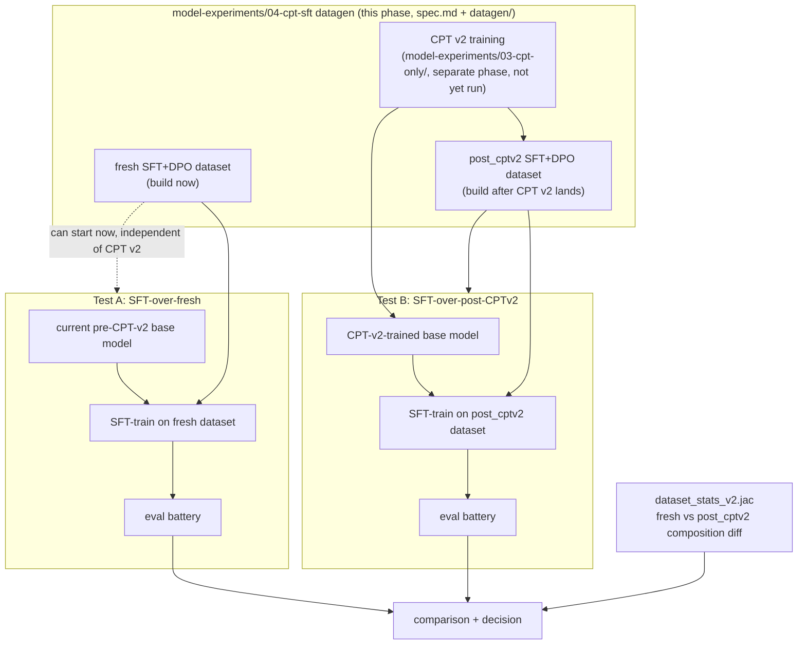

# workflow.md — Two-Test CPT-Effect Protocol

Root workflow. Companion to `spec.md` (umbrella design), `datagen/spec.md`
+ `datagen/workflow.md` (how the two datasets get built), `dpo-plan.md`
(the DPO half of each dataset). This file covers what happens **after**
both the `fresh` and `post_cptv2` datasets exist: two SFT training runs and
the comparison that answers "did CPT v2 actually do anything."

## 1. Why this is the right instrument

`model-experiments/03-cpt-only/docs/cpt-2/design.md` found CPT-v1 moved free-generation vocabulary
but left MCQ concept-recognition completely unmoved (18/20 byte-identical
before/after) — the diagnosis was partly an *instrument* problem: MCQ can't
see a shift in generation capability. SFT-then-eval on a real coding task
distribution is a better instrument for exactly the capability CPT is
supposed to move: can the model *write* correct, idiomatic Jac. This
workflow is that instrument, run twice.

## 2. Overall flow

`Test A` has no dependency on CPT v2 landing — it can and should run as soon
as the `fresh` dataset (§rollout in `spec.md`) is built. `Test B` is blocked
on CPT v2 training completing, which is out of this phase's scope
(`model-experiments/03-cpt-only/`'s responsibility).

## 3. Test A — SFT over fresh (no CPT)

**Purpose**: establish the baseline. What does full 5-category SFT (the
thing that was never actually built past the conversion probe) get you on
top of the *current*, non-CPT'd base model.

1. Base model: current pre-CPT-v2 checkpoint (whatever `model-experiments/03-cpt-only/` currently
   treats as its base — not the CPT-v1 checkpoint, the pre-CPT-v2 one, so
   Test B's comparison isolates CPT-v2 specifically).
2. Train: SFT on `model-experiments/04-cpt-sft/dataset/fresh/releases/sft_train.jsonl`, DPO
   pass on `dpo_train.jsonl` (same `mlx-lm-lora` toolchain as `model-experiments/01-sft-dpo`'s
   existing runs — reuse `build_splits.jac`/`build_dpo_splits.jac` patterns).
3. Eval battery (§5).
4. Record: full eval battery results, tagged `run=A_fresh`.

## 4. Test B — SFT over post-CPT-v2

**Purpose**: same SFT recipe, same task distribution, applied to a base
model that's gone through CPT v2. If CPT v2's hypothesis (corpus dilution +
better instrument, per `model-experiments/03-cpt-only/docs/cpt-2/design.md` §1) is right, this run
should show measurably better eval results than Test A, on the *same* eval
battery.

1. Base model: CPT-v2-trained checkpoint.
2. Train: SFT on `model-experiments/04-cpt-sft/dataset/post_cptv2/releases/sft_train.jsonl`,
   DPO on its `dpo_train.jsonl`. Identical training recipe/hyperparameters
   to Test A — the only intended variable is the base model checkpoint (the
   dataset *content* is a secondary, acknowledged variable — see §6).
3. Eval battery (§5), identical to Test A.
4. Record: full eval battery results, tagged `run=B_post_cptv2`.

## 5. Eval battery (identical for both tests)

Reuses existing instrumentation rather than inventing new eval:

| Eval | Source | What it measures |
|---|---|---|
| Function-holdout `jac run` pass rate | `model-experiments/01-sft-dpo/sft_dpo/jacgen/eval_probe.jac` (`mlx` mode) | basic run%/test-pass% on 150-example function holdout |
| Graph-holdout `jac run` pass rate | `graph_holdout.jac`'s 13-example disjoint set | walker/node/edge-specific correctness |
| Idiom-quality judge | `idiom_eval.jac`'s ROUGE-L(output, py2jac(python)) bucketing | idiomatic-divergent vs Python-shaped, per output |
| `code_gen`/`debug`/`trajectory` holdout pass rate | new holdout slices carved from `model-experiments/04-cpt-sft` generation (never seen during SFT training — same disjoint-offset pattern as `holdout.jac`) | the categories that never existed before this phase |
| `explanation` holdout accuracy | held-out docs-quiz Q&A, graded by groundedness + correctness | whether SFT + CPT improved doc-grounded reasoning, not just code output |
| CPT-v2's own open-ended-vs-oracle eval | `model-experiments/03-cpt-only/docs/cpt-2/design.md`'s open-ended generation compared against a jac-gpt-oracle, per that doc's §1 instrument-mismatch hypothesis | cross-check against CPT-v2's own success criteria, run post-SFT instead of post-CPT-only |

Running CPT-v2's own eval instrument *after* SFT (not just right after CPT)
is deliberate — it directly tests whether CPT's effect, if any, survives
and compounds through a subsequent SFT pass, which is the actually-relevant
question (nobody ships a CPT-only model).

## 6. Comparison protocol + confound mitigation

Primary comparison: `eval_battery(B_post_cptv2) − eval_battery(A_fresh)`,
per metric in §5.

Acknowledged confound: `fresh` and `post_cptv2` are independently
LLM-generated datasets (per `spec.md` §3, deliberately not the same content
reused twice), so some of any observed delta could be generation-run noise
rather than a real CPT effect. Two mitigations, both already built into
`datagen/spec.md`/`datagen/workflow.md`:

1. **Shared, non-run-tag-scoped `seed_pool.jsonl`** (`../spec.md` §5) — the
   actual code seeds and doc chunks driving both builds are identical; only
   the LLM-authored instructions/bugs/quiz-answers/trajectories vary between
   builds. This bounds how much the two datasets can differ in *coverage*,
   even though their *content* differs.
2. **`dataset_stats_v2.jac` diff report** (`datagen/workflow.md` §4) —
   before trusting any eval delta as a CPT signal, confirm the two datasets
   are compositionally similar (task_type distribution, per-category counts,
   rejection rates). If they diverge significantly, that divergence itself
   is a confound to report alongside the eval delta, not a reason to discard
   the comparison — just a reason to caveat it.

Decision rule: treat CPT v2 as having a measurable effect only if
`B_post_cptv2` outperforms `A_fresh` on a **majority of §5's eval rows**, by
a margin exceeding whatever noise floor the dataset-composition diff report
suggests (e.g. if code_gen pass-rate is the only metric that moved and the
diff report shows code_gen was also the category with the largest
composition drift between the two builds, that's inconclusive, not
confirming). A single-metric win is not sufficient given the confound —
this mirrors CPT-v1's own lesson (`model-experiments/03-cpt-only/docs/cpt-2/design.md`'s MCQ result
was a single-metric false-negative; guard against the mirror-image
single-metric false-positive here).

## 7. Sequencing against `model-experiments/03-cpt-only/`

This phase does not block on or gate CPT v2 training. Recommended real-world
order:

1. Build `fresh` dataset now (`spec.md` rollout steps 1-7).
2. Run Test A now, independent of CPT v2's timeline. This alone delivers
   value regardless of CPT v2's outcome — it's the first time the full
   5-category SFT plan will have actually been executed.
3. When `model-experiments/03-cpt-only/` finishes CPT v2 training: build `post_cptv2` dataset
   (`spec.md` rollout steps 8-9), run Test B, run the comparison in §6.
